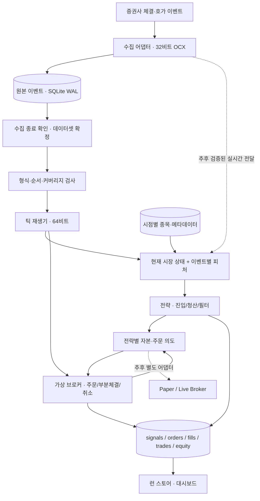

# 틱 중심 파이프라인 설계

작성: 2026-09-16 · 상태: 사용자 방향 확정 / 최소 재생·raw v1 읽기 구현 중

## 0. 최상위 결정과 문서 우선순위

**주 경로는 원본 체결·호가 이벤트를 그대로 재생하는 틱 백테스트다.**
1초봉 생성, `*_LOB.db` 변환, 초봉용 `features/fs_v1` 빌드는 선행 조건이 아니다.
이 문서는 그 결정과 아래의 구현 순서에서 `ARCHITECTURE_V2.md`와 README의
이전 초봉 중심 설명보다 우선한다. 기존 문서의 런 스토어·전략/실행 분리 개념은 재사용한다.

사용자가 이미 정한 방향을 문서의 최상위 결정으로 올리지 못했다. 기존 V2는 두 엔진의
병존을 명시했고 README는 raw → LOB를 기본 Stage 2처럼 안내했다. 따라서 “아무 데도
기록이 없었다”보다는 **주 경로의 우선순위가 명문화되지 않았고 이후 안내도 어긋났다**가
확인 가능한 결론이다. 과거 대화에 더 명확한 지시가 있었는지까지 이번 파일 점검으로 단정하지 않는다.

### 확정된 범위

- 틱 백테스트를 위한 체결·호가 보존과 재현 정확성이 우선이다.
- `Daily_baseline`과 사용자 `old_data`는 그대로 보존한다. 초봉 엔진은 레거시 회귀용이다.
- 거래 5건 / -1.301%는 **초봉 기준선**이며 새 틱 엔진의 수익률 목표나 정답이 아니다.
- 20260911 복원은 게이트가 아니다. 앞으로 확보한 실제 날짜를 명시해 검증한다.
- 장중에는 문서·코드 읽기와 짧은 상태 관측을 한다. 현재 수집기 교체/재시작,
  DB 변환·대량 스캔·전체 테스트·성능 측정은 이번 설계 작업에서 실행하지 않는다.
- 아래 새 모듈·스키마·운영 연결은 **설계안**이다. 파일이 존재한다고 구현 완료로 취급하지 않는다.

### 1차 검증 범위 — 사용자 확정

기존 `nxt_breakout` 한 전략을 소수 종목/확보된 하루에 대해 정확하게 재생한 뒤,
같은 재생 루프를 여러 종목과 전략별 자본으로 확장한다. 사용자가 이번 설계 중
“기존 NXT 돌파 전략의 틱 재현 정확성부터 확인”을 선택했다.

## 1. 전체 흐름



정규화는 코드·수치·시각 표현을 통일하는 작업이다. **체결 N개와 호가 M개를 초당 한 행으로
줄이지 않는다.** 초봉 차트가 필요하면 화면 표시용으로 파생하되 신호/체결 재생에 되돌려 쓰지 않는다.

## 2. 현재 구현과 목표의 차이

### 재사용할 부분

- `collector/kiwoom/kiwoom_universe_logger.py`: 원본 체결/10호가 수집, 세션 로그.
  이번 아침에 시작한 프로세스에는 이후 작성한 종료 저장 개선이 아직 적용되지 않았다.
- `engine/nxt_tick_engine.py`: raw 직접 읽기, NXT 시간대 필터, 진입/청산 비교 프로토타입.
- `core/runstore.py`, `core/contracts.py`, `dashboard/data_service.py`: 거래 결과와 런 조회 기반.
- `core/universe.py`: 명시·규칙 선언. 원천 명부의 최신성/시점성은 추가 검증 대상.
- `collector/kiwoom/stock_meta.py`, `meta_batch.py`, `run_meta_batch.py`: 재개 가능한 opt10001 파일럿.
  운영 Daily 연결과 실제 TR 검증은 별도이며, 원응답 단위/정의가 확정됐다고 간주하지 않는다.

### 코드에서 확인한 정밀 재생의 빈틈

1. 현재 수집기는 `datetime.now().strftime('%H%M%S')`를 저장한다. 체결/호가가 별도 큐와
   테이블에 들어가며 공통 순번, 수신 고해상도 시각, 공급자 이벤트 시각, 거래소 구분은 저장하지 않는다.
2. 틱 엔진은 체결마다 `q_time <= t_time`인 호가를 모두 반영한다. 같은 초에 실제로 나중에
   수신된 호가도 앞 체결에 붙을 가능성이 있다. 두 테이블의 rowid를 서로 비교해 해결할 수 없다.
3. 이벤트 목록은 체결 중심이다. 호가만 바뀐 순간과 데이터가 없는 동안의 주문 타이머가 독립 이벤트가 아니다.
4. 호가가 없으면 체결가를 매수/매도 호가로 대체한다. 스프레드와 실행 가능성을 과장할 수 있다.
5. 매수는 지연 후 호가로 체결하지만 청산은 조건 발생 때 현재 bid로 기록한다. 수량은 `qty=0`이며
   잔량 소비·부분체결·계좌 현금·미체결 취소·매도 지연 모델은 미완성이다.
6. `execution/broker.py`의 Broker/Paper/Live 계층은 대부분 계약과 `NotImplementedError`다.
7. `make_run_id()`에는 현재 raw 파일의 내용 식별자가 없다. 날짜/코드가 같고 데이터가 바뀌어도
   같은 실행 ID가 생길 수 있다. 데이터셋 버전까지 고정해야 재현성 근거가 된다.
8. 시간대가 08시라는 이유만으로 이벤트를 NXT로 확정할 수 없다. 현재 raw에는 venue 정보가 없다.
9. 후속 공식 문서 확인: OpenAPI+ 1.7 §8.2에서 FID 14는 누적거래대금이다.
   현재 운영 코드의 FID 14 기반 is_buy 판정은 근거 오류다. 원본 방향 필드의 의미와
   부호를 검증하기 전에는 기존 is_buy를 검증된 매수/매도 방향으로 인증하지 않는다.
   세부 근거와 미완료 항목은 [교차 검증 문서](TICK_CROSS_REVIEW.md)를 따른다.

위 사항은 코드 정적 점검 결과다. 이번 작업에서는 시장 데이터 재생/수익률 비교를 실행하지 않았다.

## 3. 수집과 원본 데이터 계약

### 3.1 수신 시 부여할 순서와 시각 — raw v2 제안

하나의 수집 세션에서 **체결·호가를 포함한 모든 수신 이벤트에 공통 `event_seq`**를 부여한다.
순번은 DB 쓰기 단계가 아니라 콜백에 들어온 시점에 결정한다.

- 식별자: `source`, `session_id`, `event_seq`, `event_type`, `code`.
- 시각: `received_at_utc`, `received_monotonic_ns`.
  공급자가 제공하는 `exchange_ts_raw`, 해석한 `exchange_ts`, `source_time_precision`도 별도 보존한다.
  필드가 없거나 해석이 불확실하면 null이다. 저장 자릿수가 많다고 공급자 정밀도가 높아지는 것은 아니다.
- 출처: `venue`/`feed_scope`, `schema_version`, 수집기 버전, 시장일/세션 명세.
  venue를 구별할 근거가 없으면 `unknown` 또는 공급자 통합 피드로 표시한다.
- 내용: 체결 가격·수량·원천 방향 필드, 호가 가격/잔량 단계와 원문 표현.
  원천 부호/필드를 보존하고 방향 추정은 버전 있는 파생값으로 둔다.
- 품질: 파싱 실패/결측/재접속 경계도 기록한다. 오류를 0이나 임의의 가격으로 바꾸지 않는다.

공통 순번은 **이 수집기가 관측한 순서**를 확정한다. 거래소 전체 주문의 절대 순서를 증명하지 않는다.
실시간 전략과 같은 정보 접근 순서를 재현할 때는 수신 순서를 우선하고, 교환 시각으로 무조건 재정렬해
늦게 도착한 정보를 과거로 옮기지 않는다. 세션 간 병합 순서/시계 역행은 명시적 검증 대상이다.

### 3.2 저장 경계

오프라인 프로토타입 구현: `collector/raw_v2.py` (`raw_v2_prototype_1`).
원문 필드와 UTC 수신 시각, 원천 시각 원문/정밀도, 정규화 이벤트를 JSON payload로 보존하고
SQLite 공통 seq를 키로 기록한다. WAL/FULL, 새 파일 전용이며 명시적 batch commit을 지원한다.
`finish(close_ns=...)`를 성공해야 closed가 된다. 미완료 파일과 append 실패 후 finish를 거부한다.
기존 파일의 자동 resume는 지원하지 않는다. 읽기는 전체 순번·카운트·payload 체크섬을
끝까지 확인해야 유효하다. 늦은 오류는 앞서 재생한 결과까지 실패 처리한다.
`run_raw_v2()`는 전체 스트림 검증 중 선택한 종목/venue만 단일 계좌에 전달한다.
이는 별도 새 파일용 저장/읽기 계약이며 현재 키움 콜백·큐·운영 DB에는 연결하지 않았다.
단조 시각은 콜백에서 받아야 하며 정규화/오류 이벤트/재접속 계약과 장외 성능 검증은 남아 있다.
후속 순수 변환기는 `collector/kiwoom/tick_normalizer.py`다. 명시적 가격 부호 정책,
기본 unknown 방향 정책, 원문/오류 보존, UTC 수신시각과 제공자 HHMMSS 분리를 구현했다.
호가 top3/10 잔량의 결측을 0으로 채우지 않는다. 실제 콜백·큐 연결과 제어 이벤트 처리는 아직 없다.

- 32비트 수집기는 최소 파싱·순번 부여·큐 적재만 담당한다. 전략 계산과 원본 DB 대량 조회를 넣지 않는다.
- 단일 기록기가 순서가 있는 큐를 받아 batch commit한다. 지연·대기 건수·미커밋 건수를 분리해서 측정한다.
- SQLite WAL을 당장 교체하지 않는다. 기존 `synchronous=OFF`는 강제 종료/전원 장애의 내구성 보장이
  없으므로, raw v2 적용 전 commit 주기와 NORMAL/FULL의 지연·손실 허용범위를 장외에서 측정한다.
- v2는 새 파일/버전으로 시작한다. 실행 중인 v1 DB를 ALTER하거나 기존 데이터를 다시 쓰지 않는다.
- 수집 세션 기록은 시작 → 기록 중 → 수신 차단 → 잔여 커밋 → 종료의 상태를 갖는다.
  정상 종료와 강제 종료/불명확 종료를 구분한다. 구독 성공과 실제 수신 성공도 분리한다.
- 다중 기록기가 같은 날짜 DB를 공유하지 않는다. 키움과 KIS 파일은 향후 source/session 경로로 분리한다.

### 3.3 기존 raw v1 데이터

원본을 보존하고 `(파일, 테이블, rowid)`로 출처를 유지한다. `order_quality=second_only`로 표시한다.
서로 다른 테이블의 동일 초 내부 순서는 복구 불가다. 임의 순번을 만든 뒤 정밀 순서라고 주장하지 않는다.

연구용 기본안은 체결보다 **이전 초**의 호가만 사용하고 호가 나이 제한을 적용하는 것이다.
동일 초의 호가를 포함하는 기존 방식과의 차이는 별도 민감도 결과로 남긴다. 이전 초 정책도
그 순간 실제 호가를 복구하는 것은 아니므로 엄격한 체결 정확성 검증과 구분한다.
두 정책 사이 수익 차이를 “새 엔진 버그” 또는 “개선 수익”으로 자동 판정하지 않는다.

최소 구현: `engine/raw_v1_reader.py`의 `read_raw_v1()`는 명시적인
`allow_second_only=True` 없이는 입력을 거부한다. 종료·확정된 파일을 호출자가 제공해야 하며,
리더 자체가 수집 종료를 인증하지 않는다. 운영 DB에는 실행하지 않는다.
읽기 전용 SQLite 트랜잭션에서 테이블별 rowid 순서로 읽고, 같은 초는 체결 다음 호가로
배치하는 연구 정책(`prior_second_v1`)을 적용한다. 초봉 집계 없이 모든 행과 원문 값을 유지한다.
호가 나이는 기록된 초 구간의 차이이며 정밀 경과 시간이 아니다. 무호가/오래된 호가는
`missing`/`stale`로 표시한다. 시각 역행/오류 발견 시 이미 나온 결과를 포함해 전체 런을 거부해야 한다.
이 리더는 `OrderedTick`의 공통 수신 순번을 만들어내지 않으며 venue는 `unknown`이다.
최우선 가격·잔량 검증은 `execution/quote_validation.py`에 추가했다.
유한한 양수 가격·양쪽 양의 정수 잔량·양수 스프레드를 요구한다. 동일/역전 호가는
별도 시장 정책 검증까지 거부한다. 원문과 `second_only` 표시는 유지하며, 최우선
호가 이외의 가격/잔량이나 체결 가능성을 인증하지 않는다. raw v1에서 새 정밀 체결기로의
연결은 미구현이며, 메모리 이벤트 기반 가상 체결·전략 연결은 §11의 상태를 따른다.

## 4. 종료 후 검사와 데이터셋 확정

원본 쓰기가 끝난 뒤에만 해당 세션을 고정된 백테스트 입력으로 승격한다.
파일 존재만으로 승격하지 않고, 종료 상태·마지막 커밋·미저장 여부를 확인한다.
불명확 종료 자료도 폐기하지 않고 연구용 불완전 데이터로 별도 표시한다.

- manifest에는 파일/세션 ID, 형식 버전, 원천, 이벤트 건수, 첫/끝 시각,
  선언된 유니버스/실수신 종목, 결손/재접속/오류, 데이터 내용 식별자를 담는다.
- 고비용 해시·정합성 검사·데이터 재배치는 장외에서 수행한다. 장중 SQLite 본체만 복사해
  WAL에 남은 커밋을 누락시키는 방식은 쓰지 않는다.
- 검사 항목: 순번 중복/역행, 가격·수량 타입/범위, 시각/세션 경계, 호가 수준 유효성,
  코드·거래소 범위, 동일 초 순서 품질, 스냅샷 관측 시각, 중단 구간.
- 데이터셋과 source universe를 버전으로 묶는다. 50종목 fchart 응답 성공은 이 검사의 대체물이 아니다.
- 반복 조회 속도가 부족할 때만 이벤트별 Parquet/인덱스 캐시를 만든다. 원본 한 이벤트에 대응하는
  식별자를 보존하며 캐시를 지워도 원본에서 재생성할 수 있어야 한다. 필수 초봉 전처리는 없다.

## 5. 재생기·현재 시장 상태·피처

### 입력/출력 경계

`EventReader → ReplayClock → MarketState → TickFeatures → Strategy`를 분리한다.
Reader는 원본 또는 동등한 이벤트 캐시를 순차 읽는다. 전 종목 raw를 종목마다 풀스캔하거나
당일 이벤트 전부를 Python 리스트로 만들어야 하는 구조를 피한다. 형식 최적화는 정확성 검증 후다.

`MarketState`는 종목/venue별 마지막 체결, 현재 10호가, 각각의 관측 순번·시각·나이를 갖는다.
거래가 없어도 호가 이벤트는 상태와 미체결 주문에 반영한다. 호가가 없거나 오래되면 실행 불가로
표시하며 체결가를 가짜 호가로 넣지 않는다.

`TickFeatures`는 같은 이벤트 업데이트 함수를 연구 재생과 실시간 경로에서 공유한다.
최근 15체결, 최근 10/60초 거래대금, OBI 등은 매 이벤트마다 갱신한다.
60초 창을 쓰는 것과 1초봉으로 리샘플링하는 것은 다르다. 동일 초에 10번 변하면 10번 반영한다.
warmup 미충족, 결측, stale 값을 준비된 값과 구분하고 피처 버전/창/포함 경계를 기록한다.

### 인과 순서

하나의 이벤트 처리 순서를 정책 버전에 고정한다.

1. 가상 시계를 진행하고 해당 시각 이전에 확정된 타이머/주문 도착을 처리한다.
2. 해당 원천 이벤트로 시장 상태를 갱신한다. 이미 도착한 주문에만 실행 기회를 준다.
3. 체결 결과로 포지션/현금을 갱신하고 피처를 계산한다.
4. 전략이 현재까지의 상태로 Signal을 낸다. 새 주문은 이후 도착 이벤트로 예약한다.

같은 시각의 타이머·원천 이벤트 순서, 0 지연 주문도 최소한 현재 관측 이후 단계에서 처리하는 규칙,
휴장/세션 경계에서의 미체결 처리를 버전으로 고정한다. 원천 이벤트가 없는 때도 타이머는 동작한다.
늦게 도착한 이벤트를 재정렬할 경우 필요한 대기시간과 전략의 정보 접근 지연까지 함께 모델링한다.

## 6. 종목·일봉 메타데이터: 옆에서 공급하는 정보

일봉은 틱을 만들기 위한 전처리가 아니다. 종목 속성·발행주식수·유통비율·거래대금·기준가격을
전략이 필요로 할 때 **그 시점에 알 수 있었던 값**으로 제공하는 별도 입력이다.

- 최소 계약: `code`, `field`, `value`, `source`, `effective_date`, `observed_at`,
  `available_at`, `units`, `quality`, 원응답 ID. 날짜만으로 장중 사용 가능 시점을 추측하지 않는다.
- 예: 오늘 16시에 받은 shares/float 스냅샷을 오늘 09시 백테스트에 넣지 않는다.
  데이터의 기준일과 수신/공개 시각이 다르면 둘 다 보존한다. `available_at <= decision_time`이어야 한다.
- 현재 tidy CSV는 날짜 중심이다. opt10001 원응답 아카이브의 received_at을 포함해 시점 조회 계층을
  연결해야 한다. 현재 값의 과거 브로드캐스트, 거짓 float 상수, 임의 shares 폴백은 금지다.
- 거래소 기준가·상하한가·호가단위·비용은 적용 날짜/시장별 계약으로 공급한다. 분할/권리변동일에
  단순 전일 종가 × 1.3을 정답으로 사용하지 않는다. 실제가 소스와 해당 규칙 검증은 별도 남은 작업이다.
- fchart 수정주가는 절대가격/체결가격 입력에서 차단한다. 수정가격을 비율 계산에 쓰더라도
  당시 이용 가능한 조정계수인지 확인한다. 최신 조정계수의 과거 소급도 점검 대상이다.
- 필요한 필터의 입력이 없으면 보수적으로 진입을 거부하고 사유를 기록한다. 불필요한 필터가
  꺼져 있는 실험은 계속할 수 있다. pykrx/과거 백필 미확정이 raw 수집을 멈추게 하지 않는다.
- 종목 명부는 과거 기준으로 재현한다. 현재 생존 종목만 과거에 적용하거나, 응답이 오래됐다는
  이유만으로 상장폐지를 추측하지 않는다. 수집 유니버스와 전략 대상 유니버스는 구분한다.

## 7. 전략과 체결 시뮬레이터

### 전략

전략은 `MarketSnapshot + 준비된 피처 + 자신의 포지션 상태`를 받아 Signal을 반환한다.
DB나 증권사 로그인에 접근하지 않는다. 진입/청산/필터는 기존 nxt 규칙을 먼저 그대로 옮기고
동작 변경은 별도 버전으로 관리한다. Python PARAMS와 YAML 중 실제 적용된 설정을 하나로
해석하고, 최종 값 전체를 런에 저장한다.

### 가상 브로커

- Signal과 Order를 구분한다. 주문마다 ID, 전략/종목/venue, 수량, 가격/유형, 발생·도착·취소 시각을 둔다.
- 매수·매도·취소 모두 지연 모델을 적용한다. 미래 최저/최고 또는 다음 체결가를 미리 선택하지 않는다.
- 호가 없는 주문은 임의 체결하지 않는다. 시장가/시장성 지정가부터 지원하고 관측 잔량·부분체결·
  미체결 잔량을 처리한다. 동일 호가의 잔량을 여러 가상 주문이 중복 소비하지 않게 관리한다.
- 지정가 대기열 위치는 L2 10호가만으로 정확히 알 수 없다. 초기에는 미지원으로 두거나 보수적 모델과
  가정을 명시한다. 관측되지 않는 시장 충격·숨은 유동성도 실제 체결처럼 확정하지 않는다.
- 수수료/세금/슬리피지/quote age/지연값은 버전 있는 실험 설정이다. 현재 0.20% 하드코딩을
  모든 날짜·시장에 맞는 값으로 인증하지 않는다. 수량 없는 거래 수익률과 자본 수익률을 분리한다.
- 세션 종료 때 미체결 취소와 보유 잔량 처리를 명시한다. 평가손익 또는 유효 호가의 가상 청산으로
  구분하고, 데이터 끊긴 시점의 마지막 가격으로 조용히 확정 이익을 만들지 않는다.

### 다종목·다전략

같은 전략 안의 여러 종목은 동일한 가상 계좌와 이벤트 시간축을 공유한다.
종목별 수익률을 독립 계산해 더한 값을 포트폴리오 수익률로 부르지 않는다.
기존 결정인 전략별 자본 분리를 유지한다. 세 청산 규칙 비교는 각각 독립 실험/계좌로 표시한다.

## 8. 결과·재현성·대시보드

현재 RunStore와 대시보드를 재사용하고 다음 산출물/필드를 확장한다.

- `signals`, `orders`, `fills`, `trades`, `equity`와 거절/미체결 사유.
- 원천 dataset ID/세션, 코드 commit 및 미커밋 패치 식별, 파서·순서·피처·전략·체결·메타데이터
  정책 버전, 유니버스 해석 결과, 파라미터, 난수 seed, 실행 상태, 시간대.
- 상태는 success/no_trades/failed/incomplete를 구분한다. 정상 무거래와 입력 부재는 다른 결과다.
- 동일 입력·정책·seed는 같은 이벤트/Signal/Order/Fill/Trade를 만든다. 데이터나 정책이 바뀌면
  ID도 달라져야 한다. 재실행 산출물은 기존 RunStore의 suffix 보존 정책을 따른다.
- 대시보드는 수익 외에 데이터 품질, 주문 대비 체결률, 미체결, quote age, 비용 가정,
  동일 초 순서 불확실성, 결손 구간을 함께 보여준다. 원본 수집 DB를 장중 대량 조회하지 않는다.

## 9. 프로세스 경계와 운영

집 PC를 기본 운영 후보로 설계하되 동시 운영의 성능/안정성이 검증됐다고 단정하지 않는다.

- 수집: 전용 32비트 프로세스, 인증·구독·원본 쓰기를 담당한다.
- 재생/분석: 별도 64비트 프로세스. 고비용 작업은 수집 종료 후 고정 데이터셋에서 실행한다.
- 추후 실시간 전략: 공통 이벤트를 IPC로 전달받는 별도 프로세스. 전략 계산으로 수집 콜백을 막지 않는다.
  IPC는 종목 구독 범위/큐 상한/역압 정책을 둔다. 전략 소비가 밀리면 신규 주문을 막고 원본 수집을 우선한다.
- 주문 어댑터: 계정/피드 동시 로그인과 API 제한을 실제 환경에서 검증한 뒤 결정한다.
  단순히 OpenAPI 프로세스 두 개를 켜서 같이 쓰는 것을 기본안으로 삼지 않는다.
- 모의/실전: 주문·체결 로그, 중복 주문 방지, 재접속 뒤 주문/포지션 대조, 신호 지연 감시,
  자본 제한·수동 중단을 먼저 검증한다. 수익이 나오는 백테스트만으로 실전 투입을 승인하지 않는다.

현재 키움 수집 종료에서 후처리로 이어지는 실행기는 없다. 향후 운영 실행기는
세션 종료 확인 → 데이터셋 확정/검사 → 선택한 틱 실험 → 결과 게시 순서로 구성한다.
LOB 변환과 초봉 피처 빌드를 그 경로에 넣지 않는다. 수집 시간이 15:35로 고정된 현재 코드가
모든 NXT 세션을 커버한다고 가정하지 않으며, 수집 시간/피드 범위는 공급자 계약 검증 후 확정한다.

## 10. 제안 모듈 배치

아래 신규 이름은 목표 배치다. 첫 최소 구현은 `engine/tick_ordering.py`에 두었으며,
공통 수신 순서가 있는 메모리 이벤트의 재생만 담당한다. 파일 리더와 체결 모델은 아직 없다.

```text
collector/kiwoom/              기존 수집 어댑터 + 추후 raw v2 기록
core/tick_events.py            Event / DatasetManifest 계약
data/tick_reader.py            raw v1/v2 순차 읽기, 출처 보존
data/point_in_time.py          available_at 기준 메타데이터 조회
engine/tick_replay.py          가상 시계, 원천/타이머 이벤트 재생
engine/market_state.py         종목/venue별 체결·호가 상태
features/tick/                이벤트별 피처 상태
strategies/nxt_breakout/       첫 전략 구현, 진입/청산/필터
execution/                    가상/모의/실전 어댑터, 전략별 계좌
core/runstore.py               기존 결과 저장 확장
dashboard/                    결과와 데이터·체결 품질 조회
```

`engine/engine.py`, `collector/build_lob_db.py`, `features/fs_v1` 경로는 레거시다.
삭제·재수집·일괄 이식하지 않고 기존 기준선 검증용으로 보존한다.

## 11. 구현 순서와 완료 기준

### A. 방향 기록 — 이번 작업

주 경로/레거시/보존/현재 제약을 이 문서와 README·HANDOFF·V2 안내에 일치시킨다.
완료 기준은 문서의 경로가 같고, 설계안과 현 구현을 구분하는 것이다. 운영 코드 변경은 없다.

### B. 이벤트 정확성 — 진행 중

동일 초 `호가 A → 체결 → 호가 B` 합성 예제로 기존 미래 호가 혼입을 재현한다.
공통 event_seq/시각/원문/세션 계약과 raw v1의 불확실성 정책을 구현한다.
v2 수집은 장외에서 기록 지연·종료 drain·재시작·오류 복구를 검증한 후 다음 세션에 적용한다.
무응답/재접속/역행/동일 값의 정상 반복을 다루며 가격·시각이 같다는 이유로 이벤트를 삭제하지 않는다.

첫 구현 상태: `engine/tick_ordering.py`는 source/session별 공통 순서와 단조 수신 시각을
검사하고 종목/venue별 직전 호가만 연결한다. 무호가는 `missing`, 오래된 호가는 `stale`로
표시하며 체결가로 대체하지 않는다. `observed`는 시간상 신선함만 뜻하며 체결 가능성 인증이 아니다.
`tests/test_tick_receive_order.py`는 기존 엔진의 동일 초 미래 호가 혼입을 합성 DB로 재현하고,
새 모듈의 순서·호가 상태·미래 이벤트 변경 및 청크 경계 불변성을 검증한다.
기존 엔진 결함 재현 테스트는 현상을 기록하며, 해당 엔진 교체 시 올바른 동작 검증으로 변경한다.
raw v1 연구용 리더는 §3.3처럼 별도 구현했다. raw v2 오프라인 저장/리더와
연구 실행기 연결은 §3.2처럼 추가했다. 실제 수집 콜백/운영 raw 연결은 미구현이다.
메모리 이벤트 기반 전략/체결 연결은 아래 C/D처럼 구현했다.
따라서 기존 틱 엔진의 미래 호가 문제가 운영 경로에서 해결됐다는 판정은 아직 할 수 없다.

### C. 최소 틱 재생 + 가상 주문

단일 전략/소수 종목, 체결·호가·타이머 이벤트, 신선한 호가 사용, 매수·매도 지연을 연결한다.
완료 기준: 미래 suffix를 바꿔도 그 이전 Signal/Order/Fill이 변하지 않음; 청크 크기와 재실행에
따른 결과 불변; quote-only·무호가·stale·같은 시각 주문 경계·마감 미체결 테스트 통과.

구현 상태: `execution/tick_simulator.py` + `engine/tick_session.py`.
단일 종목/venue, 공매도 없는 계좌, 시장가 주문, Decimal 현금·수수료를 사용한다.
매수·매도 및 취소 지연은 각각 설정한다. 같은 시각은 기존 호가 기준 타이머 → 새 이벤트
→ 전략 순서이며 취소가 체결보다 우선한다. 지연 0인 주문은 신호 이벤트 처리 후 실행한다.
매수는 ask, 매도는 bid 잔량을 주문 접수 순으로 소모한다. 새 호가 순번이면 표시 잔량을
새로 제공하는 가정이다. 체결/타이머는 잔량을 복구하지 않는다. 최우선 호가만 사용하며
주문 큐 위치·시장 충격·깊은 호가 소진·실제 보충량을 재현했다고 주장하지 않는다.
자금/보유량 부족 잔여 주문은 살아 있으므로 명시적으로 취소해야 한다.
`close(t)`는 t 이전까지만 실행하고 남은 주문을 만료한다. 보유분은 그대로 보고한다.
호출자는 마감 이후 이벤트를 전달하지 않아야 한다. 재생/전략 예외 발생 시 전체 런을 실패로 처리한다.
타이머는 `advance(t)`로 거래 없는 구간에도 실행된다. 전략 콜백은 시장 이벤트마다 실행되므로
취소 완료 후 새 청산 신호의 재평가는 다음 시장 이벤트에서 이루어진다.

### D. 기존 전략 이식과 수익 검증

현재 nxt 규칙/비용 가정의 프로토타입 재현 모드를 먼저 남긴다.
정확성 수정으로 달라지는 거래는 원인을 이벤트/주문 로그로 설명한다. 잘못된 체결을
보존하려고 구 결과와 수익률을 강제로 맞추지 않는다. 검증된 입력/실행 계약 위에서 수익을 평가한다.

연구용 연결: `strategies/nxt_breakout/tick_research.py`의 `NxtResearchStrategy`를
`replay_chunk(simulator, events, strategy)`에 전달한다. 고정/틱/계단식 청산 변형마다
새 전략과 새 simulator를 만든다. 기존 PARAMS와 기존 호가단위 함수를 재사용하지만
호가단위의 최신 시장별 정확성을 새로 인증한 것은 아니다. 수수료는 simulator 설정을 사용하며
기존 일괄 비용률을 양방향에 중복 적용하지 않도록 실행 설정을 별도로 확정해야 한다.
벽시각 `market_second`, 거래량/방향, top3 잔량은 정규화된 원천 값이 필요하다.
raw v1의 부재 정보를 추정해서 채우지 않는다. top3가 없으면 OBI 진입을 거부한다.
개장 전에는 미래 정규장 시가를 사용할 수 없으므로 새 어댑터는 시가 관측 후 진입한다.
이는 기존 로직과 의도적으로 다른 정확성 수정이며 수익률 동치성 검증과 구분한다.
세 규칙 연결, 부분 진입 취소 후 청산, 청크 불변성을 포함한 합성 테스트 82개를 통과했다.
메모리 연구 실행/저장: `engine/tick_research_run.py::run_research()`.
설정·비용·입력 이벤트 해시·관련 코드 해시와 주문/체결/신호/현금을 JSON에 기록한다.
호출자는 정규화 이벤트, 명시적 fee_rate, 마감 시각, 입력 라벨, 출력 폴더를 전달한다.
독립 UUID 경로에 원자적으로 파일을 교체하여 재실행 시 기존 결과를 보존한다.
실패한 런은 진단 전용이며 예외를 다시 발생시킨다. 강제 중단 시 running 기록이 남는다.
입력 라벨은 원본 식별 인증이 아니고 이벤트 해시는 실패 시 소비한 부분만 나타낸다.
미청산 보유를 실현 수익이나 확정 equity로 표시하지 않는다. 기존 Trade/대시보드 저장 형식과는
분리된 연구 스키마이며 큰 데이터에서의 메모리 사용량은 후속 검증 대상이다.
저장 테스트 8개 통과. 이후 raw v2 합성 파일 → 실행/저장 통합을 포함한 19개 테스트를 통과했다.
실제 수집 파일의 일자별 재현 검증은 아직 완료하지 않았다.
CLI는 `scripts/run_tick_research.py`이며 [실행 안내서](TICK_RESEARCH_RUNBOOK.md)에
명시적 비용/지연 설정, 상태 구분, 호가 검증 집계의 의미와 운영 전 제약을 기록했다.
CLI/메타데이터 검증/파일 재생·저장 합성 테스트는 후속 변경 포함 38개 통과했다.

### E. 다종목 계좌 → 모의 → 실전

공유 자본·수량·부분체결·위험 한도와 독립 전략 비교를 검증한다.
실시간 신호와 같은 날 재생 신호를 대조한 뒤에만 주문 어댑터를 검증한다.
실거래 시점, 공급자/venue 범위, 허용 자본, 지연·손실 한도는 운영 전 별도 결정한다.

### 독립 진행 가능한 보조 작업

시점별 유니버스 정리, opt10001 필드/단위 검증, 공식 메타데이터 백필 소스 검토는 병행할 수 있다.
현재 raw 수집과 최소 틱 재생을 이들 확인 때문에 통째로 멈추지 않는다. 특정 필터가 요구하는
데이터가 준비되지 않았으면 그 실험의 범위/거절 사유에만 반영한다.

## 12. 이번 설계의 검증 범위

근거는 위에 인용한 로컬 소스와 사용자 rev.2 지시다. 최신 증권사 필드/시장 제도/API 제한을
새로 인증한 문서가 아니다. 로그/문서/코드의 짧은 읽기 외에 운영 데이터 처리나 네트워크 측정은
실행하지 않았다. 재설계가 수집 무누락, 체결 정확성 또는 수익을 이미 달성했다는 뜻은 아니다.

후속 최소 구현 검증은 작은 합성 SQLite DB와 메모리 이벤트만 사용한다.
운영 raw DB, Daily_baseline, 사용자 old_data는 이 테스트의 입력이나 출력이 아니다.
