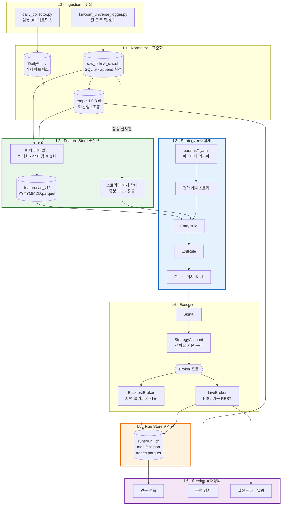

# 🧭 Architecture V2 — 확장 가능한 퀀트 파이프라인 설계서

> **REFACTORING_PLAN.md가 "L0/L1(수집·리샘플링)이 왜 지금 이 모양인가"를 기록한 ADR이라면, 이 문서는 "전략이 N개가 되고 자동매매가 붙었을 때도 무너지지 않으려면 경계를 어디에 그어야 하는가"를 기술한다.** (구 PIPELINE_DESIGN.md는 저장소 정리 과정에서 삭제됨 — 진행 상황 로그 참조)

- **작성 배경**: 전략 1개 프로토타입 단계에서 (1) raw 데이터 직접 사용 → 가공 계층 도입, (2) 전략 N개 누적 및 자동매매 연결, (3) 애매해진 대시보드 역할 재정의가 필요해짐
- **확정된 전제**: 자동매매는 **전략별 계좌/자본 분리** 방식 (전략 간 자본 중재 로직 불필요)
- **미확정**: 대시보드 최종 형태 → 7장에서 옵션 비교만 제시하고 판단은 보류

---

## 진행 상황 로그 (Progress Log)

> VS Code(Claude Code 확장)에서 실제 구현 작업을 수행하고, 이 세션에서 `.git/logs/HEAD`, `.pytest_cache`, `runs/*/manifest.json`, `sampledata/features/fs_v1/_manifest.json`을 직접 열어 대조 검증했다. 아래는 에이전트가 보고한 내용이 아니라 저장소 상태로 확인한 사실이다.

**2026-09-14 — Phase A(런 스토어) + Phase B(피처 스토어) 완료, 정합성 정리 완료**

- `core/runstore.py` 구현 완료. `engine/engine.py`, `engine/nxt_tick_engine.py` 출력부가 표준 `Trade`/`RunManifest`로 교체됨(CSV 병행 출력 유지). 실제 `runs/` 아래 7개 런이 생성돼 있고, 그중 `31111e34`는 종목 053260에 대해 3대 청산 컷(`fixed`/`tick_trail`/`step_trail`) 동시 비교 결과(6건, `net_pnl_sum -3.84%`)를 담고 있음 — §6이 설계한 그대로 동작.
- `dashboard/data_service.py`가 런 질의 기반으로 교체됨(§7.5), `dashboard/run_selector.py` 신규, `core/metrics.py`로 지표 계산 단일 출처화(대시보드·런스토어 중복 제거).
- `features/` 전체 구현 완료(Phase B). §3.7 매핑표의 미시 피처(`cbv_*`, `cbv_ratio_max/tmax_*`, `tick_rate_cum`, `amt_*s`/`bamt_*s`, `trigger_dev_min/max_*`, `obi_top3`, `buy_ratio_15t`, `tick_size_ratio`) + 거시 피처(`mkt_cap`, `float_ratio`, `prev_close`, `ytd_tradamt_5/20`, `upper_limit`) 총 44개가 `sampledata/features/fs_v1/_manifest.json`에 실제로 등록됨. `scripts/build_features.py`(배치 빌더), `scripts/verify_features_vs_legacy.py`(레거시 대조)도 존재.
- 테스트 220개 전부 통과 확인 (`.pytest_cache`의 `lastfailed` = `{}`): `test_runstore.py`(32) / `test_data_service.py`(24) / `test_feature_store.py`(26) / `test_feature_parity.py`(138, 패리티+룩어헤드).
- §1.6의 정합성 이슈 4건 모두 커밋으로 해소됨: 테스트용 종목 필터 제거(config/CLI화), `nxt_tick_engine` 날짜 하드코딩 제거, 미사용 `candle_close` 제거, `upper`/`tick_rate` 상수를 `calculate_upperlimit()`/`calculate_ticksize()` 실계산에 연결.
  **대조 완료** (2026-09-14): 기아·삼성전자·SK하이닉스 3종목 × 8거래일(20220425~20260504, Daily 매트릭스 전체 범위)에서 수정 전/후 `git stash` diff 결과 거래 5건(진입가·청산가·PnL) 전부 바이트 단위 일치. 단, 계산된 상한가 자체는 종목·날짜별 -3.4%~+2.9% 차이가 있었고, SK하이닉스(10만원대)는 호가단위 비율이 0.45~0.46%로 나와 진입 필터 임계값(0.18)을 넘는 사례가 확인됨. 이번 5건이 전부 트레일링 스탑 청산이라 상한가를 건드리지 않았고, SK하이닉스는 다른 조건에서 이미 걸러졌기 때문에 우연히 결과가 같았던 것 — **전 종목 백테스트로 확장하면 결과가 달라질 수 있으므로, 전체 유니버스 재실행 전 한 번 더 대조 필요.**
- **아직 손대지 않음**: `strategies/`, `execution/`는 스캐폴딩 상태 그대로(Phase C, E 미착수). 대시보드 §7.2 옵션(A~D) 최종 결정도 미확정 — 7.4의 권장대로 보류 중.
- 커밋 63건이 GitHub 원격과 병합됨(`Merge branch 'master' of https://github.com/Peter-jackson12/Stock`). 병합으로 `PIPELINE_DESIGN.md`, `practice.ipynb`, 로그 파일 2개가 삭제됨 — 코드/문서에서의 참조는 grep으로 확인해 끊어진 곳 없음(§1.5 각주 수정 완료). 단, `PIPELINE_DESIGN.md`에만 있던 시간대별 운영 생애주기 표와 Stage 3~5 데이터 계약 서술은 다른 문서에 옮겨지지 않은 채 사라진 상태 — **의도적 삭제인지 확인 필요.** 병합 후 회귀 테스트 219개 통과(병합 전 확인한 220개와 1개 차이 — conflict 해소 과정에서의 변경으로 추정, 문제 소지 낮음).

**2026-09-14 (2차) — 설계 재평가: 실측 기반 4건 발견**

fs_v1 파케이와 엔진 소스를 직접 열어 대조한 결과, 구조 방향은 유효하나 아래 4건을 확인했다. 상세는 §3.5.1 / §3.5.2 / §3.6.1 / §3.6.2.

| # | 발견 | 심각도 | 처리 |
| :---: | :--- | :---: | :--- |
| 1 | **피처 스토어를 아무도 읽지 않는다.** `engine/config.py`의 `FEATURE_SET_VERSION = "none"`, `engine.py`는 여전히 `calculate_window_metrics()`를 루프에서 호출. Phase B가 약속한 "파라미터 스윕 시 피처 재계산 0회" 이득이 **현재 0% 실현** | 🔴 | ✅ 해소 (2026-09-14, Phase B-1 — 아래 3차 로그) |
| 2 | **저장 전제 오류.** §3.5의 "zstd 5~10배"는 실측 **1.26배**. 전 종목 확대 시 0.95~6 GB/일, 5년 1.2~7.6 TB | 🔴 | §3.5.1 수정 완료 / §3.5.2 개선안 결정 대기 |
| 3 | **거시 피처 커버리지 1.5%** (200종목 중 3종목). null 정책·커버리지 게이트 부재로 조용히 실패할 구조 | 🟡 | ✅ 정책·게이트 구현 (2026-09-14). 커버리지 자체는 여전히 1.5% — 원인 규명됨(아래) |
| 4 | **해상도 불일치.** `obi_top3`/`buy_ratio_15t`가 `resolution: "tick"` 선언과 달리 1초봉 행에 저장. 틱 엔진이 스토어를 읽는 순간 결과가 바뀜 | 🟡 | ✅ A안 채택, 표기 정정 (2026-09-14) |

**유효성이 확인된 부분**: L2/L3 경계(계산 vs 임계값 판단)가 코드에서 지켜지고 있음 — `obi_top3`는 비율만 계산하고 `1.2` 비교는 `params/default.yaml`에 있다. `macro.py`의 시점 규칙도 `frame.index < str(date)`로 정확히 구현됨. 런 스토어는 설계대로 실제 동작 중.

**메타 관찰**: Phase A·B 모두 "만들었지만 아직 소비되지 않음"에 가깝다. 인프라가 소비자보다 앞서 있으면 검증되지 않은 구조가 쌓인다. 또한 모든 검증이 2022년 샘플 8일 + 2026년 1일 1종목 위에서만 이루어지고 있어, 위 2번(용량)처럼 실데이터 규모에서만 드러나는 문제가 늦게 발견된다. README Phase 4(무인 수집)와 이 문서의 Phase C~F는 독립 트랙이므로, 한쪽만 계속 진행하면 "검증 안 된 인프라" 또는 "쓸 구조가 없는 데이터" 중 하나가 쌓인다.

**다음 착수 순서 (재조정)**: ① `engine.py`가 fs_v1을 읽게 만들기 → ② fs_v2 포맷 개선 → ③ 거시 null 정책·커버리지 게이트 → ④ 해상도 결정 → ⑤ Phase C 전략 추상화

**2026-09-14 (3차) — ①③④ 완료, ② 미착수**

위 순서의 ①(Phase B-1), ③, ④를 처리했다. 아래는 실행 결과로 확인한 사실이다.

**① `engine.py`가 fs_v1을 읽는다 (발견 1번 해소)**

- `FEATURE_SET_VERSION`이 `"fs_v1"`이 되고, `engine.py`는 날짜마다 피처를 한 번 읽어 루프에서는 조회만 한다. 전략이 실제로 읽는 피처는 42개 중 **4개**(`cbv_1`, `tick_rate_cum`, `amt_10s`, `trigger_dev_max_10`)뿐이라 `read(names=...)`로 그 4개만 꺼낸다.
- 피처 파일·종목이 없거나 피처 행과 LOB 행의 시각이 어긋나면 `MissingFeaturesError`. **인라인 계산으로 폴백하지 않는다** — 폴백하면 "스토어를 쓰고 있다고 착각하는" 상태가 아무 로그도 남기지 않은 채 만들어진다.
- 인라인 경로는 `--feature-source inline`으로 남아 있다. §8이 요구한 거래 목록 대조가 통과하기 전에는 제거하지 않는다.
- 인라인 런은 `feature_set_version`을 `"none"`으로 기록한다. 같은 거래가 나와도 출처가 다르면 다른 런이어야 하기 때문이다.

**대조 결과** (`scripts/verify_engine_feature_parity.py`, 20220425~20220504 8거래일, 엔진 유니버스 전 종목, 2회 반복):

| | 인라인 | 스토어 |
| :--- | ---: | ---: |
| 거래 | 5건 | 5건 |
| 누적 PnL | -1.301% | -1.301% |
| 불일치 필드 | \- | **0** |

진입가·청산가·진입/청산시각·PnL·MAE/MFE·보유시간·청산사유 + 진입 시점 피처 스냅샷(`signal_meta`)까지 전부 일치. 피처 값 자체는 `verify_features_vs_legacy.py`로 200종목 × 33피처를 t 단위 대조해 최대 절대오차 `0.000e+00`.

**속도**: 인라인 122.6s → 스토어 5.0s, **24.6배**. 컬럼 선택 읽기는 44컬럼 564MB 중 6컬럼 106MB(18.8%)만 I/O — **5.3배 절감**. 8일치 빌드가 약 200초이므로 **약 1.7회 실행부터 이득**이다. §3.5가 "Parquet을 택한 이유는 압축이 아니라 컬럼 선택 읽기"라고 고쳐 쓴 판단이 숫자로 확인됐다.

> ⚠️ **대조의 실제 폭은 생각보다 좁다.** `sampledata/Daily/open.csv`에 컬럼이 3개(000270·005930·000660)뿐이라 `engine.py`의 유니버스가 거기서 끊긴다. LOB DB에는 1,300~1,500종목, fs_v1에는 200종목이 있는데도 거래 대조의 근거는 **8일 × 3종목 = 24 종목일**이다. 유니버스를 넓히려면 일봉 매트릭스부터 채워야 한다.
>
> **스토어로 옮기지 않은 값 2개.** `upper`(상한가)와 `tick_rate`(호가단위 비율)는 종목·일 단위 스칼라라 루프 비용에 기여하지 않고, 스토어 값과 정의가 다르다. `tick_size_ratio`는 매 봉 `close` 기준인데 엔진의 `tick_rate`는 당일 시가 기준 스칼라다 — §3.7 매핑표는 둘을 대응시켜 놨지만 같은 값이 아니다. `upper_limit`은 아래 커버리지 문제가 그대로 걸린다.

**③ 거시 null 정책과 커버리지 게이트 (발견 3번)**

- `filters.macro.on_missing: reject | skip_filter`. 기본값 `reject`. `strategies/macro_filter.py`가 판정하고, 결과는 boolean이 아니라 `MacroDecision(allowed, reasons, skipped)`이다 — "통과했다"와 "판정할 수 없어 통과시켰다"는 다른 사건인데 boolean 하나로는 구분되지 않는다. `on_missing` 오타는 생성 시점에 에러다.
- `nxt_tick_engine`의 `PARAMS`에 `macro` 섹션이 들어가 `param_hash`를 통해 런 매니페스트에 기록된다. `enabled: false`라 거동은 그대로지만 이 엔진의 `run_id`는 이전 런과 달라진다.
- `build_features.py`가 빌드 후 커버리지를 재고 `_manifest.json`의 `coverage[날짜]`에 남긴다. 임계치 기본 95%, 미만이면 경고, `--strict`면 실패. `--coverage-only`로 기존 파일에 사후 기록도 가능하다.

**실측(8일 × 200종목)**: 거시 피처 6종 전부 **종목 커버리지 1.5%**, 행 커버리지 6.8~7.5%. 20220425의 7.14%는 §3.6.1이 기록한 92.9% null과 정확히 일치한다. **정책과 게이트는 생겼지만 커버리지 자체는 그대로다** — 아래 원인 참조.

**④ 해상도 표기 (발견 4번)** — §3.6.2 A안 채택. 표기를 둘로 나눴다.

| | 뜻 | fs_v1 실제 |
| :--- | :--- | :--- |
| `resolution` | 저장 해상도 | 42개 **전부 `bar_1s`** |
| `native_resolution` | 개념/스트리밍 해상도 | `bar_1s` 34 · `daily` 6 · `tick` 2 |

거시 피처도 `daily`로 선언돼 있었지만 초당 행마다 반복 저장된다(§3.5.2의 600배 중복). 계산식과 저장값은 그대로라 fs_v2 분기가 필요 없다 — 바뀐 것은 서술뿐이다.

**⑤ `float_ratio`가 전 종목 60.0인 이유 — 샘플 한계가 아니라 수집기 버그**

§3.6.1의 부수 관찰("원천 데이터를 확인할 것")을 확인했다. `collector/daily_collector.py`에 **유통비율을 수집하는 코드가 아예 없다.**

```python
meta = {"shares": 100_000_000, "float": 60.0}     # L72 하드코딩 기본값
...
m_shares = re.search(r"상장주식수.*?<em.*?>([\d,]+)</em>", page_res.text, ...)
if m_shares:
    meta["shares"] = int(...)                      # shares 만 덮어쓴다
```

`meta["float"]`는 크롤링 대상이 아니라 **한 번도 덮어써지지 않는 상수**다. 그래서 3종목 × 1,073거래일 전부 60.0이다. 파싱 실패가 아니라 미구현이다.

같은 함수에서 **`shares`도 시점 규칙을 어긴다.** 값 자체는 실제값(기아 390,412,998 / 삼성전자 5,846,278,608 / SK하이닉스 730,492,365)이지만 **오늘 시점의 상장주식수를 1,073일 전 과거에 그대로 소급**한다. `mkt_cap = close × shares`이므로 2022년 시총이 2026년 주식수로 계산된 값이다. 유상증자·액면분할이 있었다면 그만큼 틀린다. 거시 필터를 켜기 전에 고쳐야 할 대상이 `float_ratio` 하나가 아니라는 뜻이다.

> **커버리지 1.5%의 진짜 원인도 여기다.** 일봉 매트릭스가 3종목만 담고 있어서지, 피처 계산이 실패해서가 아니다. 순서는 (1) `daily_collector` 유통비율 구현 + `shares` 시점 규칙 수정 → (2) 전 종목 일봉 수집 → (3) 커버리지 게이트 통과 확인 → (4) `filters.macro.enabled: true`. 게이트가 있으니 이제 (3)을 건너뛰면 빌드가 경고한다.

**남은 것**: ② fs_v2 포맷 개선(§3.5.2 — float32화, `time` int32화, 거시 피처 일별 테이블 분리)은 미착수. 그리고 `20260908_LOB.db`는 원천 컬럼이 BLOB이라 두 경로 모두 실패한다 — 인라인 경로는 예외 핸들러가 `stock` 할당 전에 참조해 `UnboundLocalError`로 죽는다(`engine.py`의 기존 버그).

---

## 0. 결론 먼저 (TL;DR)

| 질문 | 답 |
| :--- | :--- |
| 피처 레이어를 넣어야 하나? | **넣어야 한다.** 단, 이유는 "속도"가 아니라 **"실전과 백테스트가 같은 숫자를 보게 하는 것"**이 본질이다. |
| 피처 저장은 어디에? | **L0/L1은 SQLite 유지, L2(피처)만 Parquet.** 계층마다 쓰기 패턴이 정반대다. 단 근거는 압축이 아니라 **컬럼 선택 읽기** — 실측 압축률은 1.26배뿐이다(§3.5.1). |
| 전략 N개는 어떻게? | `Strategy = EntryRule × ExitRule × Filter` 조합으로 분해. 이미 `nxt_tick_engine.py`가 3개 청산룰을 동시 비교하는 형태로 이 구조를 암시하고 있다. |
| 자동매매 연결은? | 전략 코드를 고치지 않는다. **Broker 포트 뒤에 백테스트/모의/실전 어댑터를 갈아끼운다.** |
| 대시보드가 왜 애매한가? | UI 문제가 아니다. **결과 계약(Run Store)이 없어서** 파일 하나를 보는 뷰어에 머물러 있기 때문이다. |
| 그럼 대시보드 결정은? | **지금 내리지 마라.** Phase A(런 스토어)를 먼저 하면 선택지가 저절로 2개로 좁혀진다. (7.4 참조) |

---

## 1. 현재 구조 진단 (코드 근거)

설계를 바꾸기 전에, 지금 코드에서 실제로 확장을 막고 있는 지점을 특정한다. 추상적인 "모듈화가 부족하다"가 아니라 파일과 줄 단위로.

### 1.1 피처 계산이 백테스트 루프 안에 박혀 있다

`engine/strategy.py::calculate_window_metrics()`는 모든 종목 × 모든 날짜 × 모든 초(t)마다 호출되며, 그 안에서 다음을 **매번 처음부터** 계산한다.

```python
for w in [5, 10, 30, 60]:
    stock[f'cbv_{w}'] = sum(stock['buy_vol'][t - w: t]) / w   # 슬라이스 + 재합산
...
    price_ws = np.mean(stock['close'][t_ws:t])                 # 슬라이스 + 재평균
...
for w in [1, 5, 10, 30, 60]:
    min_price_w = min(stock['low'][t - w: t])                  # 슬라이스 + 재스캔
    max_price_w = max(stock['high'][t - w: t])
```

정규장 1초봉은 하루 약 23,400개다. 윈도우 합계만 따져도 종목 1개 하루에 약 250만 회의 파이썬 레벨 덧셈이 발생한다. 문제는 절대 속도가 아니라, **`amt_10s > 700`의 700을 750으로 바꿔보고 싶을 때 이 250만 회가 통째로 다시 돌아간다**는 점이다. 피처는 시장 데이터의 순수 함수이고 파라미터와 무관한데, 지금 구조는 둘을 같은 루프에 묶어놓아서 파라미터 스윕 비용이 피처 계산 비용에 곱해진다.

그리고 더 중요한 문제가 있다. 이 계산은 **과거 배열을 뒤로 슬라이스하는 방식**이라 실전에서 그대로 쓸 수 없다. 실시간에서는 "지금까지 들어온 이벤트"만 있고 미래로 채워진 배열이 없다. 실전용 코드를 따로 짜는 순간 백테스트와 실전이 다른 숫자를 보게 되고, 그 차이는 조용히 손실로 나타난다.

### 1.2 전략이 코드에 하드코딩되어 있다

`engine/strategy.py::check_entry_conditions()`:

```python
if (stock['upper'] > trigger and
    stock['high'][t] >= trigger > stock['high'][t - 1] and
    stock['tick_rate'] <= 0.18):                       # ← 매직넘버
    if (stock.get('max10_trigger', 0) > 0 and
        2.3 < stock.get('ctotal', 0) < 31 and          # ← 매직넘버
        stock.get('amt_10s', 0) > 700):                # ← 매직넘버
```

`engine/nxt_tick_engine.py::run_strategy()`도 마찬가지로 `0.005`, `0.008`, `0.004`, `1.2`, `0.75`, `30`, `0.0025`가 함수 본문에 흩어져 있고, 3개 청산 규칙이 `rules` 딕셔너리로 **함수 안에** 정의되어 있다.

전략 이름은 `engine/config.py`에 전역 상수 하나다.

```python
STRATEGY_NAME = "cross_Today"
SET_TIME = 1300
```

전략이 2개가 되는 순간 이 구조는 성립하지 않는다. 전역 상수 하나를 두 전략이 공유할 수 없기 때문이다.

### 1.3 두 엔진이 아무 계약도 공유하지 않는다

| | `engine/engine.py` | `engine/nxt_tick_engine.py` |
| :--- | :--- | :--- |
| 입력 | `temp/*_LOB.db` (1초봉) | `raw_ticks/*_raw.db` (틱) |
| 전략 위치 | `strategy.py` import | 클래스 메서드 내부 |
| 청산 위치 | `risk_manager.py` import | 클래스 메서드 내부 |
| 상태 표현 | `stock` 가변 딕셔너리 | `rules[...]` 딕셔너리 |
| 출력 | CSV 20컬럼 | **stdout `print`만** (저장 안 함) |

`nxt_tick_engine.py`는 `strategy.py`도 `risk_manager.py`도 import하지 않는다. 사실상 두 번째 레거시가 하나 더 생긴 상태다. 두 엔진의 결과를 나란히 비교하는 것이 현재로서는 불가능하다 — 한쪽은 CSV고 한쪽은 화면에만 찍히니까.

**해법은 두 엔진을 합치는 것이 아니다.** 틱 해상도와 1초봉 해상도는 정당하게 다른 도구다. 합쳐야 할 것은 **입출력 계약**이다.

### 1.4 결과 스키마가 없다 — 대시보드 애매함의 진짜 원인

`dashboard/data_service.py`:

```python
DEFAULT_RESULT = PROJECT_ROOT / "results" / "cross_Today_1.csv"   # ← 파일 하나에 고정
```

대시보드는 지금 "cross_Today 전략의 1번 파티션 결과 파일을 보여주는 뷰어"다. 이게 애매하게 느껴지는 이유는 명확하다. **전략이 1개일 때 "결과 비교"라는 대시보드의 핵심 가치가 발동하지 않기 때문이다.** 비교 대상이 없으니 KPI 카드 4개와 피벗 대체 화면이 남고, 그건 사실 `df.describe()`로도 되는 일이다.

즉 대시보드의 애매함은 UI 설계 문제가 아니라 **상류 계층(결과 계약)의 부재가 하류에 드러난 증상**이다. 7장에서 다시 다룬다.

### 1.5 수집했지만 전략에 연결되지 않은 데이터

`engine/data_loader.py::load_daily_csvs()`는 8개 일봉 매트릭스를 모두 로드한다.

```python
files = ['mkt', 'open', 'high', 'low', 'close', 'tradamt', 'float', 'shares']
```

그런데 `engine/engine.py`에서 실제로 쓰는 건 `self.daily_data['open']` 하나뿐이고, 그것도 **날짜 목록과 종목 코드 목록을 얻기 위한 용도**다. 시총(`mkt`), 유통비율(`float`), 거래대금(`tradamt`)은 로드만 되고 필터에 쓰이지 않는다. 결과 CSV에는 아예 상수가 박힌다.

```python
self.trading['mkt_float'].append(1000)      # ← 하드코딩
self.trading['ytd_tradamt'].append(100)     # ← 하드코딩
self.trading['cum_amt'].append(100)         # ← 하드코딩
```

(구) PIPELINE_DESIGN.md의 Stage 3(거시 일봉 매트릭스, 이 문서는 이후 저장소 정리 과정에서 삭제됨)는 "일봉 수준의 시총, 거래대금, 유통비율 사전 필터링 데이터 공급"이 목적이라고 선언했었는데, 그 연결선이 실제로는 끊겨 있었다. 피처 레이어를 만들 때 **거시(일봉) 피처와 미시(틱/초봉) 피처를 같은 조회 인터페이스로 통합**해야 할 근거다.

### 1.6 그 외 정합성 이슈 (참고)

- `engine.py`에서 `candle_close`는 초기화만 되고 append되지 않는다 (`risk_manager`가 쓰지 않아 현재는 무해)
- `stock['tick_rate'] = 0.1`, `stock['upper'] = opens[0] * 1.3`이 상수로 고정되어 있다. `engine/utils.py`에 `calculate_upperlimit()`가 존재하지만 호출되지 않는다
- `engine.py` L79에 테스트용 종목 필터(`if code != '000270': continue`)가 살아 있다 — 릴리스 전 제거 대상

---

## 2. 목표 아키텍처 (L0 ~ L6)

핵심 원칙은 하나다. **각 계층은 아래 계층의 산출물만 알고, 위 계층의 존재를 모른다.** 전략은 DB를 모르고, 실행 계층은 전략 로직을 모르고, 대시보드는 어떤 엔진이 결과를 만들었는지 모른다.



### 계층별 책임 경계

| 계층 | 책임 | 절대 하면 안 되는 것 | 현재 상태 |
| :--- | :--- | :--- | :--- |
| **L0** 수집 | 무가공 적재, 유실 0% | 필터링·가공·판단 | ✅ 완성 |
| **L1** 표준화 | 리샘플링, 스키마 통일 | 전략 지식 포함 | ✅ 완성 |
| **L2** 피처 | 시장 데이터 → 파생 지표 | 임계값 판단 (`> 700`) | ★ 신규 |
| **L3** 전략 | 피처 + 파라미터 → Signal | DB·브로커 직접 접근 | ★ 재설계 |
| **L4** 실행 | Signal → Order → Fill | 전략 로직 분기 | ★ 신규 |
| **L5** 런 스토어 | 실행 기록 + 결과 표준화 | 해석·집계 | ★ 신규 |
| **L6** 서빙 | 조회·비교·감시 | 계산 로직 보유 | ★ 재정의 |

> **가장 중요한 경계는 L2와 L3 사이다.** `ctotal`을 계산하는 것은 피처(L2), `2.3 < ctotal < 31`은 전략(L3). 지금 `strategy.py` 한 파일에 둘 다 들어 있는 것이 확장을 막는 근본 원인이다.

---

## 3. L2 — 피처 레이어 설계 (심층)

### 3.1 왜 필요한가: 세 가지 이유, 우선순위 순

**① 실전-백테스트 동치성 (가장 중요)**

백테스트는 과거 배열을 뒤로 슬라이스해서 피처를 만들고, 실전은 앞으로 흘러오는 이벤트를 누적해서 피처를 만든다. 두 코드를 따로 짜면 반드시 미세하게 어긋난다. 그 어긋남은 에러로 드러나지 않고 **백테스트에서만 잘 되는 전략**이라는 형태로 드러난다.

해법은 **하나의 피처를 두 개의 구현(batch / stream)으로 명시적으로 선언하고, 두 구현이 같은 값을 내는지 자동 검증하는 것**이다. 이게 이 설계에서 피처 레이어를 두는 첫 번째 이유다.

**② 파라미터 스윕 비용의 분리**

피처는 시장 데이터의 순수 함수다. 파라미터가 바뀌어도 피처는 바뀌지 않는다. 한 번 계산해서 저장해두면, 임계값을 100번 바꿔도 피처 계산은 0번이다.

**③ 전략 간 재사용과 자기 기술(self-describing)**

전략이 `required_features = ("cbv_10", "obi_top3", "amt_10s")`라고 선언하면, 배치 빌더는 무엇을 계산할지 알고, 실시간 엔진은 어떤 스트리밍 상태를 띄울지 알고, 대시보드는 이 전략이 무엇을 보는지 안다. 전략 N개를 관리할 때 이 자기 기술성이 문서보다 훨씬 강력하다.

### 3.2 핵심 계약: 이중 구현(Dual Implementation)

```python
class Feature(Protocol):
    name: str                    # "cbv_10"
    version: str                 # "1.0.0" — 계산식이 바뀌면 올린다
    deps: tuple[str, ...]        # 의존하는 원천 컬럼 또는 다른 피처
    warmup: int                  # 유효한 값이 나오기까지 필요한 이벤트/초 수

    def batch(self, ctx: BatchContext) -> np.ndarray:
        """하루치 전체를 벡터화 계산. 장 마감 후 1회."""

    def stream(self) -> StreamingState:
        """증분 계산 상태 객체 생성. 장중 실시간."""


class StreamingState(Protocol):
    def update(self, event) -> float:
        """이벤트 1건 반영 후 현재 값 반환. O(1)이어야 한다."""

    @property
    def ready(self) -> bool:
        """warmup 충족 여부. False면 전략은 이 값을 쓰면 안 된다."""
```

**설계 의도**: `batch`와 `stream`은 같은 클래스 안에 있다. 다른 파일에 흩어지면 한쪽만 고치는 사고가 난다. 같은 클래스 안에 두고, 아래 패리티 테스트가 CI처럼 돌면 어긋남이 즉시 잡힌다.

### 3.3 패리티 테스트 (필수)

```python
def assert_parity(feature: Feature, day_events, tol: float = 1e-9):
    """같은 하루 데이터에 대해 batch와 stream이 같은 값을 내는지 검증."""
    batch_out = feature.batch(BatchContext.from_events(day_events))

    state = feature.stream()
    stream_out = np.array([state.update(e) for e in day_events])

    w = feature.warmup
    np.testing.assert_allclose(batch_out[w:], stream_out[w:], rtol=tol, atol=tol)
```

이 테스트가 통과하지 않는 피처는 **실전에 올릴 수 없다.** 이게 "백테스트 결과를 실전에서 믿을 수 있는가"에 대한 유일한 기계적 보증이다. `tests/test_feature_parity.py`에 스캐폴딩을 넣어두었다.

### 3.4 룩어헤드 방지 테스트 (필수)

피처 계산에서 미래 데이터가 새는 것은 백테스트를 무의미하게 만드는 가장 흔한 버그다. 다음 테스트로 기계적으로 잡는다.

```python
def assert_no_lookahead(feature: Feature, day_events, sample_points: list[int]):
    """t 시점까지 잘라서 계산한 마지막 값 == 전체로 계산한 t 시점 값"""
    full = feature.batch(BatchContext.from_events(day_events))
    for t in sample_points:
        truncated = feature.batch(BatchContext.from_events(day_events[: t + 1]))
        assert truncated[-1] == pytest.approx(full[t]), f"lookahead at t={t}"
```

> 참고로 현재 `nxt_tick_engine.py`는 이 점을 잘 지키고 있다 — `rolling_60s_ticks[:-1]`로 현재 틱을 제외하고 마이크로 고점을 구한다. 이런 세심함이 코드 여기저기 흩어져 암묵적으로 지켜지는 대신, 계층 차원에서 테스트로 보증되어야 한다.

### 3.5 저장 포맷: 왜 L2만 Parquet인가

계층마다 **쓰기/읽기 패턴이 정반대**다. 이게 포맷을 나누는 근거다.

| 기준 | SQLite (L0/L1 — 유지) | Parquet (L2 — 신규) |
| :--- | :--- | :--- |
| 쓰기 패턴 | 장중 초당 1,500건 행 단위 append | 장 마감 후 하루치 1회 배치 쓰기 |
| 읽기 패턴 | 종목별 전체 행 조회 | **60개 컬럼 중 3개만** 조회 |
| 컬럼 선택 읽기 | 전체 행 스캔 후 버림 | 해당 컬럼만 I/O (수십 배 차이) |
| 압축 | 사실상 없음 | zstd — **실측 1.26배** (아래 3.5.1 참조) |
| 병렬 읽기 | WAL로 가능하나 락 경합 | 파일 단위 완전 무경합 |
| 스키마 진화 | `ALTER TABLE` 필요 | 버전 디렉토리로 격리, 무중단 |
| 적합 계층 | **L0/L1 ✅** | **L2 ✅** |

**결론: SQLite를 걷어내지 않는다.** 장중 무유실 append는 SQLite WAL이 잘하는 일이고 이미 검증됐다(18만 건 유실 0%). 반면 피처는 "한 번 쓰고 수백 번 컬럼 선택 읽기"라서 컬럼 스토어가 정확히 맞는다. 각 계층에 맞는 도구를 쓰는 것이지, 마이그레이션이 아니다.

> ⚠️ **Parquet을 택하는 이유는 압축이 아니라 컬럼 선택 읽기다.** 초판에는 "zstd 기준 5~10배"라고 적었는데, 아래 실측 결과 이 전제는 **틀렸다**. 판단 자체(L2는 Parquet)는 유지하되, 근거는 압축이 아니라 "44개 컬럼 중 3개만 I/O" 쪽이다.

#### 3.5.1 실측: fs_v1 `20220425.parquet` (2026-09-14)

| 항목 | 실측값 |
| :--- | :--- |
| 종목 수 | 200 |
| 행 수 | 730,800 (종목당 3,654) |
| 컬럼 수 | 44 (`code`, `time` + 피처 42개) |
| 파일 크기 | 74.6 MB (행당 107 B) |
| **압축률** | **1.26배** (row group 0: 원본 84,688 B → 압축 후 67,427 B) |
| 타입 분포 | `double` 42개, `large_string` 2개 |

**왜 안 눌리는가**: 계산된 부동소수 피처(`0.4567823…` 같은 비율·평균)는 엔트로피가 높아 zstd가 잡을 반복 패턴이 없다. 5~10배는 반복이 많은 원본 정수 OHLCV에서나 나오는 수치이고, 파생 피처에는 적용되지 않는다.

**전 종목 확대 시 용량 추산**

| | 현재 (샘플) | 2,550종목 · 같은 밀도 | 2,550종목 · 정규장 전일(23,400초) 밀도 |
| :--- | ---: | ---: | ---: |
| 하루 | 74.6 MB | ~0.95 GB | ~6 GB |
| 30일 (핫 SSD) | — | ~28 GB | ~180 GB |
| 5년 (콜드) | — | ~1.2 TB | ~7.6 TB |

핫 구간은 2TB SSD로 여유가 있지만, **콜드 5년 보관은 설계가 상정한 2TB HDD를 초과할 수 있다.** L0 원본 틱(일 2~3GB)과 별개로 쌓이는 용량이라는 점에 유의.

#### 3.5.2 fs_v2 포맷 개선안 (미적용 — 결정 필요)

실측에서 드러난 낭비 3종. 셋 다 계산식은 그대로이므로 **피처 버전이 아니라 저장 포맷만 바뀌는 변경**이다.

| 문제 | 현재 | 개선 | 효과 |
| :--- | :--- | :--- | :--- |
| 정밀도 과잉 | 피처 42종 전부 `float64` | 비율·평균 계열을 `float32` | 용량 ~50% 절감. 비율값에 float64 유효숫자는 불필요 |
| 시각 타입 | `time`이 `large_string`("090001") | `int32` 당일 누적 초 | 용량 절감 + 범위 필터가 문자열 비교 → 정수 비교로 |
| **거시 피처 중복** | `mkt_cap` 등 6종이 **초당 행마다 반복** | 별도 일별 테이블(`_daily.parquet`)로 분리, 읽을 때 조인 | 실제 정보량은 종목당 하루 1개인데 3,654회 중복 = **600배 중복** |

> 거시 피처 중복은 §3.6의 "전략 입장에서는 같은 인터페이스로 보이게 한다"를 **저장 레이어까지 그대로 적용**해서 생긴 일이다. 통합해야 할 것은 조회 API(`ctx.f()`)이지 물리 저장이 아니다. `ctx.f("mkt_cap")` 인터페이스는 그대로 두고 뒤에서 조인하면 된다.

**디렉토리 레이아웃**

```
sampledata/features/
└── fs_v1/                         # 피처셋 버전 (계산식 또는 저장 포맷 변경 시 fs_v2로 분기)
    ├── _manifest.json             # 포함된 피처 목록·버전·생성 시각·소스 데이터 해시
    ├── 20260911.parquet           # code, time, <미시 피처...> — (code, time) 정렬
    ├── 20260912.parquet
    └── ...
    # fs_v2 예정: + _daily.parquet  (code, date, <거시 피처...>) — 초당 중복 제거
```

- 파일당 하루. 백테스트 날짜 범위 = 파일 목록이 되어 병렬 처리가 자연스럽다
- 종목별 row group으로 나누면 특정 종목만 읽을 때 predicate pushdown이 걸린다 (fs_v1 실측: row group 200개 = 종목당 1개, 의도대로 동작)
- `fs_v1` → `fs_v2` 디렉토리 분기로 **기존 백테스트 결과의 재현성이 깨지지 않는다** (중요)

### 3.6 거시(일봉) 피처 통합

1.5에서 확인한 끊어진 연결선을 여기서 잇는다. 일봉 매트릭스는 틱과 시간 해상도가 다르므로 **별도 조회 경로**를 두되, 전략 입장에서는 같은 인터페이스로 보이게 한다.

```python
# 전략이 보는 모습 — 해상도 차이를 신경 쓰지 않는다
ctx.f("cbv_10")          # 미시: 당일 초/틱 단위, Parquet에서
ctx.f("mkt_cap")         # 거시: 전일 종가 기준 시총, 일봉 매트릭스에서
ctx.f("float_ratio")     # 거시: 유통비율
ctx.f("ytd_tradamt_20")  # 거시: 20일 평균 거래대금
```

**시점 규칙(point-in-time)이 핵심이다.** 거시 피처는 반드시 **전일까지의 확정 데이터**만 쓴다. 당일 일봉은 장이 끝나야 확정되므로 당일 종가 기준 시총으로 당일 진입을 필터링하면 그 자체가 룩어헤드다. 이 규칙을 `MacroFeature` 기반 클래스에 강제한다.
→ 구현 확인됨: `features/builders/macro.py::DailyMatrix.prior_rows()`가 `frame.index < str(date)`로 **당일을 제외**한다. 의도대로 동작.

#### 3.6.1 커버리지 결손과 null 정책 (✅ 결정·구현 완료 — 2026-09-14)

fs_v1 `20220425.parquet` 실측:

```
전체 종목 200 / 거시 피처가 있는 종목 3 (000270 기아, 000660 SK하이닉스, 005930 삼성전자)
→ mkt_cap·float_ratio·upper_limit 등 92.9% (678,600 / 730,800 행) null
→ 커버리지 1.5%
```

저장소의 `sampledata/Daily/*.csv`가 3종목만 담은 샘플이라 생긴 결과일 가능성이 크다. 그러나 **문제는 결손 자체가 아니라 결손 시 동작이 정의되어 있지 않다는 것**이다. `params/default.yaml`의 `filters.macro.enabled`를 `true`로 켜는 순간, 커버리지가 부족한 종목은

- 필터가 null을 "조건 미달"로 보면 → 유니버스의 98.5%가 **에러 없이 조용히 사라진다**
- 필터가 null을 "판정 불가 → 통과"로 보면 → 거시 필터가 **사실상 꺼진 채로 켜져 있다고 착각한다**

둘 다 조용히 일어나고, 백테스트는 정상 종료된다. 이런 종류의 실패가 가장 위험하다.

**결정 1 — null 정책: `reject`(기본)**

`params`의 `filters.macro.on_missing`으로 갈라 **명시하게** 만들었다. 판정은 `strategies/macro_filter.py`.

| 값 | 동작 | 언제 쓰나 |
| :--- | :--- | :--- |
| `reject` (기본) | 판정 불가 → 진입 금지 | 모르는 종목에 돈을 넣지 않는 쪽. 거부 사유가 `reasons`에 남는다 |
| `skip_filter` | 판정 불가 → 그 조건만 미적용하고 통과 | 커버리지를 **확인한 뒤에만**. 미적용 항목이 `skipped`에 남는다 |

반환값을 boolean이 아니라 `MacroDecision(allowed, reasons, skipped)`으로 둔 것이 핵심이다. "통과했다"와 "판정할 수 없어 통과시켰다"는 다른 사건인데 boolean 하나로는 구분되지 않는다 — `skipped`가 비어 있지 않은 통과는 후자다. `on_missing` 오타는 config 생성 시점에 에러다(조용히 기본값으로 흡수되면 정책을 명시한 의미가 없다). 값은 `param_hash`를 통해 런 매니페스트에 기록된다.

**결정 2 — 커버리지 게이트: 기본 95%, `--strict`면 실패**

`scripts/build_features.py`가 빌드 후 커버리지를 재서 `_manifest.json`의 `coverage[날짜]`에 기록한다. 거시 피처는 종목당 값이 하나이므로 **판단 기준은 종목 커버리지**이고, 행 커버리지는 §3.5.2의 중복 저장 규모를 보여준다. `--coverage-only`는 기존 파일에 사후 기록만 한다.

**실측(2026-09-14, 8일 × 200종목)**: 거시 피처 6종 전부 종목 커버리지 **1.5%**, 행 커버리지 6.8~7.5%.

> ✅ **부수 관찰 확인 완료 — 샘플 한계가 아니라 수집기 미구현이다.** `collector/daily_collector.py`에 유통비율을 수집하는 코드가 없다. `meta = {"shares": ..., "float": 60.0}`의 `float`는 크롤링 대상이 아니라 한 번도 덮어써지지 않는 상수여서 3종목 × 1,073거래일 전부 60.0이다. 같은 함수에서 `shares`도 **오늘 시점 상장주식수를 과거 전 구간에 소급**하므로 `mkt_cap`은 과거일수록 틀린다. 거시 필터를 켜기 전에 고칠 대상이 `float_ratio` 하나가 아니다.

#### 3.6.2 해상도 불일치 (✅ A안 채택 — 2026-09-14)

`obi_top3`와 `buy_ratio_15t`는 `_manifest.json`에 `resolution: "tick"`으로 선언되어 있지만, 실제로는 1초봉 인덱스(`code`, `time`) 행에 저장된다. 반면 `engine/nxt_tick_engine.py`는 같은 지표를 **매 체결 틱마다** 계산해서 쓴다.

즉 틱 엔진이 나중에 피처 스토어를 읽게 되면 **지금보다 거친 값**을 받게 되고, 백테스트 결과가 바뀐다.

**패리티 테스트는 이 문제를 잡지 못한다.** §3.3의 패리티는 같은 피처 정의의 `batch ↔ stream` 일치를 보장할 뿐, "틱 해상도 ↔ 1초 해상도"는 다른 축이다. 여기에 해당하는 테스트가 현재 없다.

**선택지**

| 안 | 내용 | 비용 |
| :--- | :--- | :--- |
| **A** | 틱 엔진은 피처 스토어를 읽지 않고 스트리밍 피처만 사용. 저장된 fs_v1은 1초봉 엔진 전용 | 낮음. 단 틱 엔진은 파라미터 스윕 이득을 못 받음 |
| **B** | 틱 해상도 피처를 별도 파일로 저장 (`{date}_tick.parquet`) | 용량 급증(틱 수 = 초봉의 수십 배) |
| **C** | 1초 해상도로 통일하고 틱 엔진도 그 값을 쓰도록 전략을 재정의 | 진입 시그널 특성이 바뀜 — 재검증 필요 |

A가 현실적이다. 다만 **어느 쪽이든 `_manifest.json`의 `resolution: "tick"` 표기와 실제 저장 형태의 불일치는 먼저 해소해야 한다** — 지금은 문서가 거짓말을 하고 있는 상태다.

**결정: A안.** 틱 엔진은 피처 스토어를 읽지 않고 `stream()`으로 매 체결마다 직접 계산한다. 저장된 fs_v1은 1초봉 엔진 전용이다.

표기는 하나로 뭉뚱그리지 않고 둘로 나눴다. 하나만 두면 "저장 형태"와 "개념"이 계속 충돌한다.

| 필드 | 뜻 | fs_v1 실제 |
| :--- | :--- | :--- |
| `resolution` | **저장 해상도** — parquet 행의 해상도 | 42개 **전부 `bar_1s`** |
| `native_resolution` | **개념/스트리밍 해상도** — `stream()`이 계산하는 단위 | `bar_1s` 34 · `daily` 6 · `tick` 2 |

`obi_top3`·`buy_ratio_15t`만의 문제가 아니었다. 거시 피처 6종도 `daily`로 선언돼 있었지만 초당 행마다 같은 값이 반복 저장된다(§3.5.2의 600배 중복). 이제 매니페스트는 "파일에 무엇이 어떤 해상도로 들어 있는가"를 정확히 말한다.

계산식과 저장값은 바뀌지 않았다. 바뀐 것은 서술뿐이므로 **fs_v2 분기가 필요 없다.** `build_features.py --coverage-only`가 기존 파일의 표기를 갱신하되, 피처 `version`이 다르면 표기 오류가 아니라 fs_v2 분기 사안이므로 에러를 낸다.

### 3.7 기존 피처 이식 매핑

`engine/strategy.py`에 있는 계산을 피처로 옮길 때의 대응표. 이름을 여기서 확정해두면 Phase B 작업이 기계적이 된다.

| 현재 (strategy.py) | 피처 이름 | 종류 | 비고 |
| :--- | :--- | :--- | :--- |
| `cbv_{5,10,30,60}` | `cbv_{w}` | 미시·스트리밍 | 순수 rolling sum → 증분화 쉬움 |
| `max{w}buyratio` | `cbv_ratio_max_{w}` | 미시·스트리밍 | 누적 최대값 상태 유지 |
| `t_max{w}buyratio` | `cbv_ratio_tmax_{w}` | 미시·스트리밍 | 조건부(고가≥시가) 누적 최대 |
| `ctotal` | `tick_rate_cum` | 미시·스트리밍 | 누적 틱수 / 경과초 |
| `amt_{w}s`, `bamt_{w}s` | `amt_{w}s`, `bamt_{w}s` | 미시·스트리밍 | rolling sum × 평균가 |
| `min{w}_trigger`, `max{w}_trigger` | `trigger_dev_min_{w}`, `trigger_dev_max_{w}` | 미시·스트리밍 | monotonic deque로 O(1) 가능 |
| `upper` (= open×1.3 상수) | `upper_limit` | 거시·배치 | `utils.calculate_upperlimit()` 연결 |
| `tick_rate` (= 0.1 상수) | `tick_size_ratio` | 미시·배치 | `utils.calculate_ticksize()` 연결 |
| (nxt) `bid_v_top3 / ask_v_top3` | `obi_top3` | 미시·스트리밍 | 호가 이벤트 기반 |
| (nxt) 최근 15틱 매수비중 | `buy_ratio_15t` | 미시·스트리밍 | 고정 길이 deque |
| (미연결) `mkt`, `float`, `tradamt` | `mkt_cap`, `float_ratio`, `ytd_tradamt_{n}` | 거시·배치 | **전일 기준 강제** |

> `min/max_{w}_trigger`는 현재 매 t마다 `min()`/`max()`로 윈도우를 재스캔한다. monotonic deque로 바꾸면 amortized O(1)이 된다. 스트리밍 구현이 필요한 김에 배치도 같이 개선되는 케이스다.

---

## 4. L3 — 전략 레이어 설계

### 4.1 분해: Strategy = Entry × Exit × Filter

`nxt_tick_engine.py`는 이미 이 구조를 암시하고 있다. 하나의 진입 규칙에 대해 세 개의 청산 규칙(`A_Fixed`, `B_2TickTrail`, `C_StepTrail`)을 동시에 돌려 비교한다. 다만 그 조합이 함수 안의 딕셔너리로 하드코딩되어 있을 뿐이다.

이걸 정식 구조로 올린다.

```python
@dataclass(frozen=True)
class StrategySpec:
    id: str                        # "nxt_breakout"
    version: str                   # "1.2.0"
    engine: Literal["tick", "bar"] # 어떤 해상도 엔진에서 도는가
    required_features: tuple[str, ...]
    entry: EntryRule
    exits: tuple[ExitRule, ...]    # 복수 — 백테스트는 동시 비교, 실전은 1개만 선택
    filters: tuple[Filter, ...]    # 거시 필터 + NXT 과열 필터 등
    params: StrategyParams
```

**효과**: "3대 트레일링 컷 비교"가 코드 수정이 아니라 **설정 파일의 리스트 항목**이 된다. 네 번째 청산 규칙을 추가하는 비용이 `ExitRule` 구현 1개 + yaml 한 줄로 떨어진다.

### 4.2 파라미터 외부화

```
strategies/
└── nxt_breakout/
    ├── __init__.py
    ├── strategy.py               # 로직 (파라미터 없음)
    ├── rules.py                  # EntryRule / ExitRule 구현
    └── params/
        ├── default.yaml          # 기준 파라미터
        ├── aggressive.yaml       # 변형 1
        └── conservative.yaml     # 변형 2
```

```yaml
# params/default.yaml
id: nxt_breakout
version: "1.2.0"
entry:
  spread_max_pct: 0.0025
  buy_ratio_min: 0.75
  obi_min_ratio: 1.2
  min_vol_15t: 30
  breakout_window_sec: 60
filters:
  nxt_overheat:
    gain_threshold: 0.05
    volume_threshold: 50000
  macro:
    mkt_cap_min_eok: 500          # ← 1.5의 끊어진 연결선을 여기서 잇는다
    float_ratio_max: 40.0
    ytd_tradamt_min_eok: 100
exits:
  - type: fixed
    take_profit_pct: 0.008
    stop_loss_pct: -0.005
  - type: tick_trail
    trail_ticks: 2
    stop_loss_pct: -0.005
  - type: step_trail
    arm_threshold_pct: 0.004
    trail_ticks: 2
execution:
  latency_sec: 1
  cooldown_sec: 10
  fee_rate: 0.0020
```

**규칙: 숫자는 코드에 들어가지 않는다.** 이 규칙 하나만 지켜도 전략 N개 관리가 가능해진다. 파라미터가 파일에 있으면 (a) diff로 변경 추적이 되고, (b) 스윕이 파일 생성으로 자동화되고, (c) 런 매니페스트에 그대로 기록되어 재현성이 생긴다.

### 4.3 레지스트리

```python
@register_strategy
class NxtBreakout:
    ID = "nxt_breakout"
    ...

# 사용
spec = load_strategy("nxt_breakout", variant="aggressive")
```

전략을 추가하는 절차가 "디렉토리 하나 + 데코레이터 하나"로 고정된다. 엔진 코드는 건드리지 않는다.

---

## 5. L4 — 실행 레이어: 백테스트와 실전이 같은 전략 코드를 쓰는 방법

### 5.1 Broker 포트

이 설계의 핵심 한 문장: **전략 코드는 자신이 백테스트 중인지 실전 중인지 알지 못한다.**

```python
class Broker(Protocol):
    def submit(self, order: Order) -> OrderId: ...
    def cancel(self, order_id: OrderId) -> bool: ...
    def positions(self) -> list[Position]: ...
    def cash(self) -> float: ...
```

| 구현체 | 용도 | 체결 방식 |
| :--- | :--- | :--- |
| `BacktestBroker` | 과거 데이터 재생 | LOB의 `latency_sec` 후 `ask_p1`, 수수료 차감 |
| `PaperBroker` | 모의투자 | 실시간 호가 + 가상 체결 (실전 직전 검증) |
| `LiveBroker` | 실계좌 | KIS / 키움 REST, 주문번호 추적, 부분체결 처리 |

현재 `nxt_tick_engine.py`의 지연 체결 로직이 이미 `BacktestBroker`의 원형이다.

```python
if pending_buy and cur_sec >= target_buy_sec:
    fill_price = tick["ask_p1"]
```

이 로직을 엔진 루프에서 꺼내 `BacktestBroker.submit()` 안으로 옮기면, 그 자리에 `LiveBroker`를 끼울 수 있게 된다. **엔진을 다시 쓰는 게 아니라 이미 있는 로직의 소속을 바꾸는 작업이다.**

### 5.2 전략별 계좌 분리 (확정된 방식)

전략 간 자본 중재가 없으므로 구조가 단순해진다.

```python
@dataclass
class StrategyAccount:
    strategy_id: str
    broker: Broker                  # 전략별 독립 (실계좌 분리 또는 동일 계좌 내 예산 분리)
    capital: float                  # 할당 자본
    max_positions: int              # 동시 보유 종목 수 한도
    max_position_pct: float         # 종목당 최대 비중
    daily_loss_limit_pct: float     # 일일 손실 한도 → 초과 시 당일 정지
```

전략끼리 서로를 모르므로, 시그널이 겹쳐도 중재 로직이 필요 없다. 각자 자기 예산 안에서 독립적으로 판단한다. 설계 복잡도가 크게 내려간다.

### 5.3 그래도 필요한 전역 안전장치

자본은 분리되어 있어도 **리스크는 분리되지 않는다.** 전략 3개가 모두 "09:05 코스닥 중소형주 돌파"를 노린다면, 계좌가 나뉘어 있어도 같은 시장 충격에 동시에 맞는다. 계좌 분리는 회계적 분리지 리스크 분산이 아니다.

따라서 계좌 위에 얇은 전역 계층 하나는 남긴다.

| 장치 | 역할 |
| :--- | :--- |
| **Kill Switch** | 단일 명령/파일 플래그로 전 전략 신규 진입 즉시 중단 (보유분 청산은 별도 결정) |
| **Aggregate Exposure Monitor** | 전 전략 합산 노출액·종목 중복도 감시. 임계 초과 시 경고 |
| **Daily Global Loss Limit** | 전 계좌 합산 일일 손실 한도. 초과 시 전 전략 정지 |
| **Heartbeat** | 각 전략 루프 생존 신호. 끊기면 알림 (조용한 정지가 가장 위험하다) |

이 네 가지는 대시보드보다 먼저 만들어야 한다. 화면 없이도 돌아야 하는 것들이다.

### 5.4 실전 투입 승격 절차

전략이 백테스트에서 실전으로 가는 경로를 절차로 고정한다.

```
백테스트 (BacktestBroker)
   ↓  패리티 테스트 통과 + 룩어헤드 테스트 통과
모의투자 (PaperBroker, 최소 4주)
   ↓  실시간 시그널 발생 시각/가격이 백테스트 재현과 일치하는지 대조
소액 실전 (LiveBroker, 최소 자본)
   ↓  실제 체결가 vs 백테스트 가정 체결가 슬리피지 측정
정상 자본 실전
```

**모의투자 단계에서 반드시 측정할 것**: 같은 날짜에 대해 (a) 실시간으로 발생한 시그널 목록과 (b) 장 마감 후 그날 데이터로 백테스트를 돌린 시그널 목록이 일치하는가. 불일치는 곧 3.3의 패리티가 깨졌다는 뜻이고, 그 상태로는 실계좌에 올리면 안 된다.

---

## 6. L5 — 런 스토어: 표준 결과 계약

### 6.1 왜 이게 먼저인가

1.4에서 진단했듯, 대시보드의 애매함도 두 엔진의 비교 불가능도 전부 **결과 계약의 부재**에서 나온다. 그리고 이 계층은 **구현 비용이 가장 작으면서 파급이 가장 크다.** 기존 엔진 두 개를 건드리지 않고 출력부만 바꿔도 즉시 효과가 난다. Phase A로 잡은 이유다.

### 6.2 표준 Trade 스키마

`engine.py`의 20컬럼 CSV와 `nxt_tick_engine.py`의 history 딕셔너리를 하나로 통합한다.

| 컬럼 | 타입 | 설명 |
| :--- | :--- | :--- |
| `run_id` | str | 실행 식별자 (해시) |
| `strategy_id` / `strategy_version` | str | 전략 식별 |
| `exit_rule` | str | 어떤 청산 규칙의 결과인가 (3대 컷 비교용) |
| `code` / `name` | str | 종목 |
| `date` | date | 거래일 |
| `entry_time` / `exit_time` | time | 진입·청산 시각 |
| `entry_price` / `exit_price` | float | 진입·청산 가격 |
| `qty` | int | 수량 |
| `gross_pnl_pct` / `fee_pct` / `net_pnl_pct` | float | 수수료 전/수수료/수수료 후 |
| `mae_pct` / `mfe_pct` | float | 최대 역행폭 / 최대 순행폭 (기존 `mdd`/`mdu`) |
| `holding_sec` | int | 보유 시간 |
| `exit_reason` | str | 청산 사유 |
| `signal_meta` | json | 진입 시점 피처 스냅샷 — **사후 분석의 핵심** |

> `signal_meta`에 진입 순간의 피처 값을 통째로 박아두면, "왜 이 거래가 졌는가"를 나중에 원천 DB를 다시 뒤지지 않고 답할 수 있다. 지금 결과 CSV가 `cbv_1`, `ctotal`만 남기는 것을 일반화한 형태다.

### 6.3 런 매니페스트 — 재현성

```json
{
  "run_id": "a3f9c21e",
  "created_at": "2026-09-14T16:02:11+09:00",
  "strategy_id": "nxt_breakout",
  "strategy_version": "1.2.0",
  "param_variant": "default",
  "param_hash": "7b21...",
  "feature_set_version": "fs_v1",
  "engine": "tick",
  "date_range": ["20260901", "20260911"],
  "universe_size": 2550,
  "git_sha": "4e1a0b9",
  "metrics": { "trades": 184, "win_rate": 0.53, "net_pnl_sum": 12.4, "mdd": -3.1 }
}
```

`run_id = hash(strategy_version + param_hash + feature_set_version + date_range + git_sha)`

**같은 입력이면 같은 run_id가 나온다.** 결과가 달라졌는데 run_id가 같다면 어딘가에 비결정성(랜덤, 딕셔너리 순서, 부동소수점 누적 순서)이 있다는 뜻이고, 그것 자체가 잡아야 할 버그다.

---

## 7. L6 — 대시보드 재정의: 옵션 비교

> 요청대로 **결정하지 않고 선택지와 트레이드오프만 정리한다.** 7.4에 "지금 결정하지 않아도 되는 이유"를 덧붙였다.

### 7.1 진단: 왜 애매해졌는가

대시보드를 열었을 때 **내가 내리는 결정이 무엇인지**를 기준으로 보면, 서로 다른 세 개의 질문이 한 화면에 섞여 있다.

| 질문 | 빈도 | 갱신 주기 | 실패 시 대가 | 사실 필요한 것 |
| :--- | :--- | :--- | :--- | :--- |
| "이 전략을 실전에 올릴까?" | 주 1~2회 | 온디맨드 | 낮음 | 깊은 분석 화면 |
| "오늘 데이터가 제대로 쌓였나?" | 매일 1회, 30초 | 분 단위 | **높음 (데이터 영구 손실)** | 화면보다 **알림** |
| "지금 개입해야 하나?" | 장중 상시 | **초 단위** | **최고 (돈)** | 알림 + **킬스위치** |

세 질문은 갱신 주기가 100배 차이 나고, 실패의 대가가 완전히 다르다. 이걸 한 Streamlit 앱에 넣으면 **가장 돈이 걸린 경로가 가장 느슨한 경로의 안정성을 물려받는다.** 연구 페이지의 예외 하나가 앱을 죽이면 실전 감시도 같이 죽는다.

그리고 근본 원인은 6.1에서 말한 대로다. 지금 대시보드는 파일 하나(`cross_Today_1.csv`)를 보는 뷰어라서, 세 질문 중 어느 것에도 제대로 답하지 못하고 있다.

### 7.2 옵션 비교

| | **A. 단일 앱 정리** | **B. 연구 / 운영·실전 2분할** | **C. 3-way 완전 분리** | **D. 리포트 + 알림 중심** |
| :--- | :--- | :--- | :--- | :--- |
| 구성 | Streamlit 1개, pages를 3그룹으로 정리 + data_service를 런 스토어 기반으로 교체 | 연구는 Streamlit, 운영·실전은 경량 프로세스(알림봇/간이 웹) | Research·Ops·Live 독립 앱 + 공통 service 패키지 | 연구는 노트북+리포트 생성, 운영·실전은 텔레그램/Discord 알림 |
| 구현 비용 | **낮음** (1~2일) | 중간 (~1주) | 높음 (2~3주) | **낮음** (2~3일) |
| 실전 장애 격리 | ❌ | ✅ | ✅ | ✅ |
| 초 단위 갱신 | ❌ (rerun 모델 한계) | ✅ | ✅ | N/A (푸시) |
| 전략 N개 비교 | ✅ | ✅ | ✅ | △ (리포트 생성 필요) |
| 장중 자리 비움 대응 | ❌ | ✅ | ✅ | **✅ (가장 강함)** |
| 유지보수 부담 | 낮음 | 중간 | **높음** | **최저** |
| 1인 운영 적합도 | ✅ | ✅ | ❌ (과설계) | ✅ |
| 기존 코드 재사용 | **높음** | 중간 | 중간 | 낮음 (연구부 재작성) |

### 7.3 각 옵션의 숨은 비용

**A**는 가장 싸지만, 실전이 붙는 순간 반드시 다시 쪼개야 한다. "지금 싸게 하고 나중에 비싸게 다시" 패턴이다. 다만 **자동매매 실투입이 아직 멀다면 합리적인 선택**이다.

**B**는 균형점이지만 "경량 프로세스"가 무엇인지 정하는 순간 사실상 D와 섞인다. 실전 감시의 본질이 화면인지 알림인지 먼저 답해야 한다.

**C**는 지금 단계에서 거의 확실히 과설계다. 공통 service 패키지를 유지하는 비용이 1인 프로젝트에서 세 앱의 이득을 넘어설 가능성이 높다.

**D**는 가장 과소평가되기 쉬운 선택이다. **장중에 화면을 계속 보고 있을 게 아니라면, 실전 감시의 본질은 "이상이 생겼을 때 나를 부르는 것"이지 "항상 떠 있는 화면"이 아니다.** 다만 "그래서 어제 성과가 어땠지?"에 답하려면 리포트 생성이 매번 필요해서, 탐색적 분석의 마찰이 커진다.

### 7.4 지금 결정하지 않아도 되는 이유

**대시보드 형태를 가르는 변수는 대시보드 안에 없다.** 다음 두 가지가 정해지면 선택지는 자동으로 좁혀진다.

1. **런 스토어(Phase A)가 생기면** — 연구 화면이 "파일 뷰어"에서 "런 비교기"로 바뀐다. 이 시점에 A와 D 중 무엇이 맞는지가 실제 사용 경험으로 드러난다. 지금은 비교 대상이 없어서 판단 근거 자체가 없다.
2. **장중에 화면을 볼 것인가** — 원격 무인 가동(Phase 4)이 목표라면 사람은 자리에 없다. 그러면 실전 관제는 정의상 알림이고, B와 D가 사실상 수렴한다.

그러므로 권장 순서는 **"Phase A를 먼저 하고, 그 위에서 A안(싸게 정리)을 임시로 올린 뒤, 실전 투입 시점에 D 쪽으로 실전 경로만 떼어내는 것"**이다. C는 후보에서 빼도 좋다.

### 7.5 어느 옵션이든 공통으로 해야 하는 것

```python
# dashboard/data_service.py — 지금
DEFAULT_RESULT = PROJECT_ROOT / "results" / "cross_Today_1.csv"

# 이후 — 파일이 아니라 런을 조회한다
runs = run_store.query(strategy_id="nxt_breakout", since="20260801")
df   = run_store.load_trades(runs)
```

`load_results()`의 시그니처를 파일 경로에서 런 질의로 바꾸는 이 한 번의 수정이, 네 옵션 전부의 전제 조건이다. **대시보드를 어떻게 할지 정하기 전에 해도 손해가 없는 유일한 작업이다.**

---

## 8. 마이그레이션 로드맵

> 이 로드맵은 `README.md`의 Phase 3.7에 해당하는 세부 내역이다. Phase E는 README Phase 5(자동 주문 집행기)의 기술적 하부 구조이기도 하다.

기존 `engine/`을 멈추지 않고 점진 이행한다. 각 단계는 독립적으로 가치가 있고, 중단해도 이전 상태가 망가지지 않는다.

| Phase | 내용 | 산출물 | 비용 | 선행 | 상태 |
| :---: | :--- | :--- | :---: | :---: | :---: |
| **A** | **런 스토어 + 표준 Trade 스키마** — 기존 두 엔진의 출력부만 교체. `nxt_tick_engine`이 드디어 결과를 저장하게 된다 | `core/runstore.py`, `core/contracts.py` | 小 | — | ✅ 완료 (2026-09-14) |
| **B** | **배치 피처 스토어** — `strategy.py`의 계산을 피처로 이식, 기존 엔진과 병렬 실행해 **동일 결과 검증** | `features/`, `fs_v1/*.parquet` | 中 | A | ✅ 완료 (2026-09-14). B-1 로 소비까지 연결됨 |
| **B-1** | **엔진이 fs_v1을 소비하게 만들기** — `calculate_window_metrics()` 인라인 계산 → 피처 스토어 조회로 교체. 거래 목록 완전 동일성이 최종 검증 | `engine/engine.py`, `engine/config.py`, `scripts/verify_engine_feature_parity.py` | 中 | B | ✅ 완료 (2026-09-14) — 거래 5건 전 필드 일치, 24.6배 |
| **B-2** | **fs_v2 저장 포맷 개선** — float32 / `time` int32 / 거시 피처 일별 분리 (§3.5.2) | `features/store.py`, `fs_v2/` | 中 | B-1 | ⬜ 결정 대기 · **남은 최우선** |
| **B-3** | **거시 null 정책 + 커버리지 게이트, 해상도 표기 정합** (§3.6.1, §3.6.2) | `strategies/macro_filter.py`, `scripts/build_features.py` | 小 | B | ✅ 완료 (2026-09-14). 단 커버리지 자체는 1.5% — 수집기 수정이 선행돼야 함 |
| **B-4** | **거시 원천 데이터 수정** — `daily_collector`의 유통비율 미구현·`shares` 시점 규칙 위반 (§3.6.1). 이게 안 되면 거시 필터를 켤 수 없다 | `collector/daily_collector.py`, `sampledata/Daily/` | 中 | B-3 | ⬜ 미착수 · **거시 필터의 전제** |
| **C** | **전략 추상화 + 파라미터 외부화** — 3대 청산 컷을 설정 매트릭스로. `engine/`은 이 시점까지 현역 | `strategies/`, `params/*.yaml` | 中 | B-1 | ⬜ 미착수 |
| **D** | **스트리밍 피처 + 패리티/룩어헤드 테스트** — 실전 투입의 기술적 전제 조건 | `features/*.stream()`, `tests/` | 中 | B | 🟡 패리티/룩어헤드 테스트는 Phase B에서 선행 구현됨 (`test_feature_parity.py` 138케이스). 실전 스트리밍 결선은 미착수 |
| **E** | **Broker 포트 + Paper 어댑터** — 안전장치(킬스위치·하트비트) 먼저 | `execution/` | 中 | C, D | ⬜ 미착수 (스캐폴딩만 존재) |
| **F** | **대시보드 재편** — 7장 옵션 확정 후 | `apps/` | 小~中 | A | 🟡 §7.5 (파일 뷰어→런 비교기)만 반영. §7.2 옵션 A~D 최종 결정은 보류 중 |

**권장 착수 순서** (2026-09-14 재조정): `A ✅ → B ✅ → (F 임시 정리 ✅) → B-1 ✅ → B-3 ✅ → **B-2** → B-4 → C → D → E`

원래 `A → B` 다음이 `C`였으나, B가 "만들었지만 연결 안 됨" 상태라 **B-1(엔진이 fs_v1을 읽게 만들기)을 C보다 먼저** 뒀다. 이유는 두 가지였다.

1. **이득 실현**: 파라미터 스윕이 피처 재계산 없이 도는 것이 Phase B의 존재 이유인데, 연결 전까지는 0% 실현이다.
2. **최강의 검증**: 인라인 계산본과 스토어본이 같은 거래 목록을 내는지가 피처 레이어 정확성에 대한 가장 강력한 증명이다. 지금은 단위 테스트와 수동 스크립트뿐이고, 둘이 공존하는 기간이 길어질수록 조용히 갈라질 위험이 커진다.

둘 다 확인됐다 — 1회 백테스트가 122.6s에서 5.0s로 줄었고(24.6배), 거래 5건이 전 필드 일치했다. B-3(null 정책·커버리지 게이트·해상도 표기)은 B-1과 독립이라 함께 처리했다.

**Phase B-1의 검증 방식이 중요하다.** 새 피처 레이어로 계산한 값과 기존 `calculate_window_metrics()`의 값이 같은지 대조하고, 그 다음에 기존 백테스트와 새 백테스트의 **거래 목록이 완전히 일치**하는지 대조한다. 두 대조가 통과하기 전에는 기존 코드를 지우지 않는다.
→ 두 대조 모두 통과했다(`verify_features_vs_legacy.py` 200종목 × 33피처 / `verify_engine_feature_parity.py` 8일 × 전 종목). 그럼에도 **인라인 경로는 남겨 뒀다** — 거래 대조의 실제 폭이 3종목뿐이라(위 3차 로그 참조) 유니버스가 넓어진 뒤 한 번 더 돌려 볼 근거가 필요하다.

---

## 9. 스캐폴딩 파일 목록

이 문서와 함께 생성된 인터페이스 코드다. **동작하는 구현이 아니라 계약이다.** Phase A~E에서 채워 넣는다.

```
core/
├── __init__.py
├── contracts.py           # Signal, Order, Fill, Position, Trade, MarketSnapshot
└── runstore.py            # RunManifest, RunStore (Phase A)
features/
├── __init__.py
├── base.py                # Feature / StreamingState 이중 계약, BatchContext
├── registry.py            # 피처 등록·조회·의존성 해석
├── store.py               # FeatureStore (Parquet 읽기/쓰기, 버전 격리)
└── builders/
    ├── __init__.py
    └── microstructure.py  # CBV 배치+스트리밍 구현 예시 (패리티 데모)
strategies/
├── __init__.py
├── base.py                # StrategySpec, EntryRule, ExitRule, Filter, StrategyParams
├── registry.py            # 전략 등록·로딩
└── nxt_breakout/
    ├── __init__.py
    └── params/default.yaml
execution/
├── __init__.py
├── broker.py              # Broker 포트 + BacktestBroker 골격
└── account.py             # StrategyAccount, 전역 안전장치(KillSwitch 등)
tests/
├── __init__.py
└── test_feature_parity.py # 패리티 + 룩어헤드 테스트 하네스
```

`engine/`, `collector/`, `dashboard/`는 **건드리지 않았다.** Phase C까지 현역으로 돌아간다.

---

## 10. 이 설계가 지키려는 원칙 (요약)

1. **숫자는 코드에 들어가지 않는다** — 임계값은 전부 파라미터 파일로
2. **피처는 두 번 구현하고 기계로 대조한다** — batch와 stream이 같은 값을 내야 실전에 올릴 수 있다
3. **전략은 자신이 백테스트 중인지 모른다** — 어댑터가 바뀔 뿐 전략 코드는 그대로
4. **결과는 파일이 아니라 런이다** — run_id로 재현 가능해야 비교가 성립한다
5. **계층마다 맞는 도구를 쓴다** — append는 SQLite, 컬럼 조회는 Parquet
6. **안전장치는 화면보다 먼저다** — 킬스위치와 하트비트는 대시보드 없이도 돌아야 한다
