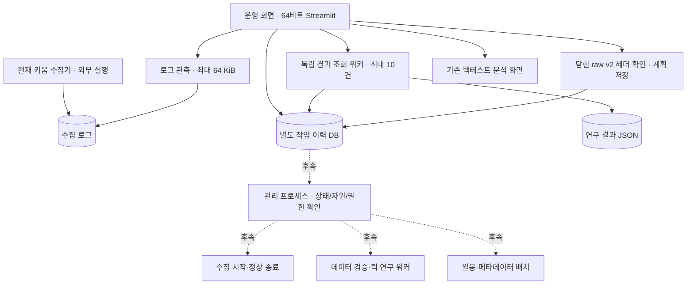
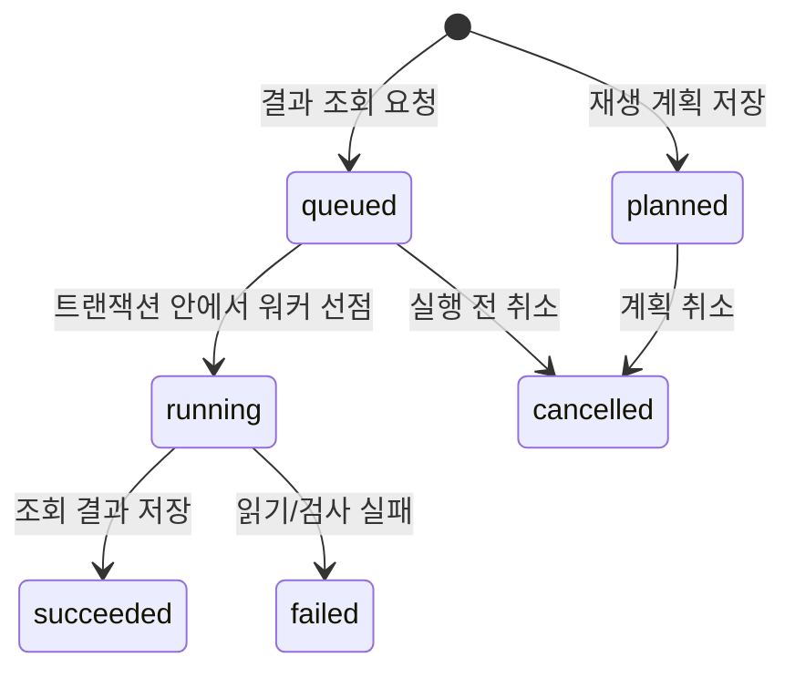

# Stock 컨트롤 타워 — 설계와 1단계 구현

작성: 2026-09-16. 데이터·전략의 기준은 [ARCHITECTURE_TICK.md](ARCHITECTURE_TICK.md),
운영 화면과 실행 관리의 기준은 이 문서다. 아래의 **구현**과 **후속 설계**를 구분한다.

## 1. 결정

**한 화면에서 전체 흐름을 관리하되, 수집·작업 실행·화면은 별도 프로세스로 둔다.**
각 프로그램의 역할이 다른 것은 통합을 막는 이유가 아니다. 중앙에서는 상태와 요청을
관리하고 실제 작업은 담당 프로세스가 수행하면 된다. 폰의 원격 연결이나 브라우저 종료가
수집 종료로 이어지지 않아야 한다.

이번 구현은 기존 Streamlit의 기본 화면을 운영 화면으로 확장한다. 현재 외부에서 실행한
키움 수집기는 관측만 한다. 수집 프로세스를 새로 띄우거나 인수하거나 종료하지 않는다.



실선은 이번 연결, 점선은 후속 설계다. **장외 재생 계획은 자동 실행되지 않는다.**

## 2. 코드에서 확인한 현재 연결

- `dashboard/app.py`: 기존에는 저장된 런 비교가 중심이었다. 지금은 운영 관리/백테스트 분석을 선택한다.
- `dashboard/control_tower.py`: 수집 로그, 결과 조회 요청, 장외 재생 계획, 최근 작업 30건을 표시한다.
- `control_tower/status.py`: 오늘 KST 로그의 끝부분만 읽는다. 최근/오래됨/미확인/시각 이상을 구분한다.
  프로세스 생존, DB 커밋, 무누락, 실제 venue/매수 방향을 인증하지 않는다.
- `control_tower/jobs.py`: `operations_state/jobs.sqlite3`에 작업을 보존한다. 수집 DB와 분리했다.
- `control_tower/service.py`, `scripts/control_worker.py`: 허용된 결과 조회만 별도 프로세스에서 실행한다.
  입력은 `research_runs/**/result.json`으로 제한한다. shell 명령 문자열을 실행하지 않는다.
- `collector/kiwoom/kiwoom_universe_logger.py`: 현재 raw v1 운영 수집기다. 실행 중에 소스를 고쳐도
  이미 메모리에 올라간 프로그램이 바뀌지는 않는다. 종료 저장 개선의 운영 적용을 가정하면 안 된다.
- `collector/raw_v2.py`, `collector/kiwoom/capture_session.py`: 새 기록 형식과 동기식 연결 프로토타입이다.
  큐·실제 Qt 콜백 연결·장외 부하 측정은 미완료다. 현 수집기가 v2를 기록한다고 표시하지 않는다.
- `scripts/run_tick_research.py`: 닫힌 v2 파일을 전체 검사하며 재생하는 기존 오프라인 CLI다.
  화면의 계획 저장은 이 CLI의 인자 검사를 재사용하지만 CLI 실행은 호출하지 않는다.
- `collector/kiwoom/run_meta_batch.py`: 재개 가능한 opt10001 파일럿이다. 별도 로그인 경로이므로
  실시간 수집 중 자동 실행하면 안 된다. 운영 화면에는 연결하지 않았다.
- `collector/run_daily_daemon.py`: 별도 KIS 수집·LOB 후처리 프로그램이다. 키움 전체 관리자로 재사용하지 않는다.
- `execution/broker.py`: 실전 주문까지 완성된 브로커가 아니다. 현재 화면에 모의·실전 주문 기능은 없다.

`runs/`의 기존 Trade/수익률 분석과 `research_runs/`의 틱 진단 결과는 아직 서로 다른 계약이다.
조회 화면을 만들었다고 틱 equity·왕복 거래·성과 비교까지 구현된 것은 아니다.

## 3. 지금 사용할 수 있는 흐름

프로젝트 루트에서 기존 64비트 환경으로 실행한다.

```powershell
.\.venv\Scripts\python.exe -m streamlit run dashboard/app.py --server.address 127.0.0.1
```

브라우저의 `http://127.0.0.1:8501`에서 확인한다. 포트를 이미 쓰는 서버가 있으면 종료하거나
덮어쓰지 말고 먼저 해당 서버를 확인한다. 이번 코드 작업에서 서버를 상시 실행해 두지는 않았다.

1. **운영 관리:** 최근 하트비트의 적재 수와 큐를 확인한다. 새로고침은 수동이다.
2. **결과 조회:** 저장된 `research_runs/<run-id>/result.json` 경로를 입력한다. 요청은 DB에 먼저
   저장하고 워커를 띄운다. 잠시 후 상태 새로고침 → 작업 이력에서 요약을 확인한다.
3. **장외 재생 계획:** `sampledata/raw_ticks_v2/` 아래 파일과 종목·venue·비용·지연 가정을 입력한다.
   헤더가 closed인지 확인하고 계획만 저장한다. 기존 `sampledata/raw_ticks/` v1은 대상이 아니다.
4. **작업 이력:** 대기/계획 단계만 취소한다. 이미 선점된 작업은 이 버튼으로 종료하지 않는다.
5. **백테스트 분석:** 왼쪽 화면 선택으로 기존 런 비교를 연다.

비용률에는 실제로 검증한 편도 비율을 직접 입력한다. 지연/호가 나이의 초기 입력값도 검증된
운영 가정이 아니다. 계획 화면은 입력 원본을 바꾸거나 전체 이벤트를 읽지 않는다.
헤더 조회는 최대 2행·행당 64 KiB까지 가져와 잘못된 크기/행 수를 거부한다.
체크섬·이벤트 순서·데이터 품질은 실제 실행 전에 다시 검증해야 한다.

원격 사용은 당장은 기존 PC 원격 접속 안에서 이 화면을 연다. 인증이 없는 Streamlit을
공개 IP/`0.0.0.0`으로 노출하는 배포는 하지 않는다. 폰 직접 접속은 후속 인증 경로가 필요하다.

## 4. 작업 상태와 실패 의미 — 구현



- 동일 종류/동일 payload의 활성 요청은 하나로 합친다. SQLite 트랜잭션으로 선점과 취소를
  직렬화하고, 선점한 owner만 결과를 기록한다. 성공/실패 후에는 새 요청을 만들 수 있다.
- `succeeded`는 **조회 작업 완료**다. 연구 JSON 자체의 `running`/`failed`는 결과 안에 남고
  화면에서 진단 자료로 경고한다. 미청산 현금을 수익률이나 총자산으로 표시하지 않는다.
- 워커 기동 오류면 `queued`가 남는다. 원인을 해결한 뒤 “대기 중 결과 조회 처리”로 처리한다.
- 워커 강제 중단/PC 재부팅이면 `running`이 남을 수 있다. 시간을 근거로 실패 확정하거나
  자동 재시도하지 않는다. 현재는 생존 재확인·운영자 복구 기능이 없으며 이력을 그대로 보존한다.
- 워커 하나는 최대 10건만 처리하고 끝난다. 화면 연결과 무관하게 동작하지만 PC 종료를 견뎌
  계속 실행되는 서비스는 아니다. 무인 기동/스케줄러/부팅 복구는 아직 없다.
- payload와 요약 결과는 각각 32 KiB, 오류는 2,048자, 원본 결과 조회는 8 MiB로 제한한다.
  더 큰 결과는 조회 실패로 기록하며 원본은 보존한다.
- 경로는 등록 시와 실행 시 다시 검사한다. 조회는 실행 시점 파일 내용을 읽는다.
  계획 저장 당시 헤더와 실제 실행 당시 데이터가 같다는 보장은 없으므로 미래 실행기는 재검증해야 한다.

이 DB는 로컬 단일 사용자 운영 기록이다. 인증·악의적인 로컬 파일 교체 방어를 제공하는
보안 서버가 아니다. 향후 네트워크 API로 직접 노출하지 않고 별도 인증/권한 계층을 둔다.

## 5. 후속 제어 계약

### 5-1. 수집 시작·종료 — 다음 우선순위

먼저 실제 운영 프로세스가 답하는 상태/제어 통로를 만든다. UI가 PID만 보고 임의의 Python을
종료해서는 안 된다. 최소 식별자는 `session_id`, PID와 시작 시각, 실행 파일, 코드 버전,
32/64비트 환경, 서버 구분, 구독 범위, 저장 경로다. 현재 외부 실행 수집기는 그 계약이 없어
자동 인수하지 않는다.

목표 상태는 `starting → login_required → subscribed → receiving → draining → closed`이며
`interrupted/failed/unknown`도 별도로 둔다. 접속 성공·구독 성공·이벤트 수신·디스크 저장을
서로 다른 사실로 보고한다. heartbeat에는 callback 수, 큐 깊이, 마지막 커밋 seq/시각,
저장 실패, 드롭 수, 디스크 여유 공간과 관측 시각이 필요하다.

정상 종료 요청은 다음 순서를 갖는다.

1. 대상 session/프로세스 일치와 명령 ID를 확인한다. 중복 명령에 같은 응답을 준다.
2. 새 입력을 차단하고 이미 받은 큐를 끝까지 저장한다.
3. 최종 commit과 닫힘 매니페스트, 미저장/오류 상태를 기록한다.
4. 그 결과를 확인한 관리자가 수집 종료로 표시한다.

시간 초과는 `unknown/interrupted`다. 즉시 강제 종료하거나 성공으로 바꾸지 않는다.
기존 수집기의 종료 패치를 적용하는 작업도 장외에서 작게 검증하고 커밋 후 다음 세션에 적용한다.

### 5-2. 장외 작업 실행

장외 워커는 조회 워커와 별도로 두고 처음에는 동시 1개로 제한한다. 관리 프로세스가 다음
조건을 검사한 뒤에만 저장된 계획을 실행한다.

- 관리 대상 수집 세션의 종료/저장 완료를 확인했다. 로그가 조용함, 특정 시각 경과, PID 부재만으로 통과시키지 않는다.
- 입력 파일을 다시 확인하고 데이터셋 식별자/체크섬, 코드·설정 버전을 실행 기록에 고정한다.
- v2 형식·연속 순서·시각·제어 이벤트·호가 품질을 검증한다. `closed`만으로 합격시키지 않는다.
- 종목/venue 범위와 방향·가격 정책, 비용·지연 가정이 연구 목적에 충분하다.
- 자원 여유와 작업 배타 조건을 확인했다. 신규 수집 시작과 무거운 작업 시작을 같은
  관리 프로세스에서 조정하여 검사 직후 동시에 시작하는 경쟁을 막는다.

데이터 검증 → 틱 재생 → 결과 게시가 주 경로다. LOB/초봉 변환은 레거시 전용이다.
실패 단계와 산출물을 보존하고 다음 단계의 성공으로 승격하지 않는다. 현재 v1은
별도의 불완전 순서 연구 모드로만 다루며 가짜 v2 순번을 붙이지 않는다.

### 5-3. 일봉·shares·float는 독립 진행 경로

shares 과거 백필 소스 미확정이 당일 스냅샷 축적이나 raw 수집을 막아서는 안 된다.
rev.2의 게이트 범위를 작업 의존성에 그대로 반영한다. 일봉 실제가 검증(D-6), 관측일/PIT,
동일 날짜 재실행 보존은 각 작업의 계약이고, 실패하면 해당 산출물만 연구 입력에서 제외한다.

키움 메타데이터 파일럿은 실제 필드/단위와 로그인 공존 검증 뒤 연결한다. fchart 대규모
전환은 50종목 실측 결과와 정책이 선행한다. pykrx/공공 API 확인은 그 소스를 쓰는 작업에만
영향을 준다. 원문 응답, 결측 이유, 관측일, 재개 지점을 저장한다.

### 5-4. 자동매매와 같은 PC 사용

집 PC에서 수집과 자동매매를 별도 프로세스로 두는 구조는 가능하다. 같은 디스크·CPU·네트워크·
브로커 세션을 쓰므로 자원 격리와 실제 동시 부하 검증은 필요하다. 현재 측정으로 적합성을 인증하지 않는다.
UI가 직접 주문을 전송하지 않으며 주문 명령과 수집 제어를 별도의 권한/상태로 둔다.

OCX 로그인/요청 한도는 공유 자원으로 관리한다. 수집·메타데이터·주문마다 OCX를 무조건
추가 실행하지 않는다. 향후 단일 게이트웨이와 분리 소비자 구성을 우선 검토하되 실제 세션
공존 및 이벤트/주문 동작 검증으로 확정한다. 틱 저장/주문 지연에 영향을 주는 분석은 장외로 보낸다.
주문 전에는 모의 검증, 자본·미체결·손실 한도, 재시작 주문 대조, 긴급 중단 계약이 별도 선행이다.

## 6. 진행 순서와 확인 대기

1. **이번 구현:** 상태 관측·조회 작업 이력·계획 저장·기존 분석 진입점.
2. **장중 독립 가능:** 관리 대상의 식별/명령/응답 계약, 가짜 프로세스로 종료·재기동 상태 전이 검증.
3. **장외 필요:** raw v2 큐 연결, 실제 OCX 필드/서버/venue/부호 확인, 작은 수집·종료·오류 복구 실측.
4. **3 통과 후:** 관리 프로세스에 수집기 시작/종료를 연결하고 종료 데이터 검증을 연결한다.
5. **종료/자원 계약 통과 후:** 저장된 재생 계획 실행, 실데이터 소규모 대조, 결과 비교 확장.
6. **별도 검증 후:** 인증된 원격 접근, 예약/재부팅 복구, 모의매매, 실전 주문 순으로 확장한다.

2는 3의 사용자/실환경 확인을 기다리는 동안 진행할 수 있다. 장외라는 이유만으로
미확인 공급자 의미나 로그인 공존 조건이 자동으로 해결되지는 않는다.

## 7. 검증과 보존

합성 파일로 중복/동시 선점/소유권/취소/워커 중단 기록/경로/입력 크기/결과 상태를 검사한다.
Streamlit AppTest로 초기 화면, 결과 요청, 실패 진단 표시, 계획 저장·취소, 분석 화면 이동을 검사한다.
실제 프로세스 시작 API는 가짜 Popen으로 검증했으며, 원격 연결 단절과 Windows 재부팅 복구는 실측하지 않았다.

`Daily_baseline`, 사용자 `old_data`, 운영 raw, 현재 수집기 세션은 이번 기능의 쓰기 대상이 아니다.
작업 DB와 연구 결과는 Git에서 제외한다. 문서의 완료 문구보다 코드·테스트·실제 운영 관측을 우선한다.
