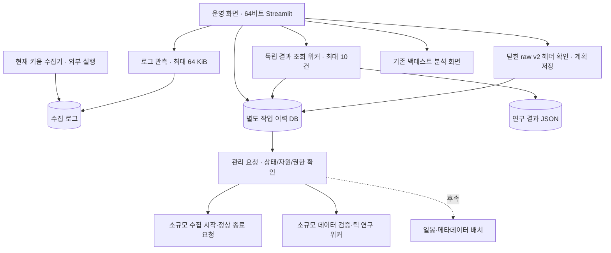
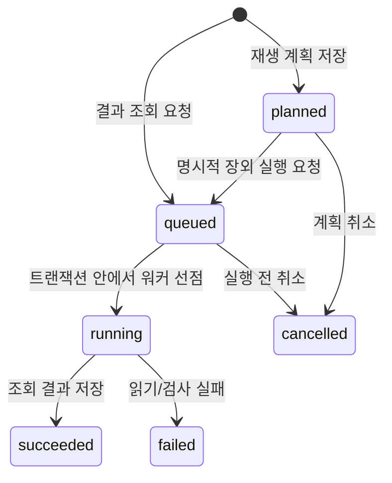

# Stock 컨트롤 타워 — 설계와 구현 상태

작성: 2026-09-16. 데이터·전략의 기준은 [ARCHITECTURE_TICK.md](ARCHITECTURE_TICK.md),
운영 화면과 실행 관리의 기준은 이 문서다. 아래의 **구현**과 **후속 설계**를 구분한다.

[문서 시작점](README.md) · [현재 인계](HANDOFF.md) · [수집 실행 안내](docs/COLLECTION_RUNBOOK.md)

**1단계:** 운영 화면/조회 워커/계획 저장 구현. **2단계:** 제어 계약과 가짜 피어 검증 구현.
**후속 계약:** 관리자/피어 이력·복구 대조, OS 식별·실제 IPC·작은 raw 저장의 합성 검증 구현.
운영 raw v2 콜백·종료/저장, 소규모 관리 수집과 장외 검사·재생 워커를 연결했다. 실피드 검증은 별도다.
상시 challenge/heartbeat, 제어 이력 보관·회전/checkpoint, 장외 1회 예약과 OIDC 접근 차단을 추가했다.
격리된 합성 입력으로 OS 정시 트리거 → 실제 재생 → 중복 차단 → 예약 삭제를 확인했다.
실제 OIDC 로그인/외부 공개와 PC 재부팅은 미실측이다.

## 1. 결정

**한 화면에서 전체 흐름을 관리하되, 수집·작업 실행·화면은 별도 프로세스로 둔다.**
각 프로그램의 역할이 다른 것은 통합을 막는 이유가 아니다. 중앙에서는 상태와 요청을
관리하고 실제 작업은 담당 프로세스가 수행하면 된다. 폰의 원격 연결이나 브라우저 종료가
수집 종료로 이어지지 않아야 한다.

이번 구현은 기존 Streamlit의 기본 화면을 운영 화면으로 확장한다. 현재 외부에서 실행한
키움 수집기는 관측만 한다. 화면에서 새로 만든 소규모 세션은 별도 32비트 자식으로 시작·종료한다.



실선은 이번 연결, 점선은 후속 설계다. **장외 재생 계획은 자동 실행되지 않는다.**

## 2. 코드에서 확인한 현재 연결

- `dashboard/app.py`: 기존에는 저장된 런 비교가 중심이었다. 지금은 운영 관리/백테스트 분석을 선택한다.
- `dashboard/operations.py`: 수집 로그, 결과 조회 요청, 장외 재생 계획, 최근 작업 30건을 표시한다.
- `control_tower/status.py`: 오늘 KST 로그의 끝부분만 읽는다. 최근/오래됨/미확인/시각 이상을 구분한다.
  프로세스 생존, DB 커밋, 무누락, 실제 venue/매수 방향을 인증하지 않는다.
- `control_tower/session_assessment.py`: 수집 세션 근거를 저장·프로세스·native UI·lease·feed freshness·research eligibility 축으로 분리한다. 어느 한 축도 다른 축의 증거로 승격하지 않는다.
- `control_tower/jobs.py`: `operations_state/jobs.sqlite3`에 작업을 보존한다. 수집 DB와 분리했다.
- `control_tower/service.py`, `scripts/control_worker.py`: 허용된 결과 조회만 별도 프로세스에서 실행한다.
  입력은 `research_runs/**/result.json`으로 제한한다. shell 명령 문자열을 실행하지 않는다.
- `collector/kiwoom/kiwoom_universe_logger.py`: 새 실행의 기본 저장은 raw v2다. 실행 중에 소스를 고쳐도
  이미 메모리에 올라간 프로그램이 바뀌지는 않는다. 종료 저장 개선의 운영 적용을 가정하면 안 된다.
- `collector/raw_v2.py`, `collector/kiwoom/capture_session.py`: 새 기록 형식과 동기식 연결 프로토타입이다.
  `queued_capture.py`가 입력 복사·크기 제한 큐·전용 저장 스레드를 연결한다.
  Qt 콜백 연결은 구현했고 실피드·장외 부하 측정은 미완료다.
- `scripts/run_tick_research.py`: 닫힌 v2 파일을 전체 검사하며 재생하는 기존 오프라인 CLI다.
  `offline_worker.py`는 같은 설정/재생 엔진을 사용하며 별도 프로세스에서 제한된 입력을 검사·재생한다.
- `managed_capture.py`: 시작 권한·소유 프로세스·종료 요청/수락·최종 보고와 중단 후 대조를 저장한다.
- `collector/kiwoom/run_meta_batch.py`: 재개 가능한 opt10001 파일럿이다. 별도 로그인 경로이므로
  실시간 수집 중 자동 실행하면 안 된다. 운영 화면에는 연결하지 않았다.
- `collector/run_daily_daemon.py`: 별도 KIS 수집·LOB 후처리 프로그램이다. 키움 전체 관리자로 재사용하지 않는다.
- `execution/broker.py`: 실전 주문까지 완성된 브로커가 아니다. 현재 화면에 모의·실전 주문 기능은 없다.

`runs/`의 기존 Trade/수익률 분석과 `research_runs/`의 틱 진단 결과는 아직 서로 다른 계약이다.
조회 화면을 만들었다고 틱 equity·왕복 거래·성과 비교까지 구현된 것은 아니다.

### 2-1. 세션 상태 축 — 재구축 1단계

2026-09-23 native 장애 조사에서 저장 종료와 OS/native 종료가 같은 사건이 아니라는 것이 직접 확인됐다.
따라서 운영 화면은 더 이상 하나의 `healthy/closed` 판정으로 세션을 요약하지 않는다.
현재 `session_assessment.py`는 다음 근거를 서로 독립된 축으로 유지한다.

| 축 | 대표 상태 | 이 축이 증명하지 않는 것 |
|---|---|---|
| storage | active / draining / closed / interrupted / failed | 프로세스 종료, feed freshness, 데이터 적격성 |
| process | alive / absent / access_denied / mismatch / unverified | native 창 해제, 저장 완료 |
| native UI | clear / runtime_error / ocx_window_present / unverified | process exit, lease 상태 |
| lease | held / free / unverified | OS process exit. **free lease는 종료 증거가 아니다.** |
| feed freshness | recent / stale / lagging / stopped / unverified | Python 저장 큐의 상태나 원천 무누락 |
| research | diagnostic_only / ineligible / eligible / unverified | 저장 종료나 프로세스 생존 |

`termination`은 process/native UI 증거에서만 파생한다. process가 absent이고 관련 native 창도 clear인 경우에만
`verified_exited`로 표현한다. process가 살아 있고 Runtime/OCX 창이 남으면 `residual_native`다.
lease는 이 계산에 일부러 사용하지 않는다.

현재 dashboard 어댑터는 기존 bounded log/status만 읽으므로 storage/feed 외의 축은 근거가 없으면 그대로
`unverified`다. 이 1단계에서 새 PID scan, 창 열거, lease probe, raw DB 검사, qualification을 자동 수행하지 않는다.
향후 로컬 관측 adapter를 추가하더라도 각 결과는 이 축에만 넣고 다른 축의 결론을 대신하지 않는다.

특히 다음 등식은 금지한다.

- `writer_closed=true` 또는 storage `closed` ⇒ OS process exited
- lease `free` ⇒ process exited
- Python queue `0` ⇒ OCX/Qt/provider 앞단 backlog 없음
- 최근 heartbeat ⇒ feed freshness/무누락 인증
- diagnostic raw closed ⇒ research eligible

## 3. 지금 사용할 수 있는 흐름

프로젝트 루트에서 기존 64비트 환경으로 실행한다.

```powershell
.\.venv\Scripts\python.exe -m streamlit run dashboard/app.py --server.address 127.0.0.1
```

브라우저의 `http://127.0.0.1:8501`에서 확인한다. 포트를 이미 쓰는 서버가 있으면 종료하거나
덮어쓰지 말고 먼저 해당 서버를 확인한다. 이번 코드 작업에서 서버를 상시 실행해 두지는 않았다.

1. **운영 관리:** 최근 하트비트의 적재 수와 큐를 확인한다. 새로고침은 수동이다.
2. **결과 조회:** 저장된 `research_runs/<run-id>/result.json` 경로를 입력한다. 요청은 DB에 먼저
   저장하고 워커를 띄운다. 잠시 후 상태 새로고침 → 작업 이력에서 요약을 확인한다.
3. **장외 재생 계획:** `sampledata/raw_ticks_v2/` 아래 파일과 종목·venue·비용·지연 가정을 입력한다.
   헤더가 closed인지 확인하고 계획만 저장한다. 기존 `sampledata/raw_ticks/` v1은 대상이 아니다.
4. **작업 이력:** 대기/계획 단계만 취소한다. 이미 선점된 작업은 이 버튼으로 종료하지 않는다.
5. **백테스트 분석:** 왼쪽 화면 선택으로 기존 런 비교를 연다.
6. **소규모 수집 시작·종료:** 명시한 종목·서버·시간으로 새 수집기를 실행한다. 로그인 창이 열린다.
   종료 요청은 저장/수락/닫기 보고로 구분한다. 중단된 관리 세션은 종료 후 이력 대조를 요청한다.
7. **장외 검사·재생 실행:** 작업 이력에서 저장한 계획을 실행한다. 32 MiB·100,000 raw 이내만 허용하고
   평일 08:00~16:30 및 수집 중에는 차단한다. 시작 실패는 대기로 보존하고 실행 중 중단은 자동 재시도하지 않는다.

비용률에는 실제로 검증한 편도 비율을 직접 입력한다. 지연/호가 나이의 초기 입력값도 검증된
운영 가정이 아니다. 계획 화면은 입력 원본을 바꾸거나 전체 이벤트를 읽지 않는다.
헤더 조회는 최대 2행·행당 64 KiB까지 가져와 잘못된 크기/행 수를 거부한다.
체크섬·이벤트 순서·데이터 품질은 실제 실행 전에 다시 검증해야 한다.

원격 사용은 기본적으로 기존 PC 원격 접속 안에서 이 화면을 연다. 저장소 설정은 127.0.0.1 바인딩이다.
외부 바인딩 시에는 아래 OIDC/허용 운영자 검사를 통과해야 한다. 공개 배포 자체는 하지 않았다.

## 4. 작업 상태와 실패 의미 — 구현



- 동일 종류/동일 payload의 활성 요청은 하나로 합친다. SQLite 트랜잭션으로 선점과 취소를
  직렬화하고, 선점한 owner만 결과를 기록한다. 성공/실패 후에는 새 요청을 만들 수 있다.
- `succeeded`는 **해당 작업 완료**다. 조회한 연구 JSON 자체의 `running`/`failed`는 결과 안에 남고
  화면에서 진단 자료로 경고한다. 미청산 현금을 수익률이나 총자산으로 표시하지 않는다.
- 워커 기동 오류면 `queued`가 남는다. 원인을 해결한 뒤 “대기 중 결과 조회 처리”로 처리한다.
- 워커 강제 중단/PC 재부팅이면 `running`이 남을 수 있다. 시간을 근거로 실패 확정하거나
  자동 재시도하지 않는다. 현재는 생존 재확인·운영자 복구 기능이 없으며 이력을 그대로 보존한다.
- 조회 워커는 최대 10건, 재생 워커는 지정한 1건만 처리하고 끝난다. 화면 연결과 무관하게 동작하지만 PC 종료를 견뎌
  계속 실행되는 서비스는 아니다. 아래 1회 장외 예약 외의 무인 수집/자동 재시작은 없다.
- payload와 요약 결과는 각각 32 KiB, 오류는 2,048자, 원본 결과 조회는 8 MiB로 제한한다.
  더 큰 결과는 조회 실패로 기록하며 원본은 보존한다.
- 경로는 등록 시와 실행 시 다시 검사한다. 조회는 실행 시점 파일 내용을 읽는다.
  재생 워커는 계획 당시 manifest와 현재 값을 대조하고 전체 무결성을 다시 검증한다.

이 DB는 로컬 단일 사용자 운영 기록이다. 인증·악의적인 로컬 파일 교체 방어를 제공하는
보안 서버가 아니다. 향후 네트워크 API로 직접 노출하지 않고 별도 인증/권한 계층을 둔다.

## 5. 제어 계약과 후속 운영 연결

### 5-1. 수집 시작·종료 — 계약과 소규모 관리 연결

먼저 실제 운영 프로세스가 답하는 상태/제어 통로를 만든다. UI가 PID만 보고 임의의 Python을
종료해서는 안 된다. 최소 식별자는 `session_id`, PID와 시작 시각, 실행 파일, 코드 버전,
32/64비트 환경, 서버 구분, 구독 범위, 저장 경로다. 현재 외부 실행 수집기는 그 계약이 없어
자동 인수하지 않는다.

목표 상태는 `starting → login_required → subscribed → receiving → draining → closed`이며
`interrupted/failed/unknown`도 별도로 둔다. 접속 성공·구독 성공·이벤트 수신·디스크 저장을
서로 다른 사실로 보고한다. heartbeat에는 callback 수, 큐 깊이, 마지막 커밋 seq/시각,
저장 실패, 드롭 수, 디스크 여유 공간과 관측 시각이 필요하다.

정상 종료 요청은 다음 순서를 갖는다.

1. 대상 session/프로세스 일치와 명령 ID를 확인한다. 중복 명령에 같은 응답을 준다.
2. 새 입력을 차단하고 이미 받은 큐를 끝까지 저장한다.
3. 최종 commit과 닫힘 매니페스트, 미저장/오류 상태를 기록한다.
4. 그 결과를 확인한 관리자가 수집 종료로 표시한다.

시간 초과는 `unknown/interrupted`다. 즉시 강제 종료하거나 성공으로 바꾸지 않는다.
기존 수집기의 종료 패치를 적용하는 작업도 장외에서 작게 검증하고 커밋 후 다음 세션에 적용한다.

#### 2단계 코드 계약 — `control_tower/lifecycle.py`

- `ProcessIdentity`: session, PID+시작 UTC, 실행 파일, 코드 버전, 비트 수, 서버, 피드 범위,
  데이터 경로를 한 묶음으로 비교한다. PID만 같거나 과거 세션의 응답이면 거부한다.
- `CaptureReport`: 버전 `capture_control_v1`의 32 KiB 이하 JSON이다. 첫 보고는 빈 `starting`,
  이후에는 상태 전이와 연속 revision을 검사한다. 중복 보고는 생존 시각을 갱신하지 않는다.
  미래 전달 계층은 중간 상태/하트비트를 순서대로 보내고 손실 시 누락 보고부터 복구해야 한다.
- callback 수와 accepted/committed 공통 seq를 구분한다. `queued + in_flight = accepted - committed`
  관계를 검사한다. 모든 제어 레코드도 accepted/committed에 포함한다. 콜백 수와 이벤트 수는 같지 않을 수 있다.
- `StopCommand`/`StopReceiver`: 종료 명령은 대상 identity와 request ID에 묶인다. 같은 명령의 재전달은
  입력 중단 동작을 반복하지 않고 기존 응답을 다시 보내도록 한다. 다른 내용의 ID 재사용을 거부한다.
- `CaptureLifecycle`: 입력 중단 → drain → 최종 commit/writer close/종료 표식 일치를 확인한다.
  표식의 마지막 seq, 마지막 이벤트 이후 close 경계, 체크섬 형식까지 대조한다.
  실제 파일 해시나 원천 데이터 품질을 확인하는 것은 아니므로 `data_quality=unverified`다.
- heartbeat와 종료 제한 시간은 관리자의 monotonic 시각을 사용한다. UTC는 식별/표시에만 쓴다.
  제한 시간 경과/연결 단절은 unknown, 알려진 저장 실패/드롭은 정상 종료 실패다.
  같은 명령의 재요청으로 제한 시간을 늘리지 않는다. 늦은 유효 완료 응답으로 unknown을 해소할 수 있다.
- interrupted 이후 receiving 복귀, 수신 중단 후 accepted seq 증가, 계수 역행, 닫힌 파일의 표식 변경을 거부한다.
  새 수집은 새 identity/파일을 갖는 별도 세션이어야 하며 자동 재시작은 구현하지 않았다.

이 상태 머신은 **단일 소유자가 순차 호출하는 메모리 상태와 메시지 계약**이다.
이력 영속화·관리자 복구·OS 식별·IPC는 아래 어댑터에서 처리한다. 운영 프로세스 기동/종료와
디스크 여유 관측은 미연결이다. PID/로그로 상태를 복원하거나
이미 실행 중인 수집기를 이 클래스로 감싸서 인수하지 않는다.
StopReceiver도 메모리 세션 내에서만 중복을 제거한다. 재부팅을 가로지르는 exactly-once 보장이 아니다.

검증은 `tests/test_capture_lifecycle.py`의 가짜 피어로 수행한다. 실제 raw/OCX/프로세스를 열지 않는다.
관리 대상의 시작·정상 종료 계약을 검증한 것이며, 운영 화면에 시작/종료 버튼을 추가한 단계는 아니다.
2단계 검증: lifecycle 41개 + 기존 작업 관리 34개, 합계 75개 통과(1.97초).

#### 제어 이력과 관리자 복구 — `control_tower/capture_history.py`

- `CaptureHistory(root)`는 `operations_state/capture_control.sqlite3`에 등록된 identity,
  heartbeat 제한, 소유권 세대와 순번별 보고/stop/단절/복구 이력을 보존한다.
  WAL/FULL 트랜잭션으로 저장하며 `request_stop()`은 커밋 후에만 명령을 반환한다.
  실제 전송 여부는 이 반환만으로 알 수 없다. 자동 재시도 기능은 없다.
- `register()`는 새 session을 등록한다. `recover(identity)`는 이미 등록한 전체 identity와
  일치할 때만 그 세션의 제어 이력을 같은 상태 머신으로 재검증하고 소유권 세대를 교체한다.
  이전 핸들의 조회/쓰기는 거부한다. 이력 누락·지원하지 않는 스키마·잘못된 전이를 추정 복구하지 않는다.
- 복구 시 과거 monotonic 시각과 생존 정보는 폐기한다. 새 연속 revision을 받아야 현재 상태를
  확인할 수 있고, 같은 보고의 중복 수신은 생존 증거가 아니다. 누락 구간은 피어에서 순서대로
  다시 받아야 하며 최신 snapshot 하나로 건너뛰지 않는다. `reconcile()`은 최대 128개 보고를
  한 트랜잭션으로 검증/저장하고 과거 보고만으로 현재 생존을 복구하지 않는다.
  이후 새 연속 heartbeat가 필요하다. 실제 보고 전송 경로는 아직 없다.
- 복구된 미완료 stop은 이전 deadline을 연장하지 않고 unknown으로 둔다. 저장된 명령은 조회용
  근거이며 `request_stop()`으로 재전달하지 못한다. 일치하는 종료/오류 보고로 결과를 대조한다.
  커밋 뒤 전송 전에 죽은 경우에도 자동 stop을 만들지 않는다. 피어가 명령을 못 받았다면
  unknown이 남으며 운영자의 별도 해결 절차가 필요하다.
- 이미 저장·검증한 closed/명령 실패 결과는 보존한다. closed는 과거 프로토콜 종료 결과이며
  현재 프로세스 생존이나 raw 파일·데이터 품질 인증은 아니다.
- DB 커밋 실패 시 변경 중인 메모리 사본을 버린다. 커밋은 되었지만 호출자가 결과를 받지 못한
  경우에는 이력 순번 불일치로 기존 핸들을 차단하고 명시적 recover가 필요하다.

`dispatch_stop(sender)`는 전송 시도를 먼저 커밋한 뒤 소유권을 다시 검사하고, 동기식 sender의
수락까지 SQLite 소유권 교체를 직렬화한다. 전송 전 관리자가 바뀌면 예전 sender는 호출되지 않는다.
전송 중 예외/중단은 unknown으로 남기고 재시도하지 않는다. sender 반환은 종료 응답이 아니다.
핸들 호출은 순차 실행하고 sender는 짧은 제한 시간 안에 반환해야 하며 같은 저장소를 재호출하면 안 된다.
현재 검증은 가짜 sender다. 실제 IPC의 전송 제한·원격 피어 인증/식별은 별도이며 이미 보낸 명령은 회수하지 못한다.
피어의 StopReceiver는 여전히 메모리 중복 제거다. OS 재부팅·실제 강제 종료 내구성이나
재부팅을 가로지르는 exactly-once는 검증/보장하지 않는다. 복구는 해당 세션의 제어 저널을
순차 재생하며 raw는 열지 않는다. 아래 재생량 제한을 적용하며 장기 운영용 checkpoint는 후속이다.

검증: `tests/test_capture_history.py`의 작은 SQLite 파일과 가짜 보고로 전송 전후 중단,
저장 실패/결과 유실, 소유권 교체, 시각 초기화, 이전 세션·revision 누락, 종료 대조를 검사한다.
UI·운영 프로세스 연결은 별도 단계다. 합성 피어의 실제 IPC 검증과 최신 실행 수치는 HANDOFF에 둔다.

#### 제한 시간 있는 IPC — `control_tower/ipc.py`

- `ControlChannel`은 이미 신뢰가 설정된 소켓을 단일 호출자가 순차 사용한다.
  4바이트 길이 헤더와 최대 32 KiB UTF-8 JSON을 전송하며 기존 엄격한 보고/명령 스키마를 적용한다.
- 기본 1초, 설정 최대 5초다. 수신의 헤더·본문·부분 읽기는 하나의 절대 마감 시간을 공유한다.
  전송은 전체 sendall 호출에 제한 시간을 적용한다. 크기 오류·파싱 오류·부분 프레임·EOF·시간 초과는
  연결을 닫으며 같은 연결로 이어 읽거나 재전송하지 않는다.
- `CaptureConnection`은 보고를 받은 뒤 관리자 단조 시각으로 이력에 저장한다.
  종료 명령은 기존 전송 의도 선저장/소유권 검사 경로를 사용한다. 소켓 전송 성공은 수락/완료가 아니다.
  보고 단절·잘못된 세션·프로토콜 오류는 연결을 닫고 불확실성을 기록한다.
  이미 기록한 유효 closed 보고는 이후 EOF로 취소하지 않는다.
- Windows 테스트는 새 32/64비트 Python 자식에게만 socket.share로 소켓 접근 권한을 전달한다.
  부모와 자식이 OS 식별을 대조하고, 작은 합성 raw 파일의 실제 저장·닫기·체크섬을 확인한다.
  응답 없는 프로세스 정상 종료도 unknown이다. 운영 수집기 시작/재접속 검증은 아니다.
- 이 모듈은 인증·프로세스 생성/검색/인수 API가 아니다. 공개/무인증 리스너에 직접 연결하지 않는다.
  신뢰하는 소켓의 독점 전달과 세션/코드/데이터 경로 승인은 호출자가 담당한다.

#### Windows 프로세스 식별 — `control_tower/windows_process.py`

- 조회·상태 확인 권한으로 대상 핸들을 유지한다. PID·OS 생성 시각·실행 파일·비트 수를
  `ProcessIdentity`와 대조한다. PID를 다시 열어 다른 프로세스로 바꾸거나 종료시키는 API는 없다.
- 생성 시각은 정수 FILETIME에서 Python 3.10과 호환되는 UTC 마이크로초 형식으로 변환한다.
  프로세스 핸들을 연결 수명 동안 유지하며 사용 후 닫는다. 접근 거부/지원하지 않는 아키텍처는 실패한다.
- `CaptureConnection(process=...)`은 연결 시와 실제 stop 전송 직전에 검증한다.
  조회 직후 종료되는 경쟁은 전송 성공으로 인증할 수 없으므로 여전히 최종 보고가 필요하다.
  OS 종료 후 버퍼에 남은 drain 보고는 생존을 갱신하지 않으며 후속 유효 closed 보고는 기록할 수 있다.
- 세션 ID·코드 버전·서버·feed·파일 내용은 OS 조회만으로 인증되지 않는다.
  운영용 시작/독점 채널 전달은 별도 연결이 필요하다. 이미 신뢰가 설정된 재접속 채널의 보고 대조는 아래와 같다.

API 근거: Microsoft의 [GetProcessTimes](https://learn.microsoft.com/en-us/windows/win32/api/processthreadsapi/nf-processthreadsapi-getprocesstimes),
[실행 파일 조회](https://learn.microsoft.com/en-us/windows/win32/api/winbase/nf-winbase-queryfullprocessimagenamew),
[IsWow64Process2](https://learn.microsoft.com/en-us/windows/win32/api/wow64apiset/nf-wow64apiset-iswow64process2).

#### 피어 보고 이력과 재접속 대조 — `control_tower/report_journal.py`

- 세션별 전용 root의 `operations_state/peer_reports.sqlite3`에 보고를 전송하기 전에 저장한다.
  WAL/FULL 트랜잭션으로 revision과 head를 함께 갱신한다. 동일 보고는 중복 저장하지 않으며
  같은 revision의 내용 변경·순번 누락·다른 identity는 거부한다. 저장 실패 시 전송하지 않는다.
- 저장 뒤 송신이 실패해도 보고는 남는다. 재개 시 같은 identity만 열 수 있으며 중단된 stop을
  다시 실행하지 않는다. 이 저장소는 보고 outbox이며 명령 실행/재실행 큐가 아니다.
- replay 요청은 전체 identity·관리자의 마지막 revision·페이지 한도(최대 128)를 담는다.
  응답은 동일 identity·요청 cursor·읽기 트랜잭션 시점 head와 연속 보고를 담는다.
  전체 프레임 32 KiB를 넘기기 전에 페이지를 자른다. 보고 하나도 담을 수 없으면 실패하며 건너뛰지 않는다.
- `CaptureConnection.reconcile_page()`는 호출당 한 페이지만 요청한다. cursor/identity/개수/순서를
  대조한 뒤 기존 관리자 reducer로 페이지 전체를 원자적으로 적용한다. 중간 단절·잘못된 후속 상태는
  페이지를 부분 반영하지 않는다. 이후 호출은 저장된 마지막 revision부터 이어 간다.
- 이력과 빈 페이지는 heartbeat가 아니다. 과거 receiving은 unknown을 유지하고, 이미 보낸 stop에
  대응하는 유효 closed 보고만 종료 결과를 확정한다. 새로운 실시간 보고로만 생존을 갱신한다.
- 실제 32/64비트 합성 자식이 작은 raw를 닫은 뒤, 복구한 관리자가 별도 공유 소켓으로 누락된
  drain/closed를 받아 manifest를 대조했다. 소켓 인증·재접속 발견/예약·OS 재부팅/강제 종료 내구성은
  별도 범위다. 소켓 피어 명령 latch는 메모리이며 운영 mailbox는 별도의 내구성 latch를 사용한다.
  소켓 관리자 재생 압축은 후속이고 운영 제어 이력 보관/회전은 §5-5를 본다.

#### 이력 예산 — `control_tower/history_limits.py`

- 피어 저널 기본 한도는 세션당 100,000보고와 UTF-8 payload 128 MiB다. 건수/용량 중 하나라도
  넘는 새 보고는 저장·송신하지 않는다. 기존 보고와 동일한 중복은 한도에서도 읽고 재전송할 수 있다.
  보고 삭제나 revision 건너뛰기, 한도 자동 확대는 하지 않는다.
- 스키마 v2는 한도와 누적 payload 바이트를 저장한다. 한도 정책이 다른 객체로 다시 열면 실패한다.
  보고 삽입·head·용량 계수는 한 트랜잭션이다. v1 전환은 설정 건수 안에서 순번·크기를 검사하고,
  범위를 벗어나면 payload/스키마를 그대로 보존한 채 실패한다.
- 관리자 복구 기본 한도는 세션당 100,000이력 이벤트·payload 128 MiB·재생 반복 2초다.
  SQL 행 수를 제한하고 8 MiB 초과 단일 이벤트는 Python으로 가져오지 않는다.
  메타데이터의 건수뿐 아니라 실제 읽은 건수/바이트도 검사한다. 초과 시 recovery 이벤트·generation을
  갱신하지 않으므로 기존 관리자 소유권이 유지된다. 재생 도중 적용한 상태도 외부에 노출하지 않는다.
- 설정 상한은 1,000,000건·1 GiB·30초다. 시간 검사는 재생 반복의 협력적 제한이며 OS I/O·잠금·커밋의
  강제 중단 기한은 아니다. 바이트는 payload 기준으로 SQLite 페이지/WAL·메타데이터를 포함한 디스크
  사용량 제한이 아니다. 디스크 진입 검사와 운영 제어 이력 보관·회전/checkpoint는 §5-5를 본다.

#### raw v2 큐와 저장 워커 — `collector/kiwoom/queued_capture.py`

- 콜백 호출자는 원문 FID·진입 시각을 제공한다. 입력 복사와 제한 검사 후 단일 FIFO로 넘기며,
  `CaptureSession` 생성·정규화·SQLite 저장·닫기는 전용 스레드에서 수행한다.
- 기본 큐 1,024콜백, 워커 배치 128콜백, 입력 JSON 64 KiB 제한이다. 최대 대기량은 큐와
  저장 중 배치를 합쳐 해석한다. 원문 객체의 사후 변경이 저장 내용을 바꾸지 않게 복사한다.
- 수신 중단과 큐 추가를 같은 잠금으로 직렬화한다. 정상 stop은 모든 배치를 커밋하고 마지막 입력보다
  뒤의 close 경계로 마감한다. 파일 연결 닫기까지 성공해야 closed다. wait 제한 시간 초과는 완료가 아니다.
- overflow/잘못된 입력은 수신을 중단하고 이미 받은 입력을 저장한다. 가능한 오류 표식을 남기되
  파일은 incomplete로 둔다. 이미 받은 후속 콜백은 오류 제어 레코드 안에 원문을 보존한다.
  저장 실패 시 queued/in-flight/미확인 커밋 수를 남기며 새 파일/세션 없이 재사용하지 않는다.
- 콜백 수와 raw 공통 seq는 다르다. session_start/parse_error 등도 raw seq를 사용한다.
  콜백 큐 크기를 제어 프로토콜의 accepted_seq로 바로 복사하면 안 된다.

`queue_control.py`의 `QueueStopReports`는 종료 보고를 연결한다. 입력을 멈추고 모든 콜백의
정규화·커밋이 끝난 뒤 실제 raw 순번으로 draining을 생성한다. 이 보고를 보낸 뒤 finalize를
허용하고 SQLite 닫기까지 성공해야 실제 manifest의 순번·close 경계·체크섬을 closed로 보고한다.
저장 대기 중에는 stop이 pending이며, 아직 확정되지 않은 raw 수를 추정한 조기 ack는 만들지 않는다.
콜백 1건에 파싱 오류가 있으면 session_start/체결/parse_error를 합친 raw 3건으로 보고한다.
closed는 파일 마감 증거이며 파싱 오류가 없는 데이터라는 뜻이 아니다.

단계별 종료는 선택 사항이고 기존 request_stop 기본 동작은 자동 마감이다. held drain은
별도 워커에서도 최대 5초까지만 기다린다. 보고 생성기를 닫거나 제한 시간이 지나면 incomplete로
남긴다. 송신 실패 시 호출자는 생성기를 닫아야 한다. finish/파일 닫기 실패에는 closed가 없다.
운영 수집기 `live_capture.py`도 위 보고 저널로 로컬 종료를 기록한다. 로컬 종료 보고에는
원격 stop_request_id를 붙이지 않는다. 수집 중 상태 관측은 별도 파일 형식이며 제어 heartbeat가 아니다.

#### 운영 진입점과 상태 관측

`kiwoom_universe_logger.py`의 기본 저장 방식은 raw v2다. 다음 새 실행부터 적용되며,
기존 raw v1은 명시적 `--storage raw-v1` 호환 경로로 보존한다. 원문 FID 추출은 Qt 스레드,
정규화/SQLite 작업은 큐 워커가 담당한다. 서버 확인·구독 거부·연결 단절·FID 읽기 오류를 처리하며
알 수 없는 방향/venue는 채우지 않는다. 단일 CLI 잠금은 추가 OCX 객체 생성 전에 획득한다.

`status.py`는 `operations_state/capture_status.json` 한 파일을 최대 64 KiB 읽는다.
화면은 접수 콜백·커밋 raw 레코드·미커밋 콜백을 구분하며, 30초 초과/미래 시각을 경고한다.
파일은 생존/데이터 품질 인증이나 명령 응답이 아니다. 상태 표시는 raw DB를 열지 않는다.
운영 제어는 아래 로컬 내구성 mailbox와 challenge/heartbeat를 사용한다. 원격 소켓 서비스는 별도 범위다.
실행 옵션·환경 점검·검증 범위는 [수집 안내](docs/COLLECTION_RUNBOOK.md)를 본다.

`scripts/probe_raw_v2_queue.py`는 새 합성 파일만 생성하는 32/64비트 점검 도구다.
양쪽 Python에서 500콜백 → 제어 포함 501레코드 저장·종료·체크섬 재읽기를 확인했다.
실제 OCX 콜백·원천 필드·수집 부하·프로세스 강제 종료 검증이나 기존 수집기 배포는 아니다.

### 5-2. 장외 작업 실행

**현재 연결:** `managed_capture.py`는 같은 체크아웃/Windows 계정을 신뢰 경계로 삼는 로컬 SQLite
mailbox다. 기존 소켓 제어 계약을 원격 서비스로 배포한 것이 아니다. 토큰은 자식 환경으로 전달하고
해시만 저장하며, 32비트 실행 파일·OS 생성 시각·PID를 새 세션과 연결한다. 수락을 저장한 후 Qt가
종료하므로 관리 화면이 재시작해도 중복 실행하지 않는다. 5초 갱신 시각은 관측 자료이며 생존 인증이 아니다.
전체 보고의 raw 수는 drain 후 확정하고 수집 중 콜백 backlog를 임의 raw 순번으로 변환하지 않는다.
단일 수집 잠금 아래 종료된 소유 프로세스의 시작/배출/닫기 보고 최대 3개를 대조하며, 완전한 closed
보고가 없으면 failed로 남긴다. 접근 거부·잠금 충돌은 종료 증거가 아니다. 원본 검사/품질 인증은 별도다.

`offline_worker.py`는 동일 수집 잠금을 실행 동안 유지한다. 활성 관리 요청·최근 로그·장중 시각을
차단하고 계획 당시 manifest와 현재 헤더를 대조한다. 32 MiB·10만 레코드 제한 안에서 전체 체크섬을
검사한 뒤 연구 엔진을 실행한다. 품질 오류나 설정/입력 교체는 실패로 보존한다.
원격 인증·예약·이력 유지 절차는 §5-5에 있고, 대규모 부하 인증은 포함하지 않는다.

새 관리 기동·raw 저장 시작·장외 워커 진입은 대상 볼륨에 최소 256 MiB 여유가 있어야 한다.
이는 기동 차단 기준이며 세션 전체 공간 예약이나 성능 보장이 아니다. 실행 중 저장 오류는 기존
중단/불완전 기록 경로로 처리하고 공간 확보를 위해 원본이나 이력을 자동 삭제하지 않는다.

장외 워커는 조회 워커와 별도로 두고 처음에는 동시 1개로 제한한다. 관리 프로세스가 다음
조건을 검사한 뒤에만 저장된 계획을 실행한다.

- 관리 대상 수집 세션의 종료/저장 완료를 확인했다. 로그가 조용함, 특정 시각 경과, PID 부재만으로 통과시키지 않는다.
- 입력 파일을 다시 확인하고 데이터셋 식별자/체크섬, 코드·설정 버전을 실행 기록에 고정한다.
- v2 형식·연속 순서·시각·제어 이벤트·호가 품질을 검증한다. `closed`만으로 합격시키지 않는다.
- 종목/venue 범위와 방향·가격 정책, 비용·지연 가정이 연구 목적에 충분하다.
- 자원 여유와 작업 배타 조건을 확인했다. 신규 수집 시작과 무거운 작업 시작을 같은
  관리 프로세스에서 조정하여 검사 직후 동시에 시작하는 경쟁을 막는다.

데이터 검증 → 틱 재생 → 결과 게시가 주 경로다. LOB/초봉 변환은 레거시 전용이다.
실패 단계와 산출물을 보존하고 다음 단계의 성공으로 승격하지 않는다. 현재 v1은
별도의 불완전 순서 연구 모드로만 다루며 가짜 v2 순번을 붙이지 않는다.

### 5-3. 일봉·shares·float는 독립 진행 경로

shares 과거 백필 소스 미확정이 당일 스냅샷 축적이나 raw 수집을 막아서는 안 된다.
rev.2의 게이트 범위를 작업 의존성에 그대로 반영한다. 일봉 실제가 검증(D-6), 관측일/PIT,
동일 날짜 재실행 보존은 각 작업의 계약이고, 실패하면 해당 산출물만 연구 입력에서 제외한다.

키움 메타데이터 파일럿은 실제 필드/단위와 로그인 공존 검증 뒤 연결한다. fchart 대규모
전환은 50종목 실측 결과와 정책이 선행한다. pykrx/공공 API 확인은 그 소스를 쓰는 작업에만
영향을 준다. 원문 응답, 결측 이유, 관측일, 재개 지점을 저장한다.

### 5-4. 자동매매와 같은 PC 사용

집 PC에서 수집과 자동매매를 별도 프로세스로 두는 구조는 가능하다. 같은 디스크·CPU·네트워크·
브로커 세션을 쓰므로 자원 격리와 실제 동시 부하 검증은 필요하다. 현재 측정으로 적합성을 인증하지 않는다.
UI가 직접 주문을 전송하지 않으며 주문 명령과 수집 제어를 별도의 권한/상태로 둔다.

OCX 로그인/요청 한도는 공유 자원으로 관리한다. 수집·메타데이터·주문마다 OCX를 무조건
추가 실행하지 않는다. 향후 단일 게이트웨이와 분리 소비자 구성을 우선 검토하되 실제 세션
공존 및 이벤트/주문 동작 검증으로 확정한다. 틱 저장/주문 지연에 영향을 주는 분석은 장외로 보낸다.
주문 전에는 모의 검증, 자본·미체결·손실 한도, 재시작 주문 대조, 긴급 중단 계약이 별도 선행이다.

### 5-5. 상시 응답·이력 유지·예약·접근 제어

**제어 heartbeat:** `managed_capture.py` 스키마 v2는 소유 프로세스만 5초마다 heartbeat 순번과
현재 challenge 응답을 저장한다. 화면의 `CaptureHealth`는 OS의 PID/생성 시각/실행 파일/비트를
대조하고 새 challenge를 보낸 뒤 응답을 기다린다. 관리자 재시작은 항상 unknown에서 시작한다.
중복 순번·UTC 갱신만으로 생존 시간을 연장하지 않으며, 관리자 단조 시계로 15초 경과 시 다시
unknown으로 전환한다. 화면 제어 영역은 5초마다 갱신하며 자동 종료/재시작은 하지 않는다.
여러 화면이 동시에 challenge를 바꾸면 일시적으로 unknown이 될 수 있다. heartbeat는 Qt 제어 응답이며
실피드 수신·저장 속도·데이터 품질 인증이 아니다. raw 순번/backlog는 기존 별도 계약을 유지한다.

**보관·회전/checkpoint:** `scripts/maintain_control_history.py jobs` 또는 `managed_captures`는
장외·수집 잠금·미해결 실행·디스크 여유를 확인한 뒤 최대 64 MiB의 제어 DB/WAL만 처리한다.
SQLite 일관된 백업 → quick_check → SHA256·파일 동기화 → 보관 증거 → 원본 checkpoint 순서다.
기본은 원본 행을 보존한다. `--prune-before 2026-08-01T00:00:00+09:00`처럼 명시할 때만
최소 최근 30일을 남기고 더 오래된 terminal 행/관련 audit·예약을 원본에서 회전한다. 원본 DB의
`history_archives` receipt와 보관 DB에 이력이 남는다. 백업 완료 전 실패는 원본 행을 삭제하지 않는다.
백업 반복은 협력적 5초 제한이며 OS I/O 강제 기한은 아니다. checkpoint busy는 결과 값으로 남긴다.
raw/Daily/피어 저널은 대상이 아니다. active 관리자 전체 이력의 압축 checkpoint와 원격 소켓 서비스는 별도다.

**장외 1회 예약:** 계획별로 1분~7일 뒤 시각을 지정하면 SQLite에 예약 의도를 먼저 저장한 뒤
현재 Windows 사용자의 InteractiveToken/LeastPrivilege 작업을 등록한다. 고정 pythonw/스크립트/
job ID만 실행한다. 암호를 저장하거나 기존 OS 작업을 덮어쓰지 않는다. PC 전원·로그인이 필요하다.
`StartWhenAvailable=false`, 5분 만료 창을 사용하고 DB의 dispatch latch로 중복 트리거를 막는다.
등록 불확실성/재부팅 뒤 누락/실행 도중 중단은 자동 재시도하지 않는다. “지난 예약 대조”는 최대 100개
만료 상태만 바꾸고, 기존 취소 버튼은 저장된 예약도 취소한다. OS에 남은 기록은 보존하며 지연 호출이
오더라도 취소/만료 latch가 실행을 막는다. XML은 Windows COM 파서로 수용을 확인했고,
격리된 표식 전용 OS 작업의 등록·수동 실행·삭제와 합성 호가 1건의 정시 재생을 확인했다.
정시 진단은 `scripts/probe_replay_scheduler.py --execute --scheduled-replay`다. 약 75초 뒤 예약하고
최대 110초 관측하며 실제 재생 코드·워커·SQLite 이력을 사용한다. 별도 인터프리터의 재호출이
결과를 중복 생성하지 않는지도 확인한다. 운영 데이터와 OCX는 사용하지 않고 진단 예약만 삭제한다.
`--scheduled-replay`를 생략하면 기존 표식 수동 실행 진단이다. 두 결과를 구분한다.
디스패치 직후/워커 수락 직후 자식 프로세스 강제 종료 후에도 재실행되지 않는 합성 테스트를 추가했다.
이는 PC 재부팅·전원 손실 내구성 실측을 대체하지 않는다.
[Microsoft 스키마](https://learn.microsoft.com/en-us/windows/win32/taskschd/task-scheduler-schema) 기준이다.

**원격 인증:** `dashboard/access.py`는 모든 화면 진입점과 제어 fragment에 동일한 검사를 적용한다.
외부 바인딩 또는 `stock_access.require_auth=true`면 OIDC와 정확한 issuer/subject 허용 목록,
만료되지 않은 exp가 필요하다. 이메일/표시 이름으로 권한을 추정하지 않는다. 설정이 없으면 기능을 차단한다.
기본 localhost에서는 기존 PC 원격 접속을 계속 쓸 수 있다. reverse proxy를 localhost에 연결할 때도
`require_auth=true`를 설정해야 한다. TLS 도메인/IdP 앱 등록은 외부 설정이며 자동 생성하지 않았다.

`.streamlit/secrets.toml`은 Git 제외다. 실제 IdP에서 받은 값만 넣는다(아래 값은 실행용이 아니다).

```toml
[auth]
redirect_uri = "https://YOUR_HOST/oauth2callback"
cookie_secret = "YOUR_RANDOM_SECRET"
client_id = "YOUR_CLIENT_ID"
client_secret = "YOUR_CLIENT_SECRET"
server_metadata_url = "https://YOUR_ISSUER/.well-known/openid-configuration"

[stock_access]
require_auth = true
operators = [{issuer = "YOUR_EXACT_ISSUER", subject = "YOUR_OPERATOR_SUBJECT"}]
```

`uv sync --locked`로 `streamlit[auth]` 의존성을 설치한다. 실제 OIDC 왕복 인증·외부 TLS 노출은 미검증이다.
공식 근거: [Streamlit 인증](https://docs.streamlit.io/develop/concepts/connections/authentication).

## 6. 진행 순서와 확인 대기

1. **이번 구현:** 상태 관측·조회 작업 이력·계획 저장·기존 분석 진입점.
2. **구현/합성 검증:** 관리 대상 식별/명령/응답 계약, 가짜 피어의 종료·이전 세션 메시지 차단.
   명령 이력·관리자 복구·가짜 sender의 전송 소유권·누락 보고 대조도 합성 검증했다.
   제한 시간 있는 IPC와 실제 32/64비트 합성 자식 통신도 검증했다.
   OS 식별 검증과 raw v2 종료 보고·manifest 대조도 합성 자식에서 검증했다.
   피어 보고 영속화와 새 소켓의 누락 보고 대조도 합성 검증했다.
   소규모 관리 시작·로컬 mailbox·Qt 종료와 관리자 중단 후 대조까지 연결했다.
3. **실환경 필요:** 운영 기본 콜백/큐 연결은 반영했다. 실제 필드/서버/venue/부호 확인, 작은 수집·종료·오류 복구 실측은 남아 있다.
4. **독립 구현:** 화면의 소규모 수집 제어와 장외 검사·재생은 합성 검증했다. 실피드 검증을 대체하지 않는다.
5. **실환경 검증 후:** 전 종목 확장, 실데이터 소규모 대조, 결과 비교 확장.
6. **별도 검증 후:** 인증된 원격 접근, 예약/재부팅 복구, 모의매매, 실전 주문 순으로 확장한다.

2의 독립 후속은 3의 사용자/실환경 확인을 기다리는 동안 진행할 수 있다. 장외라는 이유만으로
미확인 공급자 의미나 로그인 공존 조건이 자동으로 해결되지는 않는다.

## 7. 검증과 보존

합성 파일로 중복/동시 선점/소유권/취소/워커 중단 기록/경로/입력 크기/결과 상태를 검사한다.
Streamlit AppTest로 초기 화면, 결과 요청, 실패 진단 표시, 계획 저장·취소, 분석 화면 이동을 검사한다.
실제 프로세스 시작 API는 가짜 Popen으로 검증했으며, 원격 연결 단절과 Windows 재부팅 복구는 실측하지 않았다.

`Daily_baseline`, 사용자 `old_data`, 운영 raw, 현재 수집기 세션은 이번 기능의 쓰기 대상이 아니다.
작업 DB와 연구 결과는 Git에서 제외한다. 문서의 완료 문구보다 코드·테스트·실제 운영 관측을 우선한다.
