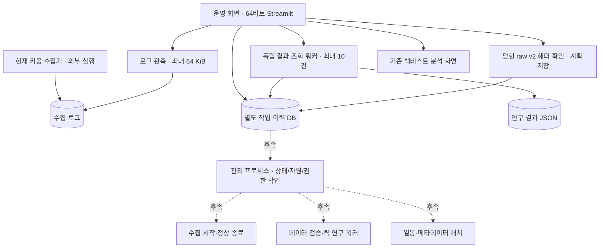
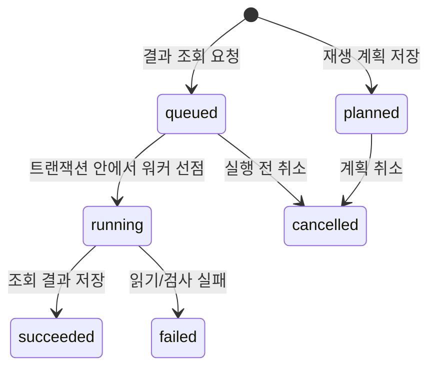

# Stock 컨트롤 타워 — 설계와 구현 상태

작성: 2026-09-16. 데이터·전략의 기준은 [ARCHITECTURE_TICK.md](ARCHITECTURE_TICK.md),
운영 화면과 실행 관리의 기준은 이 문서다. 아래의 **구현**과 **후속 설계**를 구분한다.

[문서 시작점](README.md) · [현재 인계](HANDOFF.md) · [수집 실행 안내](docs/COLLECTION_RUNBOOK.md)

**1단계:** 운영 화면/조회 워커/계획 저장 구현. **2단계:** 제어 계약과 가짜 피어 검증 구현.
**후속 계약:** 제어 이력 영속화·관리자 복구의 합성 검증 구현.
실제 수집기 제어/IPC, 운영 관리자 연결, 운영 raw v2 연결은 후속이다.

## 1. 결정

**한 화면에서 전체 흐름을 관리하되, 수집·작업 실행·화면은 별도 프로세스로 둔다.**
각 프로그램의 역할이 다른 것은 통합을 막는 이유가 아니다. 중앙에서는 상태와 요청을
관리하고 실제 작업은 담당 프로세스가 수행하면 된다. 폰의 원격 연결이나 브라우저 종료가
수집 종료로 이어지지 않아야 한다.

이번 구현은 기존 Streamlit의 기본 화면을 운영 화면으로 확장한다. 현재 외부에서 실행한
키움 수집기는 관측만 한다. 수집 프로세스를 새로 띄우거나 인수하거나 종료하지 않는다.



실선은 이번 연결, 점선은 후속 설계다. **장외 재생 계획은 자동 실행되지 않는다.**

## 2. 코드에서 확인한 현재 연결

- `dashboard/app.py`: 기존에는 저장된 런 비교가 중심이었다. 지금은 운영 관리/백테스트 분석을 선택한다.
- `dashboard/control_tower.py`: 수집 로그, 결과 조회 요청, 장외 재생 계획, 최근 작업 30건을 표시한다.
- `control_tower/status.py`: 오늘 KST 로그의 끝부분만 읽는다. 최근/오래됨/미확인/시각 이상을 구분한다.
  프로세스 생존, DB 커밋, 무누락, 실제 venue/매수 방향을 인증하지 않는다.
- `control_tower/jobs.py`: `operations_state/jobs.sqlite3`에 작업을 보존한다. 수집 DB와 분리했다.
- `control_tower/service.py`, `scripts/control_worker.py`: 허용된 결과 조회만 별도 프로세스에서 실행한다.
  입력은 `research_runs/**/result.json`으로 제한한다. shell 명령 문자열을 실행하지 않는다.
- `collector/kiwoom/kiwoom_universe_logger.py`: 현재 raw v1 운영 수집기다. 실행 중에 소스를 고쳐도
  이미 메모리에 올라간 프로그램이 바뀌지는 않는다. 종료 저장 개선의 운영 적용을 가정하면 안 된다.
- `collector/raw_v2.py`, `collector/kiwoom/capture_session.py`: 새 기록 형식과 동기식 연결 프로토타입이다.
  `queued_capture.py`가 입력 복사·크기 제한 큐·전용 저장 스레드를 연결한다.
  실제 Qt 콜백 연결·장외 부하 측정은 미완료다. 현 수집기가 v2를 기록한다고 표시하지 않는다.
- `scripts/run_tick_research.py`: 닫힌 v2 파일을 전체 검사하며 재생하는 기존 오프라인 CLI다.
  화면의 계획 저장은 이 CLI의 인자 검사를 재사용하지만 CLI 실행은 호출하지 않는다.
- `collector/kiwoom/run_meta_batch.py`: 재개 가능한 opt10001 파일럿이다. 별도 로그인 경로이므로
  실시간 수집 중 자동 실행하면 안 된다. 운영 화면에는 연결하지 않았다.
- `collector/run_daily_daemon.py`: 별도 KIS 수집·LOB 후처리 프로그램이다. 키움 전체 관리자로 재사용하지 않는다.
- `execution/broker.py`: 실전 주문까지 완성된 브로커가 아니다. 현재 화면에 모의·실전 주문 기능은 없다.

`runs/`의 기존 Trade/수익률 분석과 `research_runs/`의 틱 진단 결과는 아직 서로 다른 계약이다.
조회 화면을 만들었다고 틱 equity·왕복 거래·성과 비교까지 구현된 것은 아니다.

## 3. 지금 사용할 수 있는 흐름

프로젝트 루트에서 기존 64비트 환경으로 실행한다.

```powershell
.\.venv\Scripts\python.exe -m streamlit run dashboard/app.py --server.address 127.0.0.1
```

브라우저의 `http://127.0.0.1:8501`에서 확인한다. 포트를 이미 쓰는 서버가 있으면 종료하거나
덮어쓰지 말고 먼저 해당 서버를 확인한다. 이번 코드 작업에서 서버를 상시 실행해 두지는 않았다.

1. **운영 관리:** 최근 하트비트의 적재 수와 큐를 확인한다. 새로고침은 수동이다.
2. **결과 조회:** 저장된 `research_runs/<run-id>/result.json` 경로를 입력한다. 요청은 DB에 먼저
   저장하고 워커를 띄운다. 잠시 후 상태 새로고침 → 작업 이력에서 요약을 확인한다.
3. **장외 재생 계획:** `sampledata/raw_ticks_v2/` 아래 파일과 종목·venue·비용·지연 가정을 입력한다.
   헤더가 closed인지 확인하고 계획만 저장한다. 기존 `sampledata/raw_ticks/` v1은 대상이 아니다.
4. **작업 이력:** 대기/계획 단계만 취소한다. 이미 선점된 작업은 이 버튼으로 종료하지 않는다.
5. **백테스트 분석:** 왼쪽 화면 선택으로 기존 런 비교를 연다.

비용률에는 실제로 검증한 편도 비율을 직접 입력한다. 지연/호가 나이의 초기 입력값도 검증된
운영 가정이 아니다. 계획 화면은 입력 원본을 바꾸거나 전체 이벤트를 읽지 않는다.
헤더 조회는 최대 2행·행당 64 KiB까지 가져와 잘못된 크기/행 수를 거부한다.
체크섬·이벤트 순서·데이터 품질은 실제 실행 전에 다시 검증해야 한다.

원격 사용은 당장은 기존 PC 원격 접속 안에서 이 화면을 연다. 인증이 없는 Streamlit을
공개 IP/`0.0.0.0`으로 노출하는 배포는 하지 않는다. 폰 직접 접속은 후속 인증 경로가 필요하다.

## 4. 작업 상태와 실패 의미 — 구현



- 동일 종류/동일 payload의 활성 요청은 하나로 합친다. SQLite 트랜잭션으로 선점과 취소를
  직렬화하고, 선점한 owner만 결과를 기록한다. 성공/실패 후에는 새 요청을 만들 수 있다.
- `succeeded`는 **조회 작업 완료**다. 연구 JSON 자체의 `running`/`failed`는 결과 안에 남고
  화면에서 진단 자료로 경고한다. 미청산 현금을 수익률이나 총자산으로 표시하지 않는다.
- 워커 기동 오류면 `queued`가 남는다. 원인을 해결한 뒤 “대기 중 결과 조회 처리”로 처리한다.
- 워커 강제 중단/PC 재부팅이면 `running`이 남을 수 있다. 시간을 근거로 실패 확정하거나
  자동 재시도하지 않는다. 현재는 생존 재확인·운영자 복구 기능이 없으며 이력을 그대로 보존한다.
- 워커 하나는 최대 10건만 처리하고 끝난다. 화면 연결과 무관하게 동작하지만 PC 종료를 견뎌
  계속 실행되는 서비스는 아니다. 무인 기동/스케줄러/부팅 복구는 아직 없다.
- payload와 요약 결과는 각각 32 KiB, 오류는 2,048자, 원본 결과 조회는 8 MiB로 제한한다.
  더 큰 결과는 조회 실패로 기록하며 원본은 보존한다.
- 경로는 등록 시와 실행 시 다시 검사한다. 조회는 실행 시점 파일 내용을 읽는다.
  계획 저장 당시 헤더와 실제 실행 당시 데이터가 같다는 보장은 없으므로 미래 실행기는 재검증해야 한다.

이 DB는 로컬 단일 사용자 운영 기록이다. 인증·악의적인 로컬 파일 교체 방어를 제공하는
보안 서버가 아니다. 향후 네트워크 API로 직접 노출하지 않고 별도 인증/권한 계층을 둔다.

## 5. 제어 계약과 후속 운영 연결

### 5-1. 수집 시작·종료 — 계약 구현, 실제 연결 대기

먼저 실제 운영 프로세스가 답하는 상태/제어 통로를 만든다. UI가 PID만 보고 임의의 Python을
종료해서는 안 된다. 최소 식별자는 `session_id`, PID와 시작 시각, 실행 파일, 코드 버전,
32/64비트 환경, 서버 구분, 구독 범위, 저장 경로다. 현재 외부 실행 수집기는 그 계약이 없어
자동 인수하지 않는다.

목표 상태는 `starting → login_required → subscribed → receiving → draining → closed`이며
`interrupted/failed/unknown`도 별도로 둔다. 접속 성공·구독 성공·이벤트 수신·디스크 저장을
서로 다른 사실로 보고한다. heartbeat에는 callback 수, 큐 깊이, 마지막 커밋 seq/시각,
저장 실패, 드롭 수, 디스크 여유 공간과 관측 시각이 필요하다.

정상 종료 요청은 다음 순서를 갖는다.

1. 대상 session/프로세스 일치와 명령 ID를 확인한다. 중복 명령에 같은 응답을 준다.
2. 새 입력을 차단하고 이미 받은 큐를 끝까지 저장한다.
3. 최종 commit과 닫힘 매니페스트, 미저장/오류 상태를 기록한다.
4. 그 결과를 확인한 관리자가 수집 종료로 표시한다.

시간 초과는 `unknown/interrupted`다. 즉시 강제 종료하거나 성공으로 바꾸지 않는다.
기존 수집기의 종료 패치를 적용하는 작업도 장외에서 작게 검증하고 커밋 후 다음 세션에 적용한다.

#### 2단계 코드 계약 — `control_tower/lifecycle.py`

- `ProcessIdentity`: session, PID+시작 UTC, 실행 파일, 코드 버전, 비트 수, 서버, 피드 범위,
  데이터 경로를 한 묶음으로 비교한다. PID만 같거나 과거 세션의 응답이면 거부한다.
- `CaptureReport`: 버전 `capture_control_v1`의 32 KiB 이하 JSON이다. 첫 보고는 빈 `starting`,
  이후에는 상태 전이와 연속 revision을 검사한다. 중복 보고는 생존 시각을 갱신하지 않는다.
  미래 전달 계층은 중간 상태/하트비트를 순서대로 보내고 손실 시 누락 보고부터 복구해야 한다.
- callback 수와 accepted/committed 공통 seq를 구분한다. `queued + in_flight = accepted - committed`
  관계를 검사한다. 모든 제어 레코드도 accepted/committed에 포함한다. 콜백 수와 이벤트 수는 같지 않을 수 있다.
- `StopCommand`/`StopReceiver`: 종료 명령은 대상 identity와 request ID에 묶인다. 같은 명령의 재전달은
  입력 중단 동작을 반복하지 않고 기존 응답을 다시 보내도록 한다. 다른 내용의 ID 재사용을 거부한다.
- `CaptureLifecycle`: 입력 중단 → drain → 최종 commit/writer close/종료 표식 일치를 확인한다.
  표식의 마지막 seq, 마지막 이벤트 이후 close 경계, 체크섬 형식까지 대조한다.
  실제 파일 해시나 원천 데이터 품질을 확인하는 것은 아니므로 `data_quality=unverified`다.
- heartbeat와 종료 제한 시간은 관리자의 monotonic 시각을 사용한다. UTC는 식별/표시에만 쓴다.
  제한 시간 경과/연결 단절은 unknown, 알려진 저장 실패/드롭은 정상 종료 실패다.
  같은 명령의 재요청으로 제한 시간을 늘리지 않는다. 늦은 유효 완료 응답으로 unknown을 해소할 수 있다.
- interrupted 이후 receiving 복귀, 수신 중단 후 accepted seq 증가, 계수 역행, 닫힌 파일의 표식 변경을 거부한다.
  새 수집은 새 identity/파일을 갖는 별도 세션이어야 하며 자동 재시작은 구현하지 않았다.

이 상태 머신은 **단일 소유자가 순차 호출하는 메모리 상태와 메시지 계약**이다.
이력 영속화·관리자 복구는 아래 어댑터에서 처리한다. OS PID 확인, 프로세스 기동/종료,
소켓/파일 IPC, 디스크 여유 관측은 미연결이다. PID/로그로 상태를 복원하거나
이미 실행 중인 수집기를 이 클래스로 감싸서 인수하지 않는다.
StopReceiver도 메모리 세션 내에서만 중복을 제거한다. 재부팅을 가로지르는 exactly-once 보장이 아니다.

검증은 `tests/test_capture_lifecycle.py`의 가짜 피어로 수행한다. 실제 raw/OCX/프로세스를 열지 않는다.
관리 대상의 시작·정상 종료 계약을 검증한 것이며, 운영 화면에 시작/종료 버튼을 추가한 단계는 아니다.
2단계 검증: lifecycle 41개 + 기존 작업 관리 34개, 합계 75개 통과(1.97초).

#### 제어 이력과 관리자 복구 — `control_tower/capture_history.py`

- `CaptureHistory(root)`는 `operations_state/capture_control.sqlite3`에 등록된 identity,
  heartbeat 제한, 소유권 세대와 순번별 보고/stop/단절/복구 이력을 보존한다.
  WAL/FULL 트랜잭션으로 저장하며 `request_stop()`은 커밋 후에만 명령을 반환한다.
  실제 전송 여부는 이 반환만으로 알 수 없다. 자동 재시도 기능은 없다.
- `register()`는 새 session을 등록한다. `recover(identity)`는 이미 등록한 전체 identity와
  일치할 때만 그 세션의 제어 이력을 같은 상태 머신으로 재검증하고 소유권 세대를 교체한다.
  이전 핸들의 조회/쓰기는 거부한다. 이력 누락·지원하지 않는 스키마·잘못된 전이를 추정 복구하지 않는다.
- 복구 시 과거 monotonic 시각과 생존 정보는 폐기한다. 새 연속 revision을 받아야 현재 상태를
  확인할 수 있고, 같은 보고의 중복 수신은 생존 증거가 아니다. 누락 구간은 피어에서 순서대로
  다시 받아야 하며 최신 snapshot 하나로 건너뛰지 않는다. `reconcile()`은 최대 128개 보고를
  한 트랜잭션으로 검증/저장하고 과거 보고만으로 현재 생존을 복구하지 않는다.
  이후 새 연속 heartbeat가 필요하다. 실제 보고 전송 경로는 아직 없다.
- 복구된 미완료 stop은 이전 deadline을 연장하지 않고 unknown으로 둔다. 저장된 명령은 조회용
  근거이며 `request_stop()`으로 재전달하지 못한다. 일치하는 종료/오류 보고로 결과를 대조한다.
  커밋 뒤 전송 전에 죽은 경우에도 자동 stop을 만들지 않는다. 피어가 명령을 못 받았다면
  unknown이 남으며 운영자의 별도 해결 절차가 필요하다.
- 이미 저장·검증한 closed/명령 실패 결과는 보존한다. closed는 과거 프로토콜 종료 결과이며
  현재 프로세스 생존이나 raw 파일·데이터 품질 인증은 아니다.
- DB 커밋 실패 시 변경 중인 메모리 사본을 버린다. 커밋은 되었지만 호출자가 결과를 받지 못한
  경우에는 이력 순번 불일치로 기존 핸들을 차단하고 명시적 recover가 필요하다.

`dispatch_stop(sender)`는 전송 시도를 먼저 커밋한 뒤 소유권을 다시 검사하고, 동기식 sender의
수락까지 SQLite 소유권 교체를 직렬화한다. 전송 전 관리자가 바뀌면 예전 sender는 호출되지 않는다.
전송 중 예외/중단은 unknown으로 남기고 재시도하지 않는다. sender 반환은 종료 응답이 아니다.
핸들 호출은 순차 실행하고 sender는 짧은 제한 시간 안에 반환해야 하며 같은 저장소를 재호출하면 안 된다.
현재 검증은 가짜 sender다. 실제 IPC의 전송 제한·원격 피어 인증/식별은 별도이며 이미 보낸 명령은 회수하지 못한다.
피어의 StopReceiver는 여전히 메모리 중복 제거다. OS 재부팅·실제 강제 종료 내구성이나
재부팅을 가로지르는 exactly-once는 검증/보장하지 않는다. 복구는 해당 세션의 제어 저널을
순차 재생하며 raw는 열지 않는다. 장기 운영 전 checkpoint/재생량 제한이 필요하다.

검증: `tests/test_capture_history.py`의 작은 SQLite 파일과 가짜 보고로 전송 전후 중단,
저장 실패/결과 유실, 소유권 교체, 시각 초기화, 이전 세션·revision 누락, 종료 대조를 검사한다.
UI·운영 프로세스 연결은 별도 단계다. 합성 피어의 실제 IPC 검증과 최신 실행 수치는 HANDOFF에 둔다.

#### 제한 시간 있는 IPC — `control_tower/ipc.py`

- `ControlChannel`은 이미 신뢰가 설정된 소켓을 단일 호출자가 순차 사용한다.
  4바이트 길이 헤더와 최대 32 KiB UTF-8 JSON을 전송하며 기존 엄격한 보고/명령 스키마를 적용한다.
- 기본 1초, 설정 최대 5초다. 수신의 헤더·본문·부분 읽기는 하나의 절대 마감 시간을 공유한다.
  전송은 전체 sendall 호출에 제한 시간을 적용한다. 크기 오류·파싱 오류·부분 프레임·EOF·시간 초과는
  연결을 닫으며 같은 연결로 이어 읽거나 재전송하지 않는다.
- `CaptureConnection`은 보고를 받은 뒤 관리자 단조 시각으로 이력에 저장한다.
  종료 명령은 기존 전송 의도 선저장/소유권 검사 경로를 사용한다. 소켓 전송 성공은 수락/완료가 아니다.
  보고 단절·잘못된 세션·프로토콜 오류는 연결을 닫고 불확실성을 기록한다.
  이미 기록한 유효 closed 보고는 이후 EOF로 취소하지 않는다.
- Windows 테스트는 새 32/64비트 Python 자식에게만 socket.share로 소켓 접근 권한을 전달한다.
  부모와 자식이 OS 식별을 대조하고, 작은 합성 raw 파일의 실제 저장·닫기·체크섬을 확인한다.
  응답 없는 프로세스 정상 종료도 unknown이다. 운영 수집기 시작/재접속 검증은 아니다.
- 이 모듈은 인증·프로세스 생성/검색/인수 API가 아니다. 공개/무인증 리스너에 직접 연결하지 않는다.
  신뢰하는 소켓의 독점 전달과 세션/코드/데이터 경로 승인은 호출자가 담당한다.

#### Windows 프로세스 식별 — `control_tower/windows_process.py`

- 조회·상태 확인 권한으로 대상 핸들을 유지한다. PID·OS 생성 시각·실행 파일·비트 수를
  `ProcessIdentity`와 대조한다. PID를 다시 열어 다른 프로세스로 바꾸거나 종료시키는 API는 없다.
- 생성 시각은 정수 FILETIME에서 Python 3.10과 호환되는 UTC 마이크로초 형식으로 변환한다.
  프로세스 핸들을 연결 수명 동안 유지하며 사용 후 닫는다. 접근 거부/지원하지 않는 아키텍처는 실패한다.
- `CaptureConnection(process=...)`은 연결 시와 실제 stop 전송 직전에 검증한다.
  조회 직후 종료되는 경쟁은 전송 성공으로 인증할 수 없으므로 여전히 최종 보고가 필요하다.
  OS 종료 후 버퍼에 남은 drain 보고는 생존을 갱신하지 않으며 후속 유효 closed 보고는 기록할 수 있다.
- 세션 ID·코드 버전·서버·feed·파일 내용은 OS 조회만으로 인증되지 않는다.
  운영용 시작/독점 채널 전달/재접속과 피어 보고 영속화는 별도 연결이 필요하다.

API 근거: Microsoft의 [GetProcessTimes](https://learn.microsoft.com/en-us/windows/win32/api/processthreadsapi/nf-processthreadsapi-getprocesstimes),
[실행 파일 조회](https://learn.microsoft.com/en-us/windows/win32/api/winbase/nf-winbase-queryfullprocessimagenamew),
[IsWow64Process2](https://learn.microsoft.com/en-us/windows/win32/api/wow64apiset/nf-wow64apiset-iswow64process2).

#### raw v2 큐와 저장 워커 — `collector/kiwoom/queued_capture.py`

- 콜백 호출자는 원문 FID·진입 시각을 제공한다. 입력 복사와 제한 검사 후 단일 FIFO로 넘기며,
  `CaptureSession` 생성·정규화·SQLite 저장·닫기는 전용 스레드에서 수행한다.
- 기본 큐 1,024콜백, 워커 배치 128콜백, 입력 JSON 64 KiB 제한이다. 최대 대기량은 큐와
  저장 중 배치를 합쳐 해석한다. 원문 객체의 사후 변경이 저장 내용을 바꾸지 않게 복사한다.
- 수신 중단과 큐 추가를 같은 잠금으로 직렬화한다. 정상 stop은 모든 배치를 커밋하고 마지막 입력보다
  뒤의 close 경계로 마감한다. 파일 연결 닫기까지 성공해야 closed다. wait 제한 시간 초과는 완료가 아니다.
- overflow/잘못된 입력은 수신을 중단하고 이미 받은 입력을 저장한다. 가능한 오류 표식을 남기되
  파일은 incomplete로 둔다. 이미 받은 후속 콜백은 오류 제어 레코드 안에 원문을 보존한다.
  저장 실패 시 queued/in-flight/미확인 커밋 수를 남기며 새 파일/세션 없이 재사용하지 않는다.
- 콜백 수와 raw 공통 seq는 다르다. session_start/parse_error 등도 raw seq를 사용한다.
  콜백 큐 크기를 제어 프로토콜의 accepted_seq로 바로 복사하면 안 된다.

`queue_control.py`의 `QueueStopReports`는 종료 보고를 연결한다. 입력을 멈추고 모든 콜백의
정규화·커밋이 끝난 뒤 실제 raw 순번으로 draining을 생성한다. 이 보고를 보낸 뒤 finalize를
허용하고 SQLite 닫기까지 성공해야 실제 manifest의 순번·close 경계·체크섬을 closed로 보고한다.
저장 대기 중에는 stop이 pending이며, 아직 확정되지 않은 raw 수를 추정한 조기 ack는 만들지 않는다.
콜백 1건에 파싱 오류가 있으면 session_start/체결/parse_error를 합친 raw 3건으로 보고한다.
closed는 파일 마감 증거이며 파싱 오류가 없는 데이터라는 뜻이 아니다.

단계별 종료는 선택 사항이고 기존 request_stop 기본 동작은 자동 마감이다. held drain은
별도 워커에서도 최대 5초까지만 기다린다. 보고 생성기를 닫거나 제한 시간이 지나면 incomplete로
남긴다. 송신 실패 시 호출자는 생성기를 닫아야 한다. finish/파일 닫기 실패에는 closed가 없다.
현재는 종료 보고 연결이며 수집 중 heartbeat·콜백 backlog 보고와 피어 보고 저널은 후속이다.

`scripts/probe_raw_v2_queue.py`는 새 합성 파일만 생성하는 32/64비트 점검 도구다.
양쪽 Python에서 500콜백 → 제어 포함 501레코드 저장·종료·체크섬 재읽기를 확인했다.
실제 OCX 콜백·원천 필드·수집 부하·프로세스 강제 종료 검증이나 기존 수집기 배포는 아니다.

### 5-2. 장외 작업 실행

장외 워커는 조회 워커와 별도로 두고 처음에는 동시 1개로 제한한다. 관리 프로세스가 다음
조건을 검사한 뒤에만 저장된 계획을 실행한다.

- 관리 대상 수집 세션의 종료/저장 완료를 확인했다. 로그가 조용함, 특정 시각 경과, PID 부재만으로 통과시키지 않는다.
- 입력 파일을 다시 확인하고 데이터셋 식별자/체크섬, 코드·설정 버전을 실행 기록에 고정한다.
- v2 형식·연속 순서·시각·제어 이벤트·호가 품질을 검증한다. `closed`만으로 합격시키지 않는다.
- 종목/venue 범위와 방향·가격 정책, 비용·지연 가정이 연구 목적에 충분하다.
- 자원 여유와 작업 배타 조건을 확인했다. 신규 수집 시작과 무거운 작업 시작을 같은
  관리 프로세스에서 조정하여 검사 직후 동시에 시작하는 경쟁을 막는다.

데이터 검증 → 틱 재생 → 결과 게시가 주 경로다. LOB/초봉 변환은 레거시 전용이다.
실패 단계와 산출물을 보존하고 다음 단계의 성공으로 승격하지 않는다. 현재 v1은
별도의 불완전 순서 연구 모드로만 다루며 가짜 v2 순번을 붙이지 않는다.

### 5-3. 일봉·shares·float는 독립 진행 경로

shares 과거 백필 소스 미확정이 당일 스냅샷 축적이나 raw 수집을 막아서는 안 된다.
rev.2의 게이트 범위를 작업 의존성에 그대로 반영한다. 일봉 실제가 검증(D-6), 관측일/PIT,
동일 날짜 재실행 보존은 각 작업의 계약이고, 실패하면 해당 산출물만 연구 입력에서 제외한다.

키움 메타데이터 파일럿은 실제 필드/단위와 로그인 공존 검증 뒤 연결한다. fchart 대규모
전환은 50종목 실측 결과와 정책이 선행한다. pykrx/공공 API 확인은 그 소스를 쓰는 작업에만
영향을 준다. 원문 응답, 결측 이유, 관측일, 재개 지점을 저장한다.

### 5-4. 자동매매와 같은 PC 사용

집 PC에서 수집과 자동매매를 별도 프로세스로 두는 구조는 가능하다. 같은 디스크·CPU·네트워크·
브로커 세션을 쓰므로 자원 격리와 실제 동시 부하 검증은 필요하다. 현재 측정으로 적합성을 인증하지 않는다.
UI가 직접 주문을 전송하지 않으며 주문 명령과 수집 제어를 별도의 권한/상태로 둔다.

OCX 로그인/요청 한도는 공유 자원으로 관리한다. 수집·메타데이터·주문마다 OCX를 무조건
추가 실행하지 않는다. 향후 단일 게이트웨이와 분리 소비자 구성을 우선 검토하되 실제 세션
공존 및 이벤트/주문 동작 검증으로 확정한다. 틱 저장/주문 지연에 영향을 주는 분석은 장외로 보낸다.
주문 전에는 모의 검증, 자본·미체결·손실 한도, 재시작 주문 대조, 긴급 중단 계약이 별도 선행이다.

## 6. 진행 순서와 확인 대기

1. **이번 구현:** 상태 관측·조회 작업 이력·계획 저장·기존 분석 진입점.
2. **구현/합성 검증:** 관리 대상 식별/명령/응답 계약, 가짜 피어의 종료·이전 세션 메시지 차단.
   명령 이력·관리자 복구·가짜 sender의 전송 소유권·누락 보고 대조도 합성 검증했다.
   제한 시간 있는 IPC와 실제 32/64비트 합성 자식 통신도 검증했다.
   OS 식별 검증과 raw v2 종료 보고·manifest 대조도 합성 자식에서 검증했다.
   다음은 수집 중 heartbeat/backlog, 피어 보고 영속화·재접속과 관리 대상 시작 어댑터다.
3. **장외 필요:** raw v2 큐/워커의 실제 OCX 연결, 필드/서버/venue/부호 확인, 작은 수집·종료·오류 복구 실측.
4. **3 통과 후:** 관리 프로세스에 수집기 시작/종료를 연결하고 종료 데이터 검증을 연결한다.
5. **종료/자원 계약 통과 후:** 저장된 재생 계획 실행, 실데이터 소규모 대조, 결과 비교 확장.
6. **별도 검증 후:** 인증된 원격 접근, 예약/재부팅 복구, 모의매매, 실전 주문 순으로 확장한다.

2의 독립 후속은 3의 사용자/실환경 확인을 기다리는 동안 진행할 수 있다. 장외라는 이유만으로
미확인 공급자 의미나 로그인 공존 조건이 자동으로 해결되지는 않는다.

## 7. 검증과 보존

합성 파일로 중복/동시 선점/소유권/취소/워커 중단 기록/경로/입력 크기/결과 상태를 검사한다.
Streamlit AppTest로 초기 화면, 결과 요청, 실패 진단 표시, 계획 저장·취소, 분석 화면 이동을 검사한다.
실제 프로세스 시작 API는 가짜 Popen으로 검증했으며, 원격 연결 단절과 Windows 재부팅 복구는 실측하지 않았다.

`Daily_baseline`, 사용자 `old_data`, 운영 raw, 현재 수집기 세션은 이번 기능의 쓰기 대상이 아니다.
작업 DB와 연구 결과는 Git에서 제외한다. 문서의 완료 문구보다 코드·테스트·실제 운영 관측을 우선한다.
