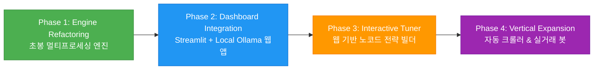

# 📈 High-Frequency Quant Backtest Engine

초봉/호가잔량(LOB) 데이터를 활용한 고성능 파이썬 백테스팅 엔진 패키지입니다.

## 📈 Real-World Performance & Track Record

> 단순 과거 백테스팅에 그치지 않고, **2022년 글로벌 대세 하락장(Bear Market) 구간에서 실제 계좌로 검증된 전략 알파(Alpha)**입니다.

<p align="center">
  
</p>

* **검증 기간:** 2022.04 ~ 2022.11 (코스닥 폭락장 구간)
* **성과 요약:** 지수 역행 월평균 +11.8% 수익률 달성 및 누적 MDD 철저 방어
---

## ✨ 주요 특징 (Key Features)

* **모듈화 아키텍처 설계:** 데이터 로딩, 손절/익절 제어, 매매 시그널을 각 모듈로 완전 분리하여 유지보수성 향상
* **멀티프로세싱 기반 병렬 연산 지원:** `multiprocessing.Pool`을 활용하여 CPU 코어별로 분할 백테스팅을 수행, 단일 프로세스 대비 백테스팅 실행 시간을 최대 80% 이상 단축하고 결과를 자동 병합하도록 설계
* **현대적 의존성 관리 (`uv`):** `pyproject.toml`과 `uv.lock` 기반으로 누구나 한 줄 명령어로 동일한 개발 환경 재현 가능
* **크로스 플랫폼 한글 인코딩 지원:** `utf-8-sig` 인코딩을 적용하여 VS Code, 깃허브, 엑셀 환경에서 한글 깨짐 원천 차단

---

## 🚀 Quick Start (실행 방법)

```bash
# 1. 의존성 동기화 (최초 1회 실행)
uv sync

# 2. 일반 실행 (단일 프로세스 - 빠른 테스트)
uv run python main.py

# 3. 병렬 실행 (대용량 데이터 - 멀티프로세싱)
uv run python run_parallel.py
```

---

## 📊 결과 확인 (Output Results)

백테스팅이 완료되면 모든 결과 파일은 **`results/`** 폴더 내에 자동으로 생성 및 저장됩니다.

* **`results/final_total_result.csv`**: 최종 백테스팅 통합 리포트 (PnL, MDD, MDU, TPI 지표 포함)
* **`results/cross_Today_*.csv`**: 병렬 가동 시 프로세스별 분할 결과 파일

---

## 🛠️ 전략 매개변수 및 조건 수정 가이드 (Customization)

전략 수치나 진입/청산 조건을 변경하고 싶다면 아래 해당 파일만 수정하시면 됩니다.

| 수정 목적 | 수정할 파일 | 주요 변경 내용 |
| :--- | :--- | :--- |
| **시스템 설정 및 경로** | `config.py` | 데이터 폴더 경로, 인코딩, 백테스트 제한 시간(`SET_TIME`) |
| **진입 조건 및 매수세 필터** | `strategy.py` | `check_entry_conditions()` 내 5초 매수비율(`cbv_5`), 거래속도(`tick_rate`), 임계값 수치 변경 |
| **청산 조건 및 손절 기준** | `risk_manager.py` | `check_exit_signals()` 내 손절 비율(-6%), 트레일링 스탑, 장 마감/상한가 청산 로직 변경 |
| **데이터 로딩 구조** | `data_loader.py` | SQLite DB 쿼리 및 일봉 CSV 조회 항목 변경 |

---

## 📂 프로젝트 구조 (Architecture)

```text
Stock/
├── pyproject.toml         # uv 기반 선언적 의존성 명세
├── uv.lock                # 버전 및 해시 동결 잠금 파일
├── config.py              # 경로 및 파라미터 통합 관리
├── utils.py               # 호가단위, 상한가, 시간차 순수 함수 유틸
├── data_loader.py         # 일봉 CSV 및 SQLite LOB DB 연결 전담
├── risk_manager.py        # 손절/익절/트레일링스탑 전담
├── strategy.py            # 호가 잔량 및 윈도우 시그널 연산
├── engine.py              # 백테스팅 핵심 실행 조율기
├── main.py                # 단일 프로세스 실행 진입점
└── run_parallel.py        # 멀티프로세스 병렬 가동 및 자동 결과 병합


## 🗺️ System Architecture & Milestones (프로젝트 로드맵)

본 프로젝트는 단순 백테스팅 스크립트를 넘어, 데이터 수집부터 전략 분석, 실거래까지 포괄하는 **All-in-One 퀀트 트레이딩 플랫폼**으로 지속 확장 중입니다.



- [x] **Phase 1: 코어 엔진 리팩토링 & 병렬화 (Completed ✅)**
  - 모놀리식 단일 코드를 7대 독립 모듈(SRP)로 분리
  - `multiprocessing.Pool` 기반 코어별 병렬 백테스팅 가속화 및 결과 자동 병합
  - `uv` 선언적 패키지 매니저 및 `utf-8-sig` 글로벌 인코딩 적용

- [ ] **Phase 2: 올인원 대시보드 저장소 통합 (In Progress 🔄)**
  - `Stock-dashboard`를 `Stock/dashboard`로 흡수·통합
  - 4개 서브페이지(Overview, Performance, Strategy Analysis, Insight) 연동
  - 로컬 LLM(Ollama `llama3.2:3b`) 기반 실시간 전략 분석 어시스턴트 탑재

- [ ] **Phase 3: 인터랙티브 전략 튜너 & 원클릭 웹 백테스팅 (Planned 🎯)**
  - Streamlit 사이드바 UI를 통한 매수세(`cbv_5`), 손절률(`stop_loss`) 파라미터 동적 입력
  - 웹에서 `[🚀 백테스트 실행]` 클릭 시 백엔드 엔진 즉시 가동 및 차트 자동 갱신

- [ ] **Phase 4: 수직 계열화 확장 (Future 🔮)**
  - **Upstream (`collector/`):** 일봉/초봉 시세 데이터 및 재무제표 자동 크롤링 & PostgreSQL DB 파이프라인
  - **Downstream (`trader/`):** 증권사(한국투자증권 등) OpenAPI 연동 실시간 모의/실거래 자동매매 봇
```