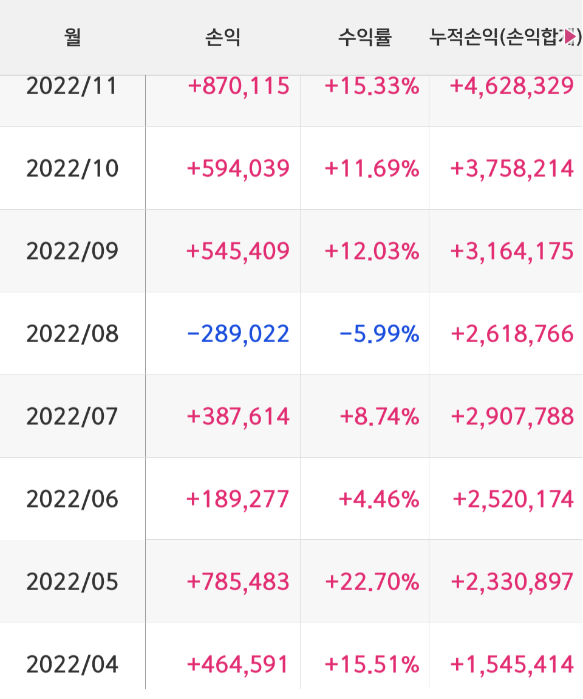
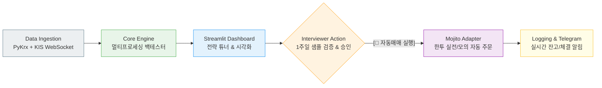
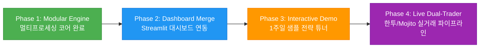

# 📈 High-Frequency Quant Backtest Engine & Trading Platform

> **3년간의 실전 트레이딩 노하우와 2022년 하락장 실계좌 검증을 바탕으로 구축된 고성능 End-to-End 퀀트 트레이딩 플랫폼**

[](https://www.python.org/)
[](https://github.com/astral-sh/uv)
[]()
[]()
[]()

---

## 1. 📌 프로젝트 개요 (Executive Summary)

본 프로젝트는 단순한 이론적 백테스팅 스크립트가 아닙니다.  
**3년간 실전 시장에서 직접 트레이딩하며 누적한 호가/체결 데이터 처리 노하우를 바탕으로, 과거 레거시(단일 스크립트) 코드를 엔터프라이즈급 모듈화·병렬 엔진으로 전면 재설계한 퀀트 트레이딩 시스템**입니다.

* **핵심 지향점:** 데이터 수집(Upstream) ➔ 멀티프로세싱 백테스팅(Core) ➔ 인터랙티브 웹 대시보드(UI) ➔ 실시간 자동주문(Downstream)으로 이어지는 **올인원 퀀트 파이프라인 구축**
* **포트폴리오 목적:** 면접관 및 사용자가 최신 1주일 치 샘플 데이터에 자신만의 전략 파라미터를 입력하고 즉시 시뮬레이션 결과를 확인한 뒤, 실거래 봇 실행으로 연결할 수 있는 **인터랙티브 프로덕트 경험 제공**

---

## 2. 🏆 Battle-Tested Track Record (엔진 신뢰성 검증)

> 본 시스템의 백테스팅 엔진과 리스크 관리 파이프라인은 **2022년 글로벌 대세 하락장(Bear Market) 구간에서 실제 계좌 운용을 통해 시장 검증을 마친 아키텍처**입니다. (과거 과적합 방지 및 실전 슬리피지/호가 괴리 최소화 입증)

<p align="center">
  
</p>

* **검증 기간:** 2022.04 ~ 2022.11 (코스닥 폭락장 구간)
* **성과 요약:** 코스닥 지수 역행 **월평균 +11.8% 실계좌 수익률 달성** 및 철저한 MDD 방어
* **의의:** 장중 초 단위 체결 강도와 호가잔량(LOB)을 정밀하게 반영하여 **"백테스트 결과가 실전 수익으로 직결되는 신뢰도 높은 엔진"**임을 실계좌로 증명

---

## 3. 🔄 Legacy Refactoring: 단일 스크립트에서 모듈형 엔진으로

과거 연구용으로 작성되었던 단일 파일(Monolithic) 형태의 백테스터를 유지보수성과 확장성을 갖춘 현대적 아키텍처로 리팩토링했습니다.

| 구분 | 레거시 버전 (`legacy/`) | 리팩토링 엔진 (현재) |
| :--- | :--- | :--- |
| **코드 구조** | 1,000줄 이상의 단일 스크립트 스파게티 코드 | 단일 책임 원칙(SRP) 기반 7대 독립 모듈 분리 |
| **연산 방식** | 단일 프로세스 순차 실행 (대용량 시 병목) | `multiprocessing.Pool` 기반 **CPU 멀티코어 병렬화 (속도 80% 단축)** |
| **의존성 관리** | 로컬 환경 의존 (`requirements.txt`) | `uv` 기반 초고속 선언적 패키지 격리 및 재현성 보장 |
| **실거래 연동** | 수동 주문 및 분리된 봇 실행 | **한국투자증권 OpenAPI / Mojito 어댑터 기반 원클릭 자동매매 직결** |

---

## 4. 📂 프로젝트 아키텍처 (Directory Structure)

```text
Stock/
├── assets/                # 실계좌 트랙레코드 및 시각화 이미지
│   └── track_record_2022.png
├── data/                  # 데이터 저장소
│   ├── sample/            # 면접관 체험용 최신 1주일 치 샘플 데이터 (초봉/일봉)
│   └── raw/               # SQLite LOB 호가잔량 DB 및 종목 마스터 CSV
├── results/               # 시뮬레이션 및 실거래 결과 자동 저장
│   ├── final_total_result.csv    # PnL, MDD, TPI 종합 성과 리포트
│   └── live_trade_log.csv        # 실거래/모의투자 실시간 체결 로그
├── collector/             # [Upstream] 데이터 수집 파이프라인
│   ├── pykrx_collector.py        # KRX 일봉/분봉 거시 데이터 스크래퍼
│   └── ws_lob_collector.py       # 한투 WebSocket 실시간 호가/초봉 수집 데몬
├── dashboard/             # [UI / Frontend] Streamlit 대시보드
│   ├── app.py                    # 인터랙티브 대시보드 메인 앱
│   └── pages/                    # 성과 분석, 전략 튜너, 실시간 잔고 페이지
├── trader/                # [Downstream] 실거래 주문 집행기
│   ├── broker_adapter.py         # Mojito 기반 KIS REST 주문 어댑터 (모의/실전 듀얼 모드)
│   └── notifier.py               # 텔레그램 체결/손절 실시간 알림 봇
├── pyproject.toml         # uv 기반 현대적 의존성 명세
├── uv.lock                # 패키지 빌드 고정 락 파일
├── .env.example           # 증권사 API Key 환경변수 템플릿
├── config.py              # 경로, 인코딩, 타임아웃 등 글로벌 환경 설정
├── utils.py               # 호가단위 산출, 상한가 판별, 시간 연산 순수 함수
├── data_loader.py         # SQLite DB 쿼리 및 일봉 데이터 파싱 전담
├── strategy.py            # 파라미터 기반 매수세/체결속도 시그널 연산 엔진
├── risk_manager.py        # 손절, 트레일링스탑, 장마감 일괄 청산 제어 모듈
├── engine.py              # 타임라인 기반 가상 매매 체결 핵심 조율기
├── main.py                # 단일 프로세스 디버깅 및 테스트 진입점
└── run_parallel.py        # 멀티프로세스 병렬 가동 및 자동 리포트 병합 진입점
```

---

## 5. 💾 데이터 파이프라인 및 수집 전략 (Data Ingestion)

데이터의 성격에 따라 수집 경로를 이원화하여 수집 속도와 정밀도를 극대화했습니다.

| 데이터 종류 | 수집 파이프라인 | 저장 형태 | 주요 컬럼 (Schema) 및 용도 |
| :--- | :--- | :---: | :--- |
| **과거 일봉/분봉** | `PyKrx` (KRX 다이렉트) | CSV / DB | `date`, `code`, `open`, `high`, `low`, `close`, `volume`, `marcap` (거시 변동폭 및 종목 필터링) |
| **초봉 & 호가잔량 (LOB)** | `한투 KIS WebSocket` | SQLite (`.db`) | `time`, `code`, `ask_price`, `bid_price`, `tot_ask_qty`, `tot_bid_qty`, `buy_volume` (장중 1초 단위 매수세 연산) |

---

## 6. ⚙️ End-to-End 시스템 데이터 파이프라인



---

## 7. 📊 퀀트 전략 및 리스크 관리 규칙 (Rule-based Strategy)

본 엔진은 틱 단위 미세 매수세 포착과 엄격한 손실 제한 룰을 결합합니다.

### 7.1 진입 시그널 (Entry Rules)
* **5초 매수 체결 비율 ($CBV_5$):** 최근 5초간 전체 거래량 중 시장가 매수 체결 비중이 임계값 이상일 때 매수세 유입으로 판정
* **체결 속도 ($Tick\_Rate$):** 초당 틱 발생 빈도가 급증하는 모멘텀 구간 탐지

### 7.2 청산 및 리스크 관리 (Exit Rules)
* **원칙 손절 (Stop-Loss):** 진입가 대비 **$-6.0\%$** 도달 시 무조건 시장가 전량 손절
* **트레일링 스탑 (Trailing Stop):** 고점 대비 일정 비율 반락 시 수익 보존 청산
* **장 마감 동시 청산 (EOD Exit):** 오버나이트 리스크를 배제하기 위해 `15:18`에 보유 전량 청산

---

## 8. 🚀 설치 및 환경 설정 (Quick Start)

### 8.1 환경 구축 (`uv`)
```bash
# 1. uv를 통한 의존성 동기화 (최초 1회)
uv sync
```

### 8.2 환경변수 설정 (`.env`)
실거래 및 모의투자 API 연동을 위해 루트 경로에 `.env` 파일을 생성합니다.

```env
# .env.example
KIS_APP_KEY="your_korea_investment_app_key"
KIS_APP_SECRET="your_korea_investment_app_secret"
KIS_ACC_NO="12345678-01"
IS_MOCK=True   # True: 모의투자 가상매매, False: 실계좌 실거래
TELEGRAM_BOT_TOKEN="your_bot_token"
TELEGRAM_CHAT_ID="your_chat_id"
```

### 8.3 실행 방법
```bash
# 1) 백테스팅 엔진 병렬 가동 (멀티프로세싱)
uv run python run_parallel.py

# 2) 인터랙티브 대시보드 웹앱 실행
uv run streamlit run dashboard/app.py
```

---

## 9. 🗺️ 향후 로드맵 & 통합 계획 (Milestones)



- [x] **Phase 1: 코어 엔진 리팩토링 & 병렬화 (완료 ✅)**
  - 레거시 단일 코드를 7대 독립 모듈로 완전 분리
  - CPU 병렬 연산 가속화 및 `utf-8-sig` 크로스 플랫폼 지원
- [ ] **Phase 2: Streamlit 분석 대시보드 통합 (진행 중 🔄)**
  - 백테스팅 결과 CSV와 Streamlit UI 연동 (누적 PnL, MDD, 승률 차트)
- [ ] **Phase 3: 면접관 맞춤형 인터랙티브 전략 튜너 (기획 🎯)**
  - 최신 1주일 치 샘플 데이터 기반 파라미터 동적 입력 및 원클릭 백테스트
  - *"이 전략으로 자동매매를 시작할까요?"* UI 흐름 완성
- [ ] **Phase 4: 한투 OpenAPI / Mojito 실거래 연동 (확장 🔮)**
  - Mojito 래퍼 기반 모의/실계좌 자동 주문 집행 및 텔레그램 체결 알림
